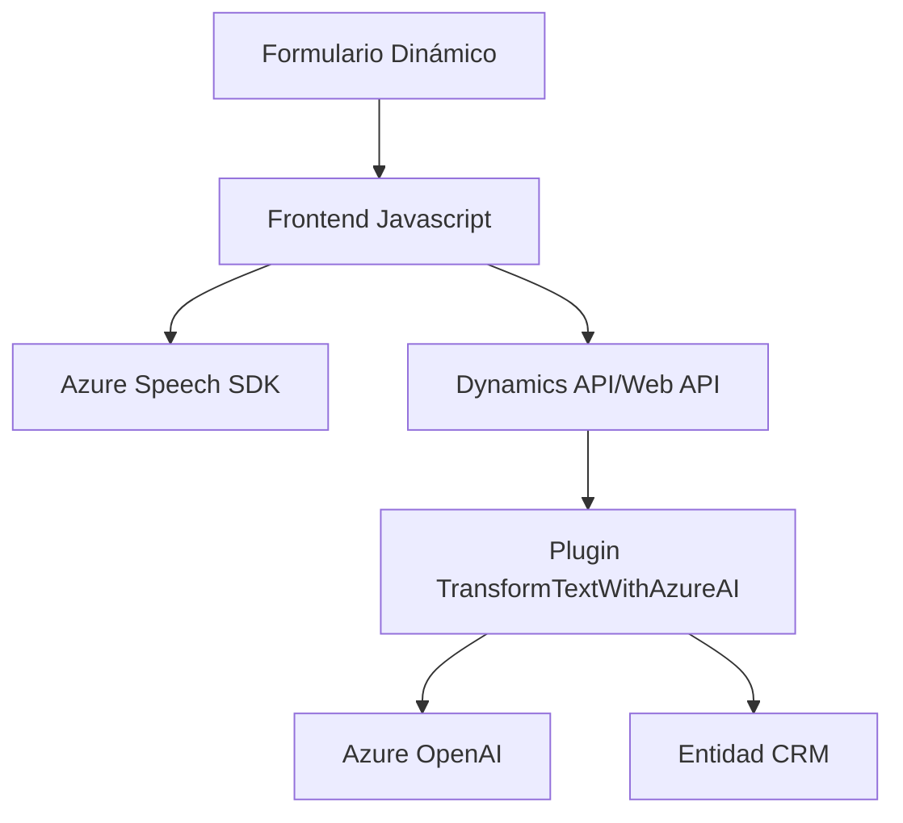

### Breve Resumen Técnico
Este proyecto constituye una solución dinámica que mezcla funcionalidades frontend y backend, diseñada para proporcionar interacción avanzada mediante reconocimiento de voz y transformación de datos con modelos Inteligencia Artificial (IA) de Azure. La solución usa varias tecnologías en un entorno modular combinado con Dynamics CRM.

### Descripción de Arquitectura
La arquitectura del sistema puede definirse como **modular basada en n capas**:
1. **Frontend Javascript**: Funciona como capa de presentación y lógica cliente. Utiliza Azure Speech SDK para reconocimiento y síntesis de voz interactuando con el formulario dinámico.
2. **CRM Plugins en .NET (Backend)**: Capa lógica empresarial que maneja la interacción directa con servicios de IA en la nube (Azure OpenAI) y Dynamics.
3. **Azure Cloud Services**: Proveedora de servicios inteligentes como Speech SDK y OpenAI.

El diseño sigue los principios de desacoplamiento entre cada capa:
- La comunicación entre frontend y CRM se realiza a través de APIs de Dynamics y plugins.
- Los plugins en el servidor tienen acceso directo a los servicios de Azure mediante HTTP.

### Tecnologías Usadas
1. **Frontend**:
   - **Azure Speech SDK**: Procesamiento de reconocimiento y síntesis de voz.
   - **Javascript**: Estructura modular con funciones separadas según responsabilidad en lógica de negocio.
2. **Backend**:
   - **.NET Framework (Microsoft Dynamics SDK)**: Extensión de funcionalidades en plugins.
   - **Azure OpenAI Service**: Módulo de IA para transformación de texto en JSON.
   - **System.Net.Http, Newtonsoft.Json**: Para requests HTTP y manipulación JSON.
3. **Servicios Externos**:
   - Azure para reconocimiento de voz, texto y procesamiento mediante OpenAI.
   - Dynamics API/WebApi para interacción y mapeo de datos CRM.

### Diagrama Mermaid Compatible

### Conclusión Final
Este proyecto es una solución basada en **n capas**, que combina una lógica frontend dinámica con extensiones backend personalizadas en forma de plugins para Dynamics CRM. Utiliza tecnologías modernas como Azure Speech SDK para reconocimiento de voz y OpenAI para procesamiento de texto, demostrando una arquitectura modular, escalable y orientada a servicios.

La elección de patrones como el mapeo de campos CRM, procesamiento observable por eventos y la carga dinámica de dependencias aseguran una experiencia interactiva robusta y adaptable. Este diseño es ideal para soluciones empresariales personalizadas que buscan integración con sistemas CRM y servicios de IA en la nube, manteniendo una alta cohesión y bajo acoplamiento entre sus componentes.