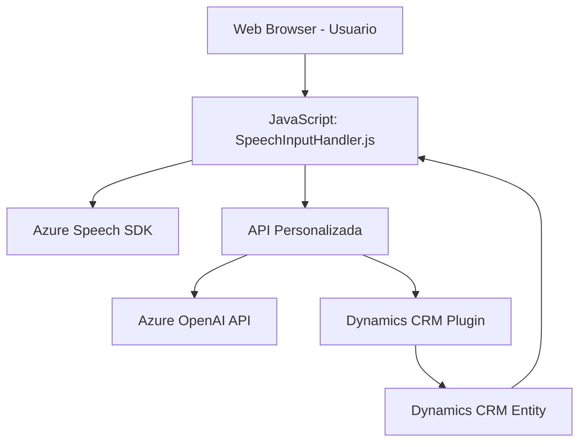

### **Breve resumen técnico**
El repositorio define una solución que integra reconocimiento de voz y síntesis de texto en un formulario CRM (posiblemente Dynamics 365). La funcionalidad principal se basa en el **Azure Speech SDK** para la interacción basada en voz y la integración con APIs para el procesamiento de texto por medio de **Azure OpenAI API**. Adicionalmente, incluye un plugin (`TransformTextWithAzureAI.cs`) que opera en Dynamics CRM para transformar el texto de entrada en formato JSON estructurado usando **GPT-4**.

### **Descripción de arquitectura**
La arquitectura de esta solución se puede clasificar como **orientada a servicios (SOA)**, con una estructura que engloba diferentes capas:
1. **Frontend en JavaScript**: Para la interacción del usuario, manejo de formularios y la invocación del reconocimiento de voz o síntesis de voz.
2. **Backend como plugins (.NET)**: Implementa procesamiento especializado que interactúa directamente con Dynamics CRM y realiza llamadas a servicios de OpenAI API.
3. **Servicios externos (Azure Speech SDK, OpenAI)**: La arquitectura depende de servicios externos para reconocimiento y síntesis de voz y transformación de texto.

En términos estructurales, el sistema utiliza principios **n-capas**, donde el frontend opera en la primera capa, la lógica interna del CRM (entidades y plugins) trabaja como la capa intermedia, y los servicios externos (como Azure Speech SDK y API personalizada) representan la capa final del procesamiento.

### **Tecnologías usadas**
1. **Frontend (JavaScript)**
   - SDK utilizado: **Azure Speech SDK**
   - Funcionalidades: Carga dinámica del SDK, integración con formularios CRM.
   - Patrones empleados: Modularización, event-driven programming.

2. **Backend (.NET Framework / Dynamics SDK)**
   - Framework utilizado: **Microsoft Dynamics CRM SDK**, .NET Framework.
   - Servicios externos: **Azure OpenAI API** (GPT-4).
   - Librerías/módulos: `Newtonsoft.Json`, `System.Text.Json`, `System.Net.Http`.

3. **Arquitectura**
   - Soporte para **Service-Oriented Architecture (SOA)**
   - Plugins basados en interfaces (`IPlugin`) para la ejecución en Dynamics CRM.

### **Diagrama Mermaid válido para GitHub**

### **Conclusión final**
La solución utiliza una arquitectura en capas bien definida, con componentes que interactúan en distintos niveles:
- **Frontend**: Frontend basado en JavaScript, procesando datos de formularios y ejecutando operaciones como entrada/salida de voz.
- **Backend**: Plugins en Dynamics CRM para la transformación y manejo de datos.
- **Servicios Externos**: Integración profunda con **Azure Speech SDK** y **Azure OpenAI API** para procesamiento de voz y texto.

Esta estructura permite un diseño modular que podría escalar fácilmente e integrar funcionalidades nuevas, siempre que se mantenga la separación de responsabilidades entre los módulos.