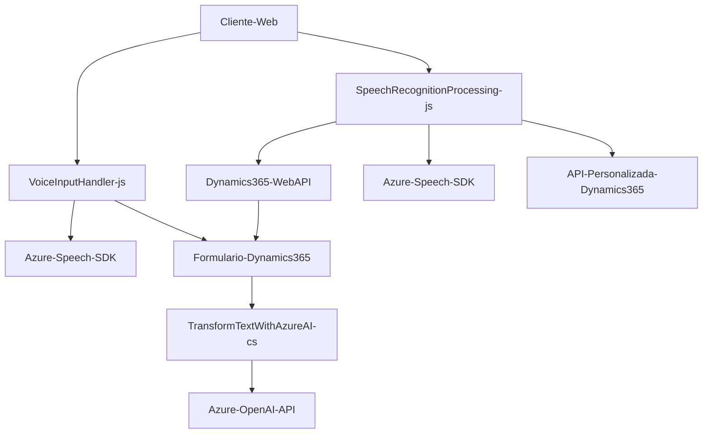

### Breve Resumen Técnico
El repositorio contiene una solución centrada en la integración de inteligencia artificial y servicios cognitivos de Azure con formularios web y Dynamics 365. Está diseñado como una combinación de frontend (JavaScript) y backend (plugin de Dynamics CRM en C#) que habilita síntesis y reconocimiento de voz junto con procesamiento avanzado de datos usando Azure Speech SDK y OpenAI. Esta solución automatiza la entrada de datos en formularios y transforma texto en estructuras más útiles.

---

### Descripción de Arquitectura
1. **Tipo de Arquitectura:** 
   - Modular + Integración de Servicios Externos
   - Arquitectura en n-capas (capas de presentación, negocio y acceso a datos), con enfoque en la encapsulación de servicios externos (Azure Speech SDK, Dynamics 365 Web API y OpenAI).
   
2. **Características:**
   - **Frontend:**
     - Capas claras con modularización para tareas específicas como reconocimiento de voz, síntesis de voz y procesamiento de datos de formularios.
   - **Backend:**
     - Plugins basados en Dynamics CRM utilizando un enfoque orientado a eventos y conectado a servicios externos por medio de adaptadores HTTP.

---

### Tecnologías y Frameworks Usados
1. **Frontend:**
   - **JavaScript**: Se utiliza para integrar servicios de entrada y salida de voz, además del manejo de formularios.
   - **Azure Speech SDK**: Para reconocimiento de voz en lenguaje natural y síntesis de voz.
   - **Dynamics 365 Web API**: Para la interacción con formularios del CRM.

2. **Backend:**
   - **Microsoft Dynamics SDK (C#)**: Para construir el plugin conectado a eventos y servicios del CRM.
   - **Azure OpenAI API**: Para procesar texto y generar objetos JSON estructurados.
   - **Frameworks de JSON** como Newtonsoft y System.Text.Json para manejar datos estructurados.

---

### Dependencias o Componentes Externos
1. **Azure Speech SDK:** Utilizado por el frontend para reconocer voz y sintetizar texto.
2. **Azure OpenAI API:** Usado por el plugin en C# para procesar texto con servicios de generación de IA.
3. **Dynamics 365 Web API:** Integrado en la solución para gestionar la entrada y salida de datos de formularios en el sistema CRM.
4. **Librerías JSON (Newtonsoft, System.Text.Json):** Para el manejo y transformación de datos estructurados.

---

### Diagrama Mermaid

---

### Conclusión Final
La solución es una arquitectura híbrida de **frontend-reconocimiento de voz** y **backend-transformación de texto** diseñada para funcionar como un kit especializado para la entrada de datos en **Dynamics 365**. Utiliza una combinación de tecnologías modernas como Azure Speech SDK, Dynamics 365 Web API y Azure OpenAI API para habilitar funcionalidades avanzadas de síntesis de voz, reconocimiento de voz y procesamiento de texto estructurado para automatizar tareas en un CRM. Este diseño modular promueve la escalabilidad y la integración sencilla con otros sistemas similares.