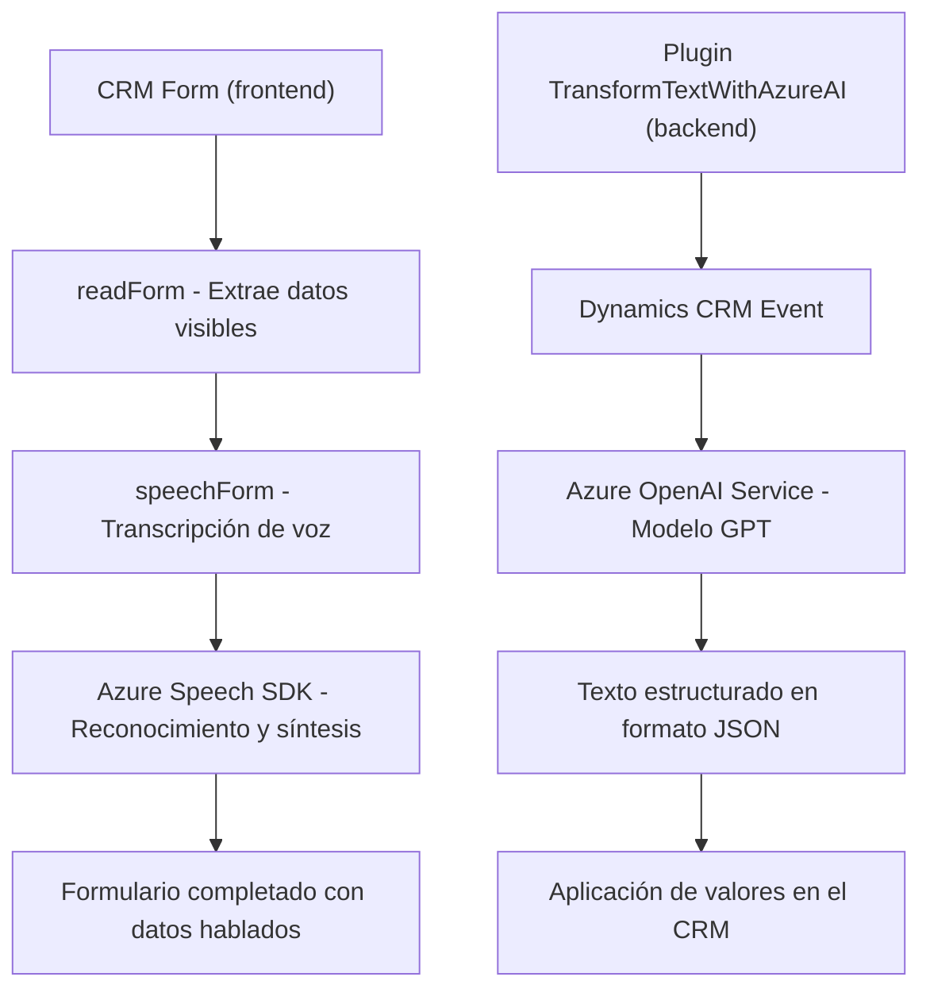

### Breve resumen técnico:
El repositorio consiste en un conjunto de archivos diseñados para integrar capacidades de voz y procesamiento de texto mediante servicios de Azure con Dynamics CRM. Hay un enfoque especial en dos funcionalidades principales:
1. **Entrada de voz** para capturar y transcribir comandos hablados y asignar valores a formularios de CRM (JavaScript).
2. **Transformación de texto mediante Azure OpenAI** como parte de un plugin de Dynamics 365 (C#).

El repositorio muestra características de **integración con servicios basados en Azure** y utiliza tanto **JavaScript** para frontend (gestión de formularios) como **C#** para backend (Azure OpenAI plugin).

---

### Descripción de arquitectura:
La arquitectura observada combina los siguientes elementos:
- **Tipo de solución**: API y procesamiento orientado a tareas específicas dentro de un sistema CRM.
- **Patrón de integración externa**: Dependencias con servicios de Azure (Speech SDK y OpenAI), lo que lo hace un ejemplo de **arquitectura orientada a servicios (SOA)**.
- **Cliente-servidor**: Los archivos JavaScript actúan como el cliente que ejecuta servicios locales (Dynamics CRM) y llega a Azure Speech SDK, mientras que el plugin de C# utiliza una arquitectura basada en eventos (plugin pattern) que ejecuta lógica en el backend del CRM.
- **Modularización orientada a tareas**: Cada archivo tiene funciones encapsuladas que abordan tareas específicas (e.g., lectura de formularios, grabación de voz, llamadas a Azure).

Por lo tanto, la solución tiene características **n-capas**, donde cada capa está claramente definida:
1. **Capa de presentación**: Archivos JavaScript (`readForm.js`, `speechForm.js`) para la interacción con formularios y datos del CRM.
2. **Capa lógica de negocio**: Plugin en C# (`TransformTextWithAzureAI.cs`) que maneja transformaciones avanzadas de texto mediante Azure OpenAI.
3. **Capa de integración**: Azure Speech SDK y REST API (para OpenAI).

---

### Tecnologías usadas:
1. **Frontend:**
   - **JavaScript**: Para manejar la interacción en formularios CRM.
   - **Azure Speech SDK**: Funcionalidad de síntesis y reconocimiento de voz.
   - **Dynamics CRM WebApi**: Para interactuar con formularios y atributos.
2. **Backend:**
   - **C# .NET Framework (Dynamics CRM Plugin)**: Procesamiento de texto avanzado mediante Azure OpenAI.
   - **Azure OpenAI**: Modelo GPT usado para transformar texto.
   - **Newtonsoft.Json** y **System.Text.Json**: Para manejar datos en JSON.
   - **REST API**: Llamadas externas a servicios de Azure.
3. **Servicios Externos**:
   - Azure Speech SDK.
   - Azure OpenAI Service.

---

### Diagrama Mermaid válido para GitHub Markdown:

---

### Conclusión final:
Este repositorio presenta una solución para la interacción avanzada entre usuarios y un sistema CRM, utilizando tecnologías de Azure. Las funcionalidades se centran en la integración de voz y procesamiento de texto con Dynamics 365 mediante una arquitectura modular orientada a servicios (SOA) y n-capas. Los componentes están bien organizados, haciendo uso de SDKs y APIs para extender las capacidades del CRM hacia necesidades específicas de los usuarios.

Se trata de una solución robusta que explota herramientas modernas como el reconocimiento de voz y la inteligencia artificial. Sin embargo, su fuerte dependencia en los servicios de Azure implica que necesitará buena gestión de credenciales y costos específicos asociados a estas herramientas.