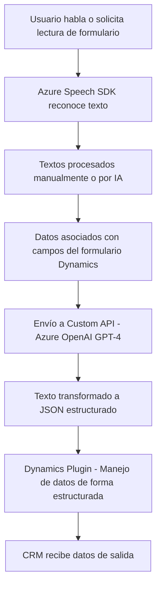

### Análisis del repositorio:

#### Breve resumen técnico:
Este repositorio implementa funcionalidades relacionadas con la entrada y salida de voz para formularios, integrándose con servicios de Microsoft Azure, como Speech SDK y OpenAI (GPT-4). Además, incluye lógica de plugin para Microsoft Dynamics CRM, procesando texto para convertirlo en objetos JSON estructurados. Las dependencias y patrones utilizados indican una arquitectura modular con integración de APIs externas.

---

#### **Descripción de arquitectura:**

1. **Tipo de solución:** 
   - El repositorio contiene una solución híbrida que combina frontend (`readForm.js`, `speechForm.js`) y backend (`TransformTextWithAzureAI.cs`) bajo un modelo orientado a la integración con servicios externos (Azure y Dynamics CRM).

2. **Arquitectura:**
   - **Frontend:** Modular y estructurado en torno a funciones y eventos específicos, lo que facilita la integración de flujos de entrada y salida de datos con APIs.
   - **Backend:** API plugin centrado en extensibilidad de Dynamics CRM, acorde al patrón de n capas. Aunque por la descripción parece combinar varios servicios externos, su complejidad puede derivar en implementaciones más cercanas a una **arquitectura de microservicios**, dada la dependencia del SDK externo (Azure Speech y OpenAI).

---

#### **Tecnologías, frameworks y patrones usados**:
1. **Frontend (JS):**
   - **Tecnología utilizada:** 
     - JavaScript ES6 (modular, orientado a funciones).
   - **Frameworks y servicios externos:**
     - Azure Speech SDK: Para la síntesis de texto a voz y reconocimiento de voz.
   - **Patrones:**
     - Modularidad funcional: Cada archivo representa una acción específica (leer form, reconocer voz).
     - Servicio externo síncrono: Manejo de dependencias dinámicas como Azure Speech SDK.
     - Separación lógica: Las funciones están aisladas para controlar cada proceso granularmente.

2. **Backend (C#):**
   - **Tecnología utilizada:** 
     - Plugin para Dynamics CRM basado en .NET Framework.
   - **Frameworks y servicios externos:**
     - Microsoft Dynamics SDK: Integración directa con los objetos CRM.
     - Azure OpenAI API (GPT-4): Proporciona lógica avanzada de procesamiento del lenguaje.
   - **Patrones:**
     - Plugin extensible (CRM): Implementación de `IPlugin` para responder a eventos en Dynamics.
     - Cliente REST: Conexión HTTP hacia Azure OpenAI.
     - Transformación y validación: Procesamiento y validación de entrada para convertir a estructuras JSON.

---

#### **Dependencias y componentes externos:**
1. **Frontend:**
   - **Azure Speech SDK:** Para el manejo de síntesis y reconocimiento de voz.
   - **Form API:** Estos scripts interactúan con formularios dentro de Dynamics CRM.
   - **Custom API:** Llamadas potenciales hacia APIs internas o personalizadas de Dynamics.

2. **Backend:**
   - **Microsoft Dynamics SDK:** Provee servicios organizacionales dentro del CRM.
   - **Azure OpenAI (GPT-4):** Procesamiento avanzado de texto.
   - **Bibliotecas estándar de .NET:** Gestión de arquitecturas REST, JSON, API y validación.

---

### **Diagrama Mermaid**

---

#### **Conclusión final:**
El repositorio contiene una solución híbrida diseñada para integrarse con Microsoft Dynamics CRM, aprovechando servicios avanzados de Microsoft Azure (Speech y OpenAI). El frontend sigue una arquitectura modular funcional con llamada a servicios externos en tiempo real, mientras que el backend respeta un patrón de n capas con integración dinámica vía SDK y APIs. La arquitectura global presenta puntos que facilitan el escalado hacia microservicios en el futuro, particularmente por su dependencia en servicios externos.