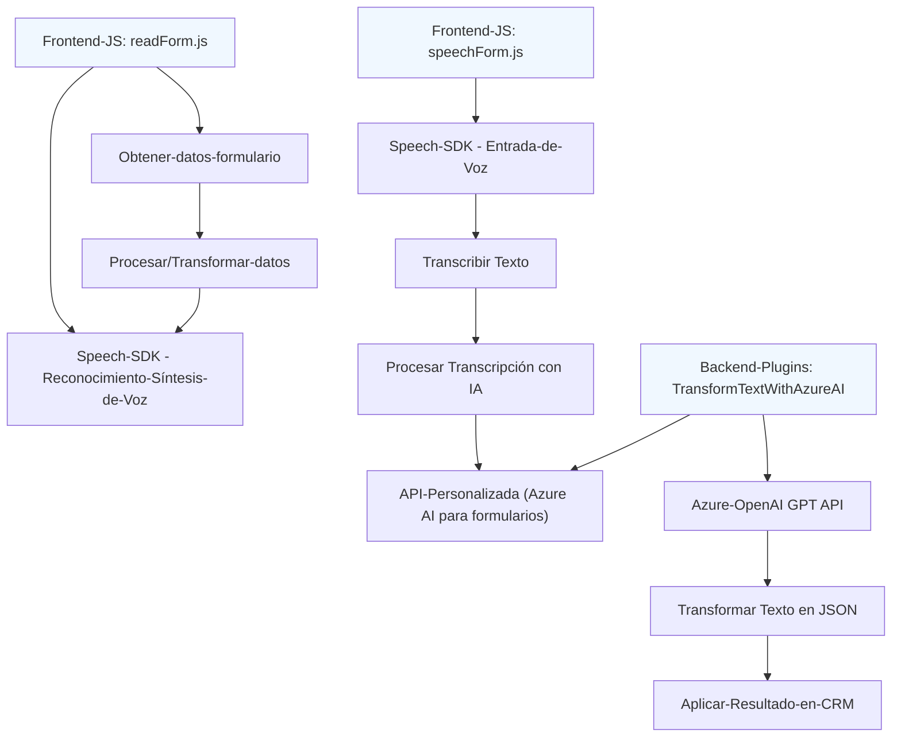

### Breve resumen técnico:
El repositorio ofrece un conjunto de archivos orientados a integrar soluciones de entrada y salida de voz, junto con procesamiento avanzado de texto, en el contexto de formularios y sistemas Dynamics CRM. Esto incluye funcionalidades como lectura dinámica de formularios, asignación de valores mediante IA, reconocimiento y síntesis de voz, y transformación de contenido con el modelo de Azure OpenAI. Los archivos indican una solución híbrida entre frontend avanzado, interacción con servicios externos (Azure), y extensiones de plugins para Dynamics CRM.

---

### Descripción de arquitectura:
La solución implementa una arquitectura basada en **n capas**, donde los componentes están distribuidos en:
1. **Frontend**: Operaciones de lectura/síntesis de formularios y entradas de voz utilizando Azure Speech SDK.
2. **Backend**: Plugins de Dynamics CRM que procesan datos mediante Azure OpenAI y complementan el flujo del sistema. 
3. **Servicios externos**: Integración con APIs de reconocimiento de voz y procesamiento de IA avanzados (Azure Speech SDK y Azure OpenAI).

Aunque no utiliza microservicios explícitos, las dependencias externas como Azure OpenAI y el Speech SDK la hacen flexible y modular. Además, los módulos internos (plugins y lógica frontend) están diseñados con alta cohesión y separación de funcionalidades.

---

### Tecnologías usadas:
1. **Frontend JS**:
   - **Azure Speech SDK**: Reconocimiento y síntesis de voz.
   - **Modular JS**: Separación funcional de métodos para lectura/formato/aplicación de datos.
2. **Backend**:
   - **Microsoft Dynamics SDK**: Interacción con datos internos de CRM utilizando `IPlugin`.
   - **System.Net.Http** y **System.Text.Json**: Realización de solicitudes HTTP y procesamiento JSON.
   - **Azure OpenAI**: GPT model for AI-based text transformation.
   - **Newtonsoft.Json**: Manipulación avanzada de JSON.
3. **Patterns**:
   - MVC (Modelo-Vista-Controlador) aplicado en la colaboración entre frontend y backend.
   - Modularity (Frontend): Cada archivo cumple un propósito específico.
   - Plugin Architecture (Backend): Uso de `IPlugin` como base para integración en Dynamics CRM.
   - Event-driven callbacks (Speech SDK).

---

### Diagrama Mermaid válido para GitHub Markdown:

---

### Conclusión final:
La solución es robusta y está diseñada para ofrecer una experiencia accesible e inteligente a los usuarios de Dynamics CRM. La arquitectura de **n capas** con integración en **Azure Speech SDK** y **Azure OpenAI** define una solución híbrida que combina frontend dinámico y extensiones backend mediante plugins. El uso de modularidad y patrones establecidos asegura una implementación mantenible y funcional.