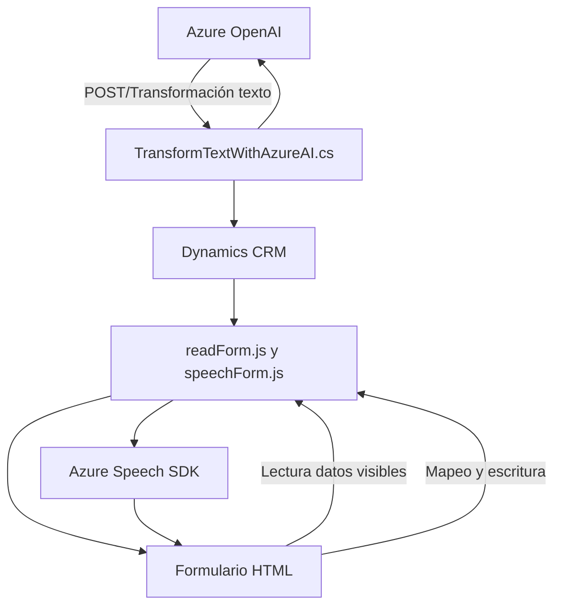

### Resumen técnico

El repositorio reúne archivos que se integran y trabajan con servicios de Azure (Speech SDK y OpenAI) y funcionalidades de **Microsoft Dynamics CRM** para manipular formularios y datos. Los archivos principales indican una solución orientada a un entorno de aplicaciones web (frontend y backend) que utiliza reconocimiento de voz para interacción con formularios, además de procesamiento avanzado de texto con OpenAI para tareas inteligentes en Dynamics CRM.

---

### Descripción de arquitectura

1. **Principal tipo de solución**:  
   - Frontend basado en JavaScript para interacción en Dynamics 365.  
   - Plugins en backend (.NET/C#) para extender funcionalidades del CRM mediante integración con Azure OpenAI.  

2. **Arquitectura general**:  
   - **Monolito en backend**: El plugin .NET opera de forma centralizada en Dynamics 365 con extensiones mediante el modelo "Plugin".  
   - **N capas en frontend**: Organización modular con separación entre lógica principal (voice recognition/speech synthesis) y servicios auxiliares (form handling/API calls).  
   - **API externa**: Azure Speech y Azure OpenAI garantizan interacción y procesamiento como servicios externos desacoplados.  

3. **Patrones usados**:  
   - **Facade Pattern**: Se utilizan puntos de entrada unificados (`startVoiceInput`, plugins) para encadenar múltiples dependencias.  
   - **Modularidad**: Diseño en JavaScript con funciones específicas encapsuladas para tareas bien definidas.  
   - **Carga bajo demanda**: Validación previa y carga de SDKs incrementa la eficiencia en tiempo de ejecución.  
   - **Plugin Pattern** (Dynamics CRM): Extensible mediante puntos de integración nativos del sistema.  

---

### Tecnologías usadas

1. **Frontend**:  
   - **JavaScript**: Funcionalidades de interacción con usuarios y formularios, además de integración con Azure Speech SDK.  
   - **Azure Speech SDK**: Reconocimiento de voz/síntesis integrado.  
   - **Dynamics CRM APIs** (JavaScript): Expone eventos del contexto de formularios y sistema.  

2. **Backend**:  
   - **C# (.NET)**: Plugins dinámicos que utilizan reglas JSON y comunicación con APIs externas.  
   - **Azure OpenAI Service**: Procesamiento avanzado de texto.  
   - **REST API**: Comunicación entre Dynamics CRM y servicios externos.  
   - **Newtonsoft.Json**: Manejo de estructuras JSON.  

---

### Dependencias y componentes externos

1. **Azure Speech SDK**:  
   - Usado tanto para síntesis de voz como para reconocimiento de voz.  

2. **Azure OpenAI Service**:
   - Procesamiento de reglas y transformación avanzada de texto.  

3. **Microsoft Dynamics 365**:  
   - Fuente principal de los datos del formulario (`executionContext`).  

4. **Plugins CRM (.NET)**:  
   - Carga y ejecución de funcionalidad extendida localmente en operaciones de sistema.  

---

### Diagrama Mermaid

---

### Conclusión final

El repositorio implementa una solución híbrida usando tecnologías frontend (JavaScript) y backend (.NET) para un ecosistema CRM robusto con Microsoft Dynamics 365. Integra servicios inteligentes como Azure Speech SDK y Azure OpenAI, apoyándose en arquitectura modular. Combina aplicativos locales con servicios cloud, empleando patrones de carga dinámica y extensibilidad nativa del CRM.