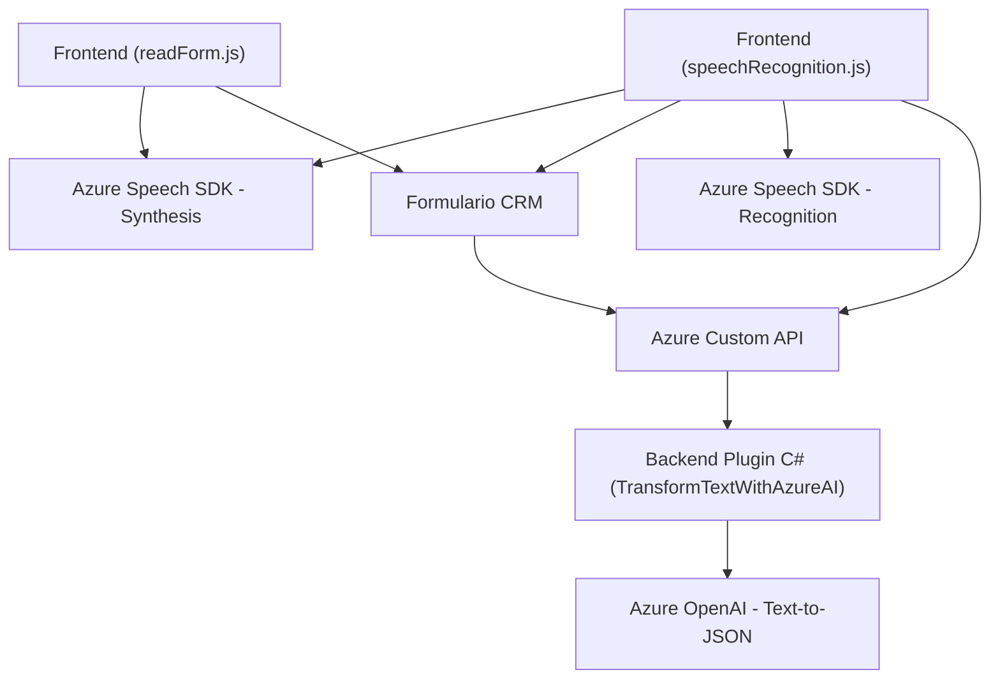

## Breve resumen técnico
Este repositorio consta de tres archivos organizados en diferentes directorios. Se trata de una solución híbrida vinculada a aplicaciones de **Microsoft Dynamics CRM** y servicios de **Microsoft Azure**. Cada archivo cumple un rol específico dentro de la integración entre formularios Dynamics CRM y el procesamiento de lenguaje natural a través del servicio Azure Speech SDK y Azure OpenAI. La solución aborda la síntesis de texto a voz, el reconocimiento de voz y la transformación de texto usando inteligencia artificial.

---

## Descripción de arquitectura
La solución presenta una arquitectura **n-capas**, ya que separa claramente las responsabilidades en diferentes módulos:

1. **Capa de presentación**:
   - Los archivos `readForm.js` y `speechRecognition.js`, ubicados en el directorio `/FRONTEND/JS`, se enfocan en la lógica relacionada con la interacción del usuario e integran con la API del Azure Speech SDK para realizar reconocimiento y síntesis de voz.
   - Ambos dependen del contexto de los formularios en Dynamics CRM para extraer datos de los campos visibles.

2. **Capa de lógica de negocios**:
   - El archivo `TransformTextWithAzureAI.cs` en la carpeta `/Plugins` implementa un plugin de Dynamics CRM que interactúa con el servicio **Azure OpenAI** para transformar texto según reglas personalizadas.

3. **Capa de integración/external services**:
   - Se incluye un modelo de comunicación con servicios externos basados en APIs ofrecidas por **Azure Speech SDK** y **Azure OpenAI**. Esto fomenta una arquitectura **Service-Oriented Architecture (SOA)**.

---

## Tecnologías usadas
1. **Microsoft Azure**:
   - **Azure Speech SDK**: Para la síntesis y reconocimiento de voz.
   - **Azure OpenAI**: Para generar respuestas basadas en inteligencia artificial.

2. **Microsoft Dynamics CRM**:
   - Integración mediante el framework de plugins (`Microsoft.Xrm.Sdk`) en `TransformTextWithAzureAI.cs`.

3. **Desarrollo frontend/web**:
   - Lenguaje: **JavaScript**.
   - Librerías: `JavaScript DOM API` para manipulación del modelo DOM.
   - Metodologías: Programación modular con funciones específicas.

4. **Desarrollo backend**:
   - Lenguaje: **C#**.
   - Framework: **.NET (Microsoft Dynamics SDK)**.
   - Librerías complementarias para el manejo de objetos JSON: `Newtonsoft.Json.Linq`.

5. **Patrones de arquitectura**:
   - **N-capas**: Separación en presentación, lógica de negocios e integración de servicios.
   - **Facade Pattern**: Implementado en el método `Execute` del plugin C# para simplificar llamadas externas.
   - **SDK Loading Pattern**: Dinámico bajo demanda para la integración con Azure Speech en el frontend.

---

## Diagrama Mermaid válido para GitHub

---

## Conclusión final
El repositorio implementa una solución **n-capas** orientada a aplicaciones especializadas en **Microsoft Dynamics CRM**, integrando servicios avanzados de **Azure Speech SDK** para la síntesis y reconocimiento de voz, así como APIs personalizadas de **Azure OpenAI** para procesamiento y transformación de texto en JSON estructurado. Los archivos están organizados en carpetas para distinguir el frontend, backend y los scripts que interactúan con el SDK. Además, el trabajo con mapeo de campos en formularios y la modularidad de funciones aseguran un diseño escalable y reutilizable.

La arquitectura y las tecnologías utilizadas son ideales para entornos empresariales que buscan automatización y soluciones basadas en inteligencia artificial, y presentan un diseño moderno y robusto que facilita la integración entre sistemas y servicios en la nube.