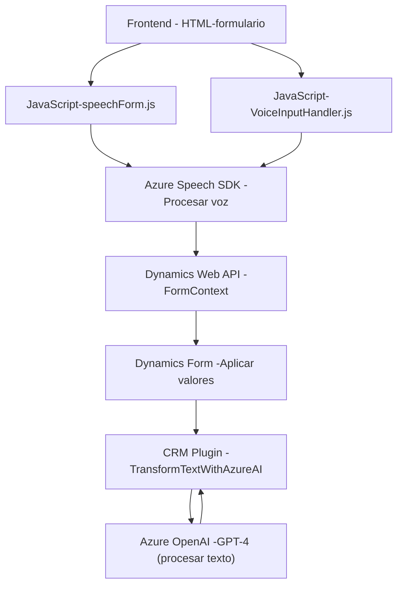

### Breve resumen técnico
El repositorio integra múltiples componentes que interactúan con formularios y servicios como Dynamics 365, Azure Speech SDK, y Azure OpenAI. Se compone de elementos frontend (procesamiento de voz y formulario) y un backend en forma de plugin CRM, diseñado para validar y transformar datos mediante servicios de inteligencia artificial.

---

### Descripción de la arquitectura
El sistema presenta una arquitectura **n-capas** que combina procesamiento frontend y backend:
- **Frontend:** Código JavaScript para gestionar formularios y voz con Azure Speech SDK. Este módulo utiliza eventos y transformación de datos para procesar información en tiempo real.
- **Backend:** Plugin en lenguaje C# implementado en Dynamics CRM como una extensión que actúa sobre eventos definidos del sistema. Invoca servicios externos como Azure OpenAI para transformar datos.

---

### Tecnologías usadas
1. **Frontend:**
   - Lenguaje: JavaScript.
   - Frameworks/Bibliotecas: 
     - Dynamics 365 (contexto de formulario).
     - Azure Speech SDK (procesamiento de voz).
   - Patrones: Modular Design, Event-driven Programming.

2. **Backend:**
   - Lenguaje: C#.
   - Frameworks/Bibliotecas:
     - Microsoft Dynamics SDK.
     - System.Net.Http y Newtonsoft.Json (consumo de APIs y manipulación de JSON).
     - Azure OpenAI (GPT-4) configurado en Azure.
   - Patrones: Plugin CRM, integración de servicios externos (microservicio).

---

### Dependencias y componentes externos
1. **Dependencias del frontend:**
   - Azure Speech SDK: Procesamiento de voz.
   - Dynamics Web API (`Xrm.WebApi.online.execute`): Para acceder y manipular datos en los formularios.
   
2. **Dependencias del backend:**
   - Dynamics SDK (Microsoft.Xrm.Sdk): Extender funcionalidad CRM.
   - Azure OpenAI Services: Consumo de servicios GPT-4 para transformación de texto.
   - HTTP y JSON libraries (System.Net.Http, Newtonsoft.Json): Interacción con APIs externas.

---

### Diagrama Mermaid

A continuación, se presenta un diagrama Mermaid compatible con GitHub Markdown, que representa la interacción de los componentes principales del sistema y sus servicios externos:

---

### Conclusión final
El repositorio combina funcionalidades frontend y backend para procesar texto y voz en tiempo real, integrándose estrechamente con servicios de Dynamics 365 y Azure AI. La arquitectura sigue el patrón n-capas, donde cada módulo tiene responsabilidades claras: procesamiento de datos en frontend y validación-transformación a través de plugins CRM en backend. Es una solución robusta para entornos de CRM enfocados en automatización y uso de inteligencia artificial.