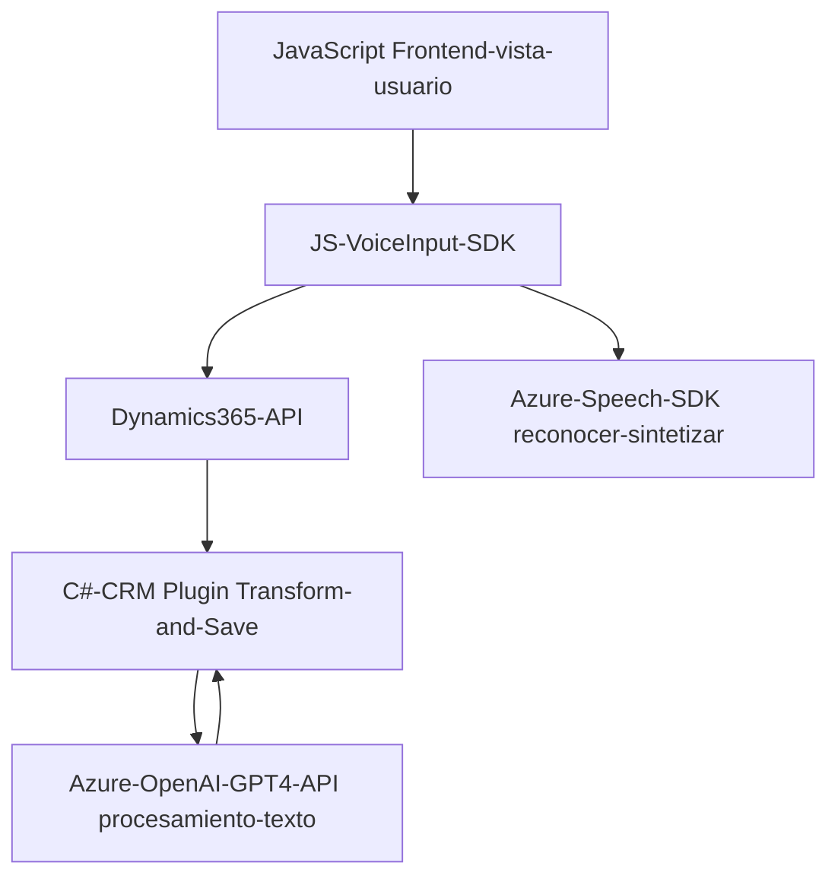

### Breve resumen técnico
La solución completa del repositorio implica una integración entre un **frontend JavaScript** con capacidades de accesibilidad y control por voz, y un **backend en Dynamics CRM** mediante plugins en C#. Utiliza servicios externos de **Azure**, como el **Azure Speech SDK** para reconocimiento y síntesis de voz, y el **Azure OpenAI GPT-4 API** para procesar texto.

---

### Descripción de la arquitectura
La arquitectura utilizada es una combinación de **n-capas** con un enfoque hacia la **arquitectura orientada a servicios (SOA)**. Esto se evidencia en la separación de responsabilidades entre el frontend (que proporciona una interfaz de usuario con capacidades avanzadas de accesibilidad y entrada por voz) y el backend (que gestiona la lógica de negocio integrada con Dynamics CRM y servicios en la nube de Azure). 

Cada capa cumple una responsabilidad clave:
- **Frontend**: Captura, procesa y sintetiza voz, mejorando accesibilidad.
- **Backend (plugin)**: Realiza transformaciones de datos mediante Azure OpenAI en Dynamics CRM.
- **Servicios externos**: Azure Speech SDK para voz y Azure OpenAI API para inteligencia artificial.

A pesar del uso de servicios externos y módulos diferenciados, la solución general está acoplada a Dynamics CRM mediante su SDK y plugins, lo que refleja elementos de un diseño monolítico especializado.

---

### Tecnologías usadas
1. **Frontend**:
   - Lenguaje: **JavaScript**.
   - SDK: **Azure Speech SDK**.
   - Framework: Puede integrarse en cualquier aplicación o sistema basado en web, como Dynamics CRM.

2. **Backend**:
   - Lenguaje: **C# (.NET Framework)**.
   - SDK/API: 
     - **Microsoft.Xrm.Sdk** (Dynamics CRM plugin).
     - **System.Net.Http** para peticiones REST.
     - **Azure OpenAI GPT-4 API** como servicio externo para procesamiento.
     - **Newtonsoft.Json.Linq** para manipulación JSON.
  
3. **Patrones**:
   - **Modularización**: Funciones bien definidas para tareas específicas.
   - **SOA**: Capa de servicios externos manejada por Azure APIs.
   - **Eventos y plugins en Dynamics CRM** para integrar y extender funcionalidad bajo el patrón **Plugin Design**.
   - Control basado en **eventos asíncronos**: La solución responde a la interacción del usuario y desencadena acciones como reconocimiento de voz o escritura en formularios.

---

### Diagrama Mermaid

---

### Conclusión final
La solución presentada es una arquitectura de software que integra capacidades modernas de voz, accesibilidad y procesamiento de texto diseñadas para extender las funcionalidades de Dynamics CRM mediante el uso de plugins en su backend. El sistema está basado en una estructura **SOA con integración de múltiples servicios externos de Azure**, y se encuentra alineado con buenas prácticas de modularización y encapsulación funcional. Sin embargo, existen riesgos como la gestión directa de claves API en los archivos de código, que deberían ser mitigados para garantizar la seguridad del sistema.