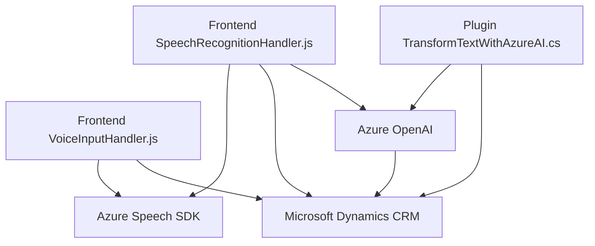

### Breve Resumen Técnico

El repositorio presentado contiene tres archivos principales:
1. **VoiceInputHandler.js**: Procesamiento de formularios dinámicos y síntesis de voz mediante Azure Speech SDK.
2. **SpeechRecognitionHandler.js**: Reconocimiento de voz y procesamiento de texto para actualizar formularios en Dynamics CRM.
3. **TransformTextWithAzureAI.cs**: Plugin para Dynamics CRM que transforma texto utilizando Azure OpenAI, estructurándolo en JSON según reglas.

El objetivo global del repositorio es integrar servicios de voz y procesamiento de texto mediante tecnologías de Azure y Dynamics CRM para automatizar la manipulación de datos en formularios.

---

### Descripción de Arquitectura

La arquitectura utilizada combina:
1. **Frontend Modular**: Los archivos JavaScript implementan funciones y módulos independientes que interactúan principalmente con formularios DOM y servicios externos como Azure Speech SDK y Dynamics CRM.
2. **Plugin Pattern**: El archivo de C# sigue el patrón de plugins de Dynamics CRM, permitiendo lógica personalizada durante el pipeline de ejecución.
3. **Integraciones de Servicio Orientadas a SOA**: Toda la lógica crítica utiliza servicios de Azure (Speech SDK, OpenAI) como capas externas que son integradas en los procesos.

En conjunto, aunque existe separación entre capas, el sistema es más **modular** que estrictamente n-capas o hexagonal. Las dependencias externas y el diseño orientado a eventos optimizan la capacidad de adaptar integraciones sin fuerte acoplamiento.

---

### Tecnologías Usadas

1. **Frontend**:
   - **Lenguaje**: JavaScript.
   - **Frameworks/Librerías**:
     - **Azure Speech SDK**: Síntesis y reconocimiento de voz.
     - **Microsoft Dynamics CRM API (`Xrm.WebApi` y `formContext`)**: Manipulación de formularios en Dynamics.

2. **Backend**:
   - **Lenguaje**: C# (.NET Framework).
   - **Frameworks/Librerías**:
     - **Microsoft.Xrm.Sdk**: Para extender funcionalidades en Dynamics CRM mediante plugins.
     - **Azure OpenAI**: Procesamiento y transformación de texto con servicios externos.
     - **HttpClient**: Envío de solicitudes REST.
     - **Newtonsoft.Json**: Manejo de JSON estructurado.

3. **Patrones de Diseño**:
   - **Asíncrona/Eventos**: Uso de Promesas y callbacks.
   - **Service-Oriented Architecture (SOA)**: Dependencia de servicios externos (Azure Speech y Azure OpenAI).
   - **Singleton para SDK Internos**: SDK de Azure Speech cargado y reutilizado bajo un único contexto.

---

### Diagrama Mermaid

---

### Conclusión Final

El repositorio presenta una solución que optimiza la interacción entre usuarios y formularios dinámicos (mediante voz) en sistemas empresariales basados en Dynamics CRM. La arquitectura modular y su integración con servicios de Azure la convierten en una herramienta flexible y extensible para aplicaciones centradas en automatización y accesibilidad.

Aspectos destacados:
- Uso eficiente de patrones asíncronos y servicios externos (Azure Speech, OpenAI).
- Modularidad bien definida en el frontend con funciones cohesionadas.
- Backend basado en plugins altamente capaz de integrar reglas específicas en Dynamics CRM.

La solución está bien orientada para casos de uso empresariales que involucren manipulación dinámica de datos mediante interfaces asistidas por voz y procesamiento semiautónomo con IA.