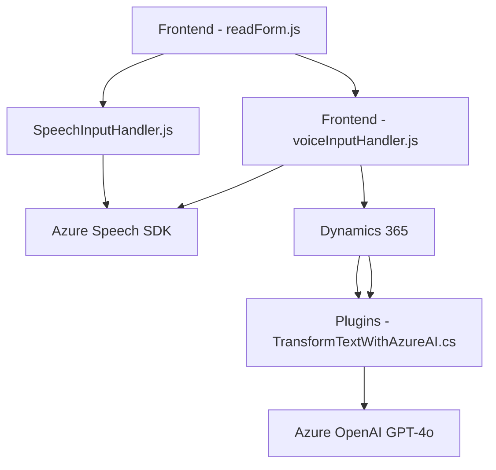

### Breve resumen técnico:
Este repositorio contiene diversos componentes diseñados para trabajar con formularios dinámicos, reconocimiento de voz, síntesis de texto a voz, y manipulación de datos en el contexto de Dynamics 365. Está altamente integrado con servicios externos, específicamente Azure Speech SDK y Azure OpenAI, para proporcionar interacción avanzada vía voz y procesamiento de datos mediante inteligencia artificial.

### Descripción de arquitectura:
La arquitectura empleada es híbrida:  
- **Multicapa (N capas):** Las funciones están separadas en diferentes capas lógicas: presentación (frontend), servicios externos (Azure Speech y OpenAI), interfaz con Dynamics CRM, y lógica del plugin.  
- **Service-Oriented Architecture (SOA):** Los servicios externos (Azure Speech y Azure OpenAI) amplían la arquitectura mediante APIs con alta modularidad.  
- **Modular arquitectura:** Cada módulo tiene una funcionalidad clara (captura/formulario dinámico, síntesis de texto a voz, transcripción, procesamiento por IA).  
- **Plugin Pattern** para la integración directa con Dynamics CRM.

### Tecnologías usadas:
1. **Frontend:**
   - JavaScript con integración dinámica vía SDKs externos (Azure Speech).
   - CDN de Azure Speech SDK (`https://aka.ms/csspeech/jsbrowserpackageraw`).
2. **Backend:**
   - **Dynamics CRM Framework:** Orientado a objetos, utiliza `IPlugin` para extensibilidad.
   - **Azure OpenAI GPT-4o API:** Para transformación avanzada de texto.
   - .NET Framework o .NET Core.
   - HTTP clients para integración REST con servicios externos.
   - `Newtonsoft.Json` y `System.Text.Json` para manejo de JSON.
3. **Patterns:**
   - Modularización.
   - Lazy loading para SDKs.
   - Service-Oriented Architecture (SOA).
   - Plugin pattern (IPlugin).
   - Client SDK pattern para las integraciones en Dynamics y Speech SDK.

### Dependencias o componentes externos:
1. **Azure Speech SDK:** Usado para síntesis y reconocimiento de voz.
2. **Azure OpenAI Services (Azure GPT-4o):** Para procesamiento de texto y estructuración en JSON.
3. **Dynamics CRM Web API:** Para integrarse y manipular datos y contextos del CRM.
4. **Libraries:**
   - `Newtonsoft.Json.Linq`: JSON handling for .NET.
   - `System.Text.Json`: Dynamics integration tailored.
   - `System.Net.Http`: Communication with REST APIs.
5. **CDN (Lazy Load):**
   - `https://aka.ms/csspeech/jsbrowserpackageraw`.

### Diagrama Mermaid válido para GitHub:

### Conclusión final:
La solución está compuesta por componentes de frontend orientados al usuario para capturar y sintetizar voz, además de plugins backend para Dynamics CRM que procesan datos utilizando servicios en nube. Su diseño hace uso de SOA y patrones de integración con servicios externos para lograr modularidad y extensibilidad. Es una solución adecuada para entornos corporativos que requieren capacidades avanzadas de interacción con formularios y datos en sistemas CRM.