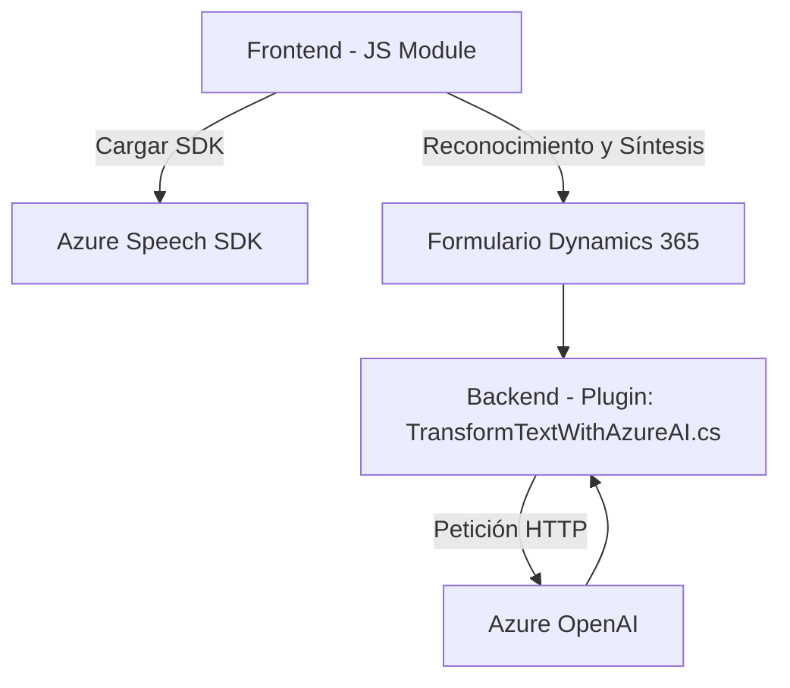

### Breve resumen técnico
Esta solución implementa una integración entre un **frontend** (usando JavaScript) y un **plugin backend** en el entorno de Microsoft Dynamics CRM. Ambas partes están diseñadas para trabajar en conjunto con servicios basados en IA y accesibilidad, haciendo uso de **Azure OpenAI** y **Azure Speech SDK** para realizar procesamiento de texto, transformación de datos, síntesis y reconocimiento de voz, proporcionando funcionalidades avanzadas en la interacción con formularios.

---

### Descripción de arquitectura
La arquitectura de esta solución es **modular** dentro de un entorno basado en una arquitectura orientada a servicios (**SOA**). El frontend utiliza un modelo de **modularización funcional**, integrando servicios de reconocimiento de voz y síntesis de texto (Azure Speech SDK), mientras que el backend consiste en **plugins** sobre Microsoft Dynamics CRM que procesan datos mediante servicios externos (Azure OpenAI).

Características:
1. **Frontend:** Interfaz comprometida con accesibilidad y reconocimiento de voz, que interactúa directamente con el usuario y datos del formulario.
2. **Plugin Backend:** Procesamiento avanzado de texto con integración de servicios externos como Azure OpenAI, que desacopla el procesamiento del propio entorno CRM.
3. **Desacoplamiento:** Las dos partes están implementadas como módulos autónomos, minimizando dependencias entre frontend y backend.
4. **Patrones empleados:**
   - **Carga dinámica:** En `ensureSpeechSDKLoaded` del frontend para cargar Azure Speech SDK solo cuando sea necesario.
   - **Delegación de servicios:** Uso de APIs externas para procesamiento avanzado (comunicación con Azure Speech y OpenAI).

---

### Tecnologías usadas
1. **Frontend:**
   - **JavaScript (Vanilla):** Para la lógica del cliente.
   - **Azure Speech SDK:** Para transcripción de voz y síntesis de texto a voz.
   - APIs del navegador (`document`, `window`) para manipulación del DOM y formularios en Dynamics 365.

2. **Backend (Plugin en Dynamics CRM):**
   - **C#:** Lenguaje de programación para el desarrollo del plugin, utilizando .NET Framework.
   - **Microsoft Dynamics CRM SDK:** Para interacción con los servicios y datos del CRM.
   - **Azure OpenAI:** Para procesar texto y generar estructuras JSON.
   - **Newtonsoft.Json:** Para trabajar con estructuras JSON.
   - **HttpClient:** Realización de solicitudes HTTP hacia servicios externos.

---

### Diagrama Mermaid

---

### Conclusión final
La solución es una implementación híbrida de **frontend y backend** con características avanzadas de accesibilidad y procesamiento de lenguaje natural. Utiliza tecnologías modernas de IA y servicios en la nube como **Azure Speech SDK** y **Azure OpenAI**, integrados en una arquitectura orientada a servicios. 
Aunque la solución es eficiente y modular, aspectos como gestión de secretos para credenciales API en el plugin podrían ser mejorados para cumplir con estándares de seguridad. La estructura permite escalabilidad y personalización para adaptarse a necesidades adicionales dentro del ecosistema de Dynamics CRM.