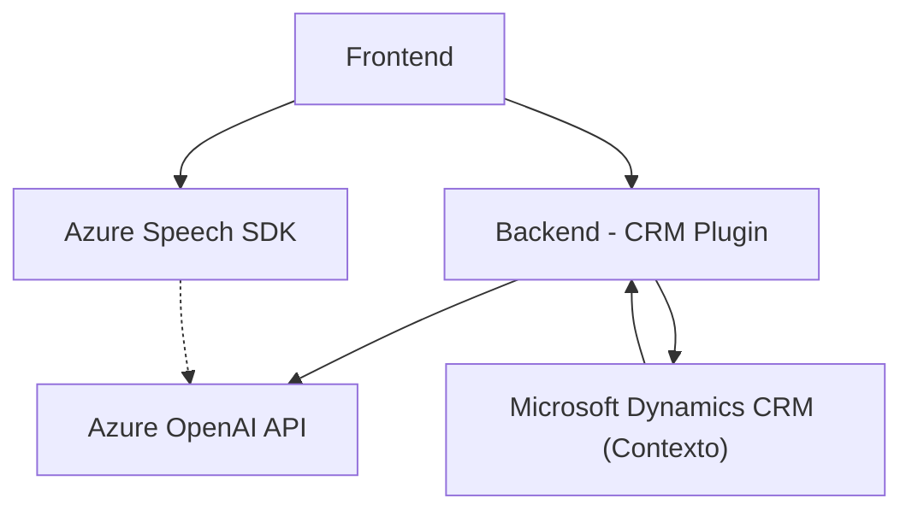

### Breve Resumen Técnico:
El repositorio presenta una solución centrada en la integración de capacidades avanzadas de voz y texto mediante Azure Cognitive Services y una API personalizada, con funcionalidades bien definidas para la interacción entre un frontend basado en JavaScript y una arquitectura de backend complementada con un plugin para Microsoft Dynamics CRM. Los componentes del sistema aplican tecnologías modernas enfocadas a la síntesis y recogida de voz, la inteligencia artificial y la manipulación de datos dinámicos en formularios.

---

### Descripción de Arquitectura:
La arquitectura presentada en el repositorio se conforma por:
1. **Frontend capa de presentación (JavaScript):**
   - Implementa funcionalidades relacionadas con el manejo de formularios y la síntesis/reconocimiento de voz mediante el SDK de Azure Speech.
   - Usa técnicas como lazy loading para cargar recursos dinámicamente (Azure Speech SDK).
   
2. **Backend capa lógica (Plugin de Dynamics CRM en C#):**
   - Consiste en un plugin extensible en el contexto de Dynamics CRM que actúa de intermediario entre el CRM y la API de Azure OpenAI.
   - Utiliza patrones SOA (Service-Oriented Architecture) para consumir servicios externos mediante Azure Cognitive Services.
   - Contiene mecanismos eficientes de manejo de JSON y solicitudes HTTP a la API externa.

**Tipo de arquitectura:**  
Aunque hay separación de capas entre frontend y backend, esta solución no aplica estrictamente principios de arquitectura basada en **n-capas** ni en sistemas desacoplados como **hexagonal**. Más bien, se orienta a un modelo híbrido de **arquitectura basada en servicios** (SOA) en combinación con un backend monolítico proporcionado por el sistema CRM.

---

### Tecnologías y Frameworks Usados:
1. **Frontend:**
   - **JavaScript:** Base para el desarrollo de funcionalidades relacionadas con formularios y reconocimiento/síntesis de voz.
   - **Azure Cognitive Services Speech SDK:** Utilizado para reconocimiento y generación de voz en tiempo real.
   - **API personalizada:** Para manejo de información avanzada vía inteligencia artificial (opcional).

2. **Backend:**
   - **C# y Microsoft Dynamics CRM (.NET Framework o .NET Core):** Construcción de plugins extendibles dentro de Dynamics CRM.
   - **Azure OpenAI API:** Para procesamiento de texto avanzado (API REST).
   - **Microsoft.Xrm.Sdk:** Integración con el modelo de Dynamics CRM.
   - **Newtonsoft.Json / System.Text.Json:** Para manipulación y parsing de datos JSON.
   - **HttpClient:** Para consumos HTTP y comunicación con APIs externas.

**Patrones de diseño principales:**
- **SOA:** Consumir servicios externos mediante APIs REST como el servicio Azure OpenAI.
- **Plugin Architecture:** Extensión de funcionalidad para sistemas CRM.
- **Modularidad:** División de responsabilidades funcionales (speakText, startVoiceInput, etc.) y adaptación dinámica del SDK.

---

### Dependencias y Componentes Externos Presentes:
1. **Azure Cognitive Services Speech SDK:** Para síntesis y reconocimiento de voz del lado del frontend.
2. **Microsoft Dynamics CRM API:** Uso de contexto del CRM con el ensamblado `Microsoft.Xrm.Sdk`.
3. **Azure OpenAI Service API:** Para procesamiento avanzado de texto conforme a las reglas definidas.
4. **JSON Libraries (Newtonsoft.Json, System.Text.Json).**
5. **Dynamic Web Resources:** Se presupone uso de recursos web dinámicos (`formContext`) dentro del entorno del CRM.

---

### Diagrama Mermaid Válido para GitHub:

---

### Conclusión Final:
La solución utiliza una arquitectura híbrida orientada a servicios para generar un flujo que conecta un frontend con capacidades de interacción de voz a un sistema de backend vinculado con Microsoft Dynamics CRM. La integración con servicios de la nube como Azure Speech SDK y Azure OpenAI optimiza las capacidades de manejo de texto y síntesis de voz.

Los archivos del código están bien organizados funcionalmente, con una estructura clara y uso adecuado de SDKs externos, APIs personalizadas y plugins. Los diseños aplican principios como el "lazy loading" para la optimización de recursos, el "adaptador" para manejar los datos del formulario, y una integración modular que es fácilmente escalable. Sin embargo, podrían beneficiarse de un mayor desacoplamiento, especialmente en la capa de presentación y la lógica de negocio.