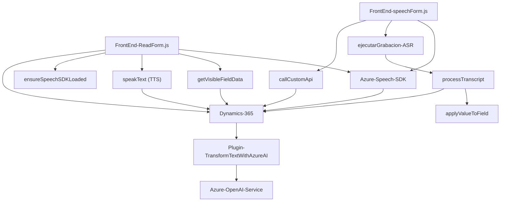

### Breve resumen técnico

Este repositorio contiene tres componentes principales, cada uno con una funcionalidad específica:

1. **`readForm.js`**: Implementa síntesis de texto a voz mediante el servicio Azure Speech SDK, leyendo datos visibles de formularios dinámicos en una interfaz de usuario.
2. **`speechForm.js`**: Proporciona una implementación para integrar entrada de voz y reconocimiento de texto mediante el mismo Azure Speech SDK, permitiendo actualizar formularios basados en trascripciones de voz.
3. **`TransformTextWithAzureAI.cs`**: Define un plugin para Microsoft Dynamics CRM que llama al servicio Azure OpenAI para transformar texto en estructuras JSON siguiendo reglas explícitas, útil para automatizar tareas.

### Descripción de arquitectura

La solución combina una arquitectura **n-capas** con elementos de **integración con servicios externos**. Las capas clave identificadas son:
- **Presentación (Frontend)**: Incluye capacidades de interacción de usuario mediante formularios en entorno web con mecanismos como reconocimiento de voz y síntesis de texto.
- **Lógica de negocio (Backend)**: Implementada mediante un plugin de Dynamics CRM que delega ciertas operaciones al servicio externo de Azure OpenAI para procesar contenido.
- **Servicios externos**: Uso de APIs y SDK externos como el **Azure Speech SDK** y el **Azure OpenAI Service** para funcionalidades avanzadas de inteligencia artificial y procesamiento de voz.

### Tecnologías usadas

1. **Frontend**:
   - **JavaScript**: Para desarrollar funcionalidades como procesamiento dinámico de formularios.
   - **Azure Speech SDK**: Realiza síntesis de texto a voz y reconocimiento de voz.
   - **Dynamics 365 SDK**: Se utiliza para el manejo de objetos y atributos en formularios en el frontend.

2. **Backend**:
   - **C#**: Lenguaje para el desarrollo del plugin en Dynamics CRM.
   - **Microsoft Dynamics CRM SDK**: Conexión con el sistema CRM.
   - **Azure OpenAI Service** (GPT): Modelo de procesamiento de lenguaje natural para transformar texto.
   - **System.Net.Http** y **System.Text.Json** para consumir APIs REST y trabajar con datos JSON.

**Patrones usados**:
- Modularización en funciones y clases claramente identificadas con responsabilidades específicas.
- **Event-driven** consta de callbacks para procesos asíncronos como la carga de SDK y manejo de reconocimiento/síntesis de voz.
- **External Service Integration** con servicios de Azure.
- **Factory Method** para la configuración y creación de instancias de SDK (como SpeechConfig).
- **Plugin Based Design** para integración con eventos en Dynamics 365.

### Diagrama **Mermaid** válido para GitHub

### Descripción del diagrama

El diagrama representa una arquitectura de capas enfocada en la interacción entre el Frontend (zona de usuario), el Backend (diferentes servicios y plugins), y los servicios externos (Azure Speech y Azure OpenAI). Los dos archivos de JavaScript (`readForm.js` y `speechForm.js`) están en la capa Frontend, mientras que el archivo de C# (`TransformTextWithAzureAI.cs`) está en la capa Backend. Ambas se integran con servicios externos (Azure Speech SDK y Azure OpenAI).

### Conclusión final

La solución propuesta es un sistema diseñado para integrar capacidades avanzadas de procesamiento de voz y texto en un entorno Dynamics 365. Utiliza arquitecturas modernas y combina tecnologías frontales como JavaScript y servicios externos (Azure Speech SDK) con lógica de negocio implementada en C# y apoyada en la integración con Azure OpenAI Service. La arquitectura sigue una **estructura n-capas**, mientras que los patrones empleados (modularización, event-driven programming, y plugin-based design) promueven un código limpio, reutilizable y fácil de mantener.

