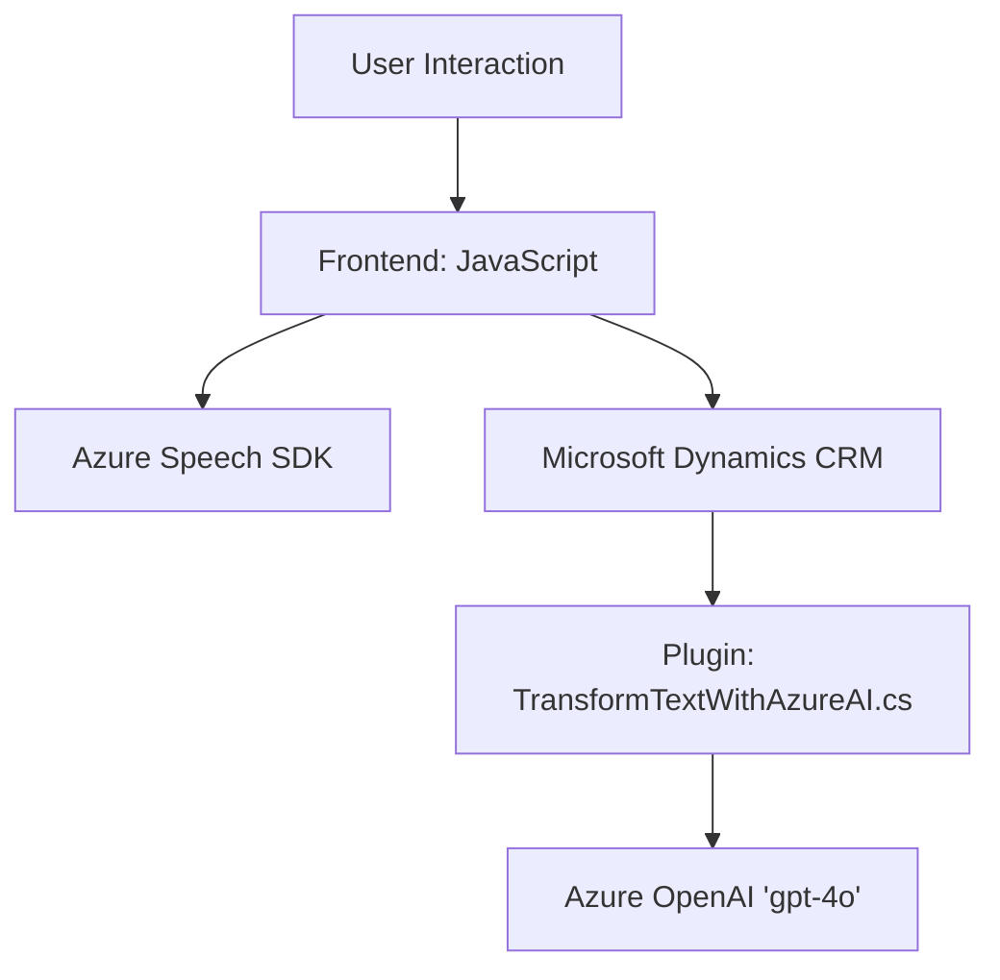

# Análisis del Repositorio

### Breve resumen técnico
El repositorio contiene diversos componentes que se integran para ofrecer un sistema de interacción entre usuarios y formularios digitales, a través de entrada de voz y salida auditiva. Se construye sobre:
- **Microsoft Dynamics CRM**: Contexto para trabajar con formularios y ejecutar plugins.
- **Azure Speech SDK**: Realiza sintetización de voz y reconocimiento de entrada de voz.
- **Azure OpenAI**: Plugin basado en C# que transforma texto acorde a normas específicas mediante un modelo de lenguaje avanzado.

La solución implementa una arquitectura modular y una integración orientada al uso de APIs externas.

---

## Descripción de arquitectura
La arquitectura del sistema presenta las siguientes características:
1. **N capas**:
   - **Capa de presentación** (Frontend/JS): Manejo de interacción con los formularios mediante voz (lectura y reconocimiento).
   - **Capa lógica de negocio** (Plugins): Extensión de funcionalidad de Microsoft Dynamics CRM utilizando plugins.
   - **Capa de servicios externos**: Azure Speech SDK para voz y Azure OpenAI para transformación avanzada de texto.

2. **Integración de APIs externas**: El diseño se basa en aprovechar Azure Speech SDK y Azure OpenAI, lo que potencia la modularidad y reduce la sobrecarga de implementación de lógica propietaria.

3. **Modularidad Funcional**:
   - Cada componente (JS y CS) tiene una responsabilidad claramente definida.
   - Uso de funciones específicas para gestionar la carga dinámica de SDKs y realizar interacciones.

4. **Patrones identificados**:
   - **Callback Handling**: Las dependencias como Azure SDK son cargadas de manera dinámica, asegurando la ejecución sin interrupciones.
   - **Abstracción de Servicios**: El plugin funciona como una integración entre Dynamics y Azure OpenAI, procesando texto bajo normas predefinidas.
   - **Plugin Architecture**: Uso de los mecanismos de extensibilidad de Microsoft Dynamics para interactuar con el CRM.

5. El sistema se puede considerar un **híbrido entre arquitectura de n capas y de microservicios**, dada la interacción modular y la comunicación mediante APIs externas.

---

### Tecnologías Usadas
1. **Microsoft Dynamics CRM**: Contexto de los formularios y ejecución de acciones del sistema.
2. **Microsoft Azure Speech SDK**: Para reconocer voz y sintetizar texto a voz.
3. **Microsoft Azure OpenAI** (gpt-4o modelo): Transformación y procesamiento avanzado de texto basado en IA.
4. **JavaScript**: Para implementar funciones de interacción entre voz/formularios en el lado del cliente.
5. **C#**: Implementación de lógica de negocio en un plugin.
6. **HTTP API Calls**: Para interactuar con servicios externos (Speech SDK y OpenAI).
7. **Newtonsoft.Json** y **System.Text.Json**: Manejo de datos JSON para la comunicación externa.

---

### Dependencias o componentes externos presentes
1. **Azure Speech SDK**: Utilizado en los archivos de frontend para reconocimiento y síntesis de voz.
2. **Azure OpenAI**: Utilizado en el plugin Dynamics para procesar texto.
3. **Xrm.WebApi.online**: Funcionalidad de Dynamics CRM para interactuar con registro y servicios.
4. **HttpClient**: Utilizado en el plugin para enviar solicitudes HTTP a Microsoft Azure.
5. **Newtonsoft.Json**: Biblioteca para manejar JSON estructurado en C#.
6. **Variables de entorno o secretos**: Claves de acceso como `apiKey` deben ser protegidas mediante herramientas como Azure Key Vault o similares.
   
---

### Diagrama Mermaid compatible con GitHub Markdown

---

### Conclusión Final
La solución implementada en este repositorio es una arquitectura híbrida basada en n capas con integración modular de servicios externos (Azure SDKs y OpenAI). Los archivos presentados exhiben principios importantes de diseño como separación de responsabilidades, modularidad y abstracción. Sin embargo, hay consideraciones de seguridad en cuanto al manejo de claves API que deberían ser refinadas.

El sistema puede escalar al incorporar nuevas funcionalidades bajo el mismo esquema de plugins/modularidad y se alinea con estándares modernos de software que priorizan la reusabilidad y la compatibilidad con frameworks externos.