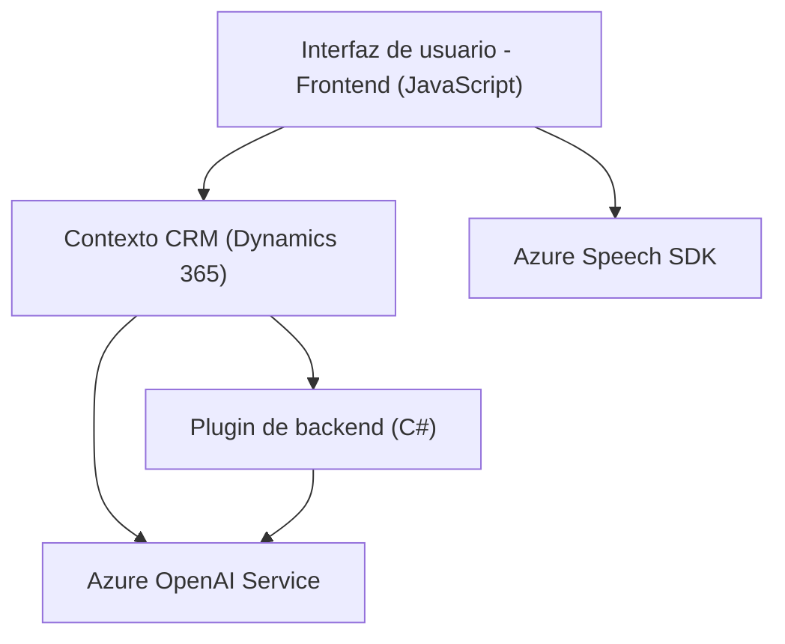

### Breve resumen técnico

Los archivos presentados forman parte de una solución que integra dinamismo entre un sistema CRM (Dynamics 365), procesamiento de texto mediante Azure Speech SDK y un servicio utilizando Azure OpenAI para transformar datos. 

Los componentes principales incluyen un frontend desarrollado en JavaScript para manejar interacción con el usuario (voz-síntesis y transcripción), acompañado por un plugin de backend en C# integrado en Dynamics CRM para transformar texto mediante reglas específicas usando AI.

### Descripción de arquitectura

#### Componentes:
- **Frontend** (JavaScript): Está altamente desacoplado y gestiona la interacción de usuario y voz. La modularidad depende de funciones encargadas de síntesis, transcripción y mapeo entre datos del formulario y el contexto CRM. 
- **Backend Plugin** (C# para Dynamics CRM): Utilizado para lógica extensible del CRM, transformando texto con Azure OpenAI y operaciones del sistema a través de su contexto API.

#### Arquitectura:
- Principalmente se observa un **patrón n-capas**:
  - Capa 1: **Interfaz de usuario (frontend)** maneja transcripción y datos visuales.
  - Capa 2: **Backend (plugin)** implementa reglas y delega procesamiento avanzado a servicios Azure (Speech y OpenAI).
  - Capa 3: **Azure Services** para AI y voz, actuando como dependencias externas en la integración.

Adicionalmente, el desacoplamiento entre las capas favorece una integración híbrida entre el sistema CRM y servicios independientes basados en la nube.

### Tecnologías usadas

1. **JavaScript**
   - Funciones principales basadas en Azure Speech SDK.
   - Llamadas API (Dynamics CRM y Azure).
   - Modularidad en funciones de manejo de lógica.

2. **C#**
   - Backend para plugins en Dynamics CRM.
   - Integración directa con Azure OpenAI para procesamiento.
   - Manejo de interacción HTTP utilizando `System.Net.Http`.

3. **Azure Speech SDK**
   - Servicio para síntesis de voz en frontend.
   - Reconocimiento y transcripción de voz en tiempo real.

4. **Azure OpenAI Service**
   - Procesamiento de datos complejos mediante modelos de lenguaje GPT.
   - Endpoints HTTP integrados con el backend CRM.

5. **Microsoft Dynamics CRM SDK**
   - Proveedor del contexto ejecutivo (formulario, lógica).
   - API para operaciones CRUD y extensibilidad modular.

6. **Newtonsoft.Json / System.Text.Json**
   - Procesamiento envolvente de mensajes JSON.

### Diagrama Mermaid válido para GitHub

### Conclusión final

La solución presentada exhibe una integración moderna entre un sistema cliente (Dynamics CRM), frontend modular (JavaScript), y servicios cloud (Azure Speech y OpenAI). Su arquitectura de n-capas asegura que cada componente cumpla una función bien definida, reduciendo dependencias acopladas y fomentando escalabilidad.

El uso de patrones como la **single responsibility** en las funciones asegura mantenimiento y adaptabilidad, lo que lo convierte en una implementación eficiente para casos de uso como la interacción con datos en formularios de CRM utilizando voz, transcripción y transformación automática con inteligencia artificial.