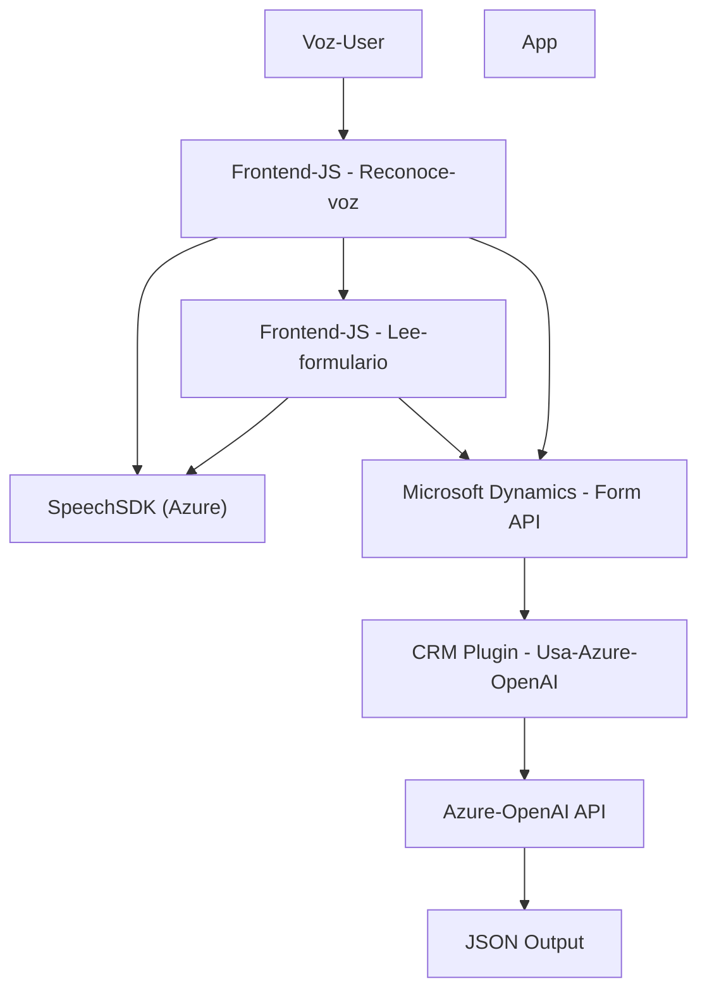

### Breve resumen técnico:
Esta solución consiste en una **aplicación que extiende una plataforma CRM**, integrando funcionalidades avanzadas de **reconocimiento de voz** y **procesamiento de lenguaje natural** mediante servicios de **Azure Speech SDK y Azure OpenAI**. Combinando archivos JS (frontend) y plugins .NET (backend), logra enriquecer los formularios del CRM con interacción por voz, automatización de datos y transformación de texto con inteligencia artificial.

---

### Descripción de arquitectura:
1. **Tipo de solución:**
   - Una solución híbrida que integra **backend** (Plugins de CRM en .NET) y **frontend** (JavaScript para formularios).
   - La funcionalidad de Plugins se orienta al procesamiento y transformación de datos mediante servicios de Azure OpenAI.
   - La capa frontend se especializa en el reconocimiento de voz y la conversión texto-a-voz usando Azure Speech SDK.

2. **Patrones y arquitectura:**
   - **Arquitectura de n capas:**
     - Capas separadas para lógica de negocio, integraciones API externas y presentación.
   - **Cliente-Servidor:** Interacción cliente (JavaScript en el navegador) que invoca servicios y complementos alojados en el servidor.
   - **Plugin Pattern:** Los Plugins .NET extienden las capacidades de Dynamics CRM.
   - **Microservicio-like**: En la integración con servicios como Azure OpenAI.

---

### Tecnologías utilizadas:
1. **Frontend JS:**
   - **Azure Speech SDK:** Reconocimiento de voz y síntesis de texto-audio.
   - **Xrm.WebApi:** API para integrar con Dynamics CRM y realizar operaciones sobre formularios.

2. **Backend Plugins (.NET):**
   - **Microsoft Dynamics SDK**: Extensión básica para plugins mediante `IPlugin`.
   - **Azure OpenAI (GPT-4)**: Procesamiento de texto mediante una API Hosted en Azure.
   - **Newtonsoft.Json**: Manipulación avanzada de estructuras JSON.
   - **System.Net.Http**: Solicitudes HTTP hacia API externas.
   - **System.Text.Json:** Serialización de datos para cumplir con el formato esperado por la API.

---

### Dependencias o componentes externos:
1. **Azure Speech SDK**: Necesario para funcionalidades de reconocimiento de voz y síntesis de audio.
2. **Azure OpenAI Service**:
   - Procesa texto usando modelos GPT.
   - Se integra vía API.
3. **Microsoft Dynamics CRM**:
   - Brinda integración con formularios mediante la estructura base de entidades.
4. **Xrm.WebApi**: Para operaciones estándar en el backend de Dynamics.
5. Posibles APIs customizadas alojadas en Microsoft Dynamics para procesamiento adicional.

---

### Diagrama Mermaid:

---

### Conclusión final:
La solución descrita en el repositorio muestra una implementación altamente dinámica y moderna para optimizar la experiencia de usuario en un CRM con formularios interactivos. Las principales ventajas radican en la habilidad de capturar y procesar entradas mediante voz, sintetizar audio y transformar texto con inteligencia artificial. El uso de un enfoque **n capas** ofrece flexibilidad y separación de responsabilidades, mientras que la integración de servicios en la nube como Azure Speech y OpenAI indica la adopción de tecnologías líderes para el manejo de voz y procesamiento de lenguaje natural. Se recomienda una revisión de seguridad para almacenamiento de credenciales como la clave API y posibles mejoras en la gestión de dependencias externas.