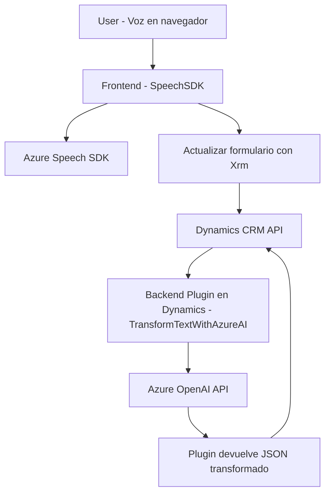

### Breve Resumen Técnico  
El repositorio implementa una solución híbrida que conecta el frontend de Dynamics utilizando **Azure Speech SDK** para procesar voz, mientras que también incluye un plugin backend basado en `C#` con integración hacia Azure OpenAI para realizar transformaciones de texto avanzadas. El objetivo general es mejorar la interactividad en formularios de Dynamics mediante entrada y salida por voz, junto con procesamiento de inteligencia artificial.

---

### Descripción de Arquitectura  
La arquitectura propuesta sigue un **modelo híbrido compuesto por n capas**, con las siguientes características:

1. **Frontend:** Interacciones con lógica cliente que se ejecutan en el navegador. Los scripts **JavaScript** utilizan **Azure Speech SDK** para manejar reconocimiento de voz, síntesis de voz y actualizaciones dinámicas en el formulario de Dynamics.
2. **Plugins en Backend:** El plugin desarrollado en **C#** opera dentro del ecosistema de **Dynamics CRM** usando **Azure OpenAI API** como microservicio para transformaciones avanzadas.
3. **Integración con Servicios Externos:** Depende directamente de APIs de Azure (Azure Speech SDK y OpenAI) para funcionalidades críticas como reconocimiento y síntesis de voz, además de generación de contenido por IA.
4. **Desacoplamiento:** Los módulos frontend y backend están desacoplados, y las interacciones entre ellos parecen estar centralizadas en la API de Dynamics y Azure.

Los archivos se conectan mediante un flujo basado en **eventos y plugins** donde los scripts en el frontend llaman al SDK de Azure Speech y las respuestas se procesan para actualizar formularios de Dynamics. Por otro lado, los datos pueden ser enviados al plugin de backend, que los procesa mediante la IA de Azure.

---

### Tecnologías Utilizadas  
1. **Frontend (JavaScript):**
   - **Azure Speech SDK:** Reconocimiento y síntesis de voz.
   - **Dynamics CRM Libraries (`Xrm`):** Manejo del frontend y formularios en Dynamics CRM.
   - **Promises y Callbacks:** Manejo asincrónico para carga de SDK y manejo de eventos.

2. **Backend (C#):**
   - **Microsoft.Xrm.Sdk:** Framework para desarrollo de plugins en Dynamics CRM.
   - **Azure OpenAI API:** Servicio de generación y transformación de texto usando GPT-4.
   - **Newtonsoft.Json y System.Text.Json:** Para manejo de objetos JSON.
   - **System.Net.Http:** Para realizar solicitudes HTTP al endpoint de Azure OpenAI.

3. **Patrones:**
   - **Callback y Promises:** En frontend para asegurar carga asincrónica de SDK.
   - **SRP (Single Responsibility Principle):** Funciones claramente delimitadas por fin único en todos los archivos.
   - **Adaptador:** Traducción de comandos hablados y proceso de transcripción en la interacción por voz.
   - **Plugin Architecture:** En backend, la clase implementa `IPlugin` como estándar en Dynamics.

---

### Diagrama **Mermaid**  
Este diagrama representa el flujo de interacción entre elementos del sistema. Sigue las reglas solicitadas.

---

### Conclusión Final  
La solución presentada está orientada a mejorar la funcionalidad de formularios en Dynamics CRM mediante dos enfoques principales:  
1. **Interacción por voz:** Se usa speech-to-text y text-to-speech con Azure Speech SDK para proporcionar accesibilidad e interactividad.  
2. **Transformación con IA:** Utilizando Azure OpenAI API, el plugin backend transforma contenido según reglas específicas y lo reintegra al sistema, demostrando un uso eficaz de inteligencia artificial.

Aunque el diseño arquitectónico está bien estructurado y desacoplado, es crítico asegurar la seguridad de las claves y conocer las limitaciones de las APIs externas. En general, la solución logra una integración eficiente entre frontend, backend y servicios externos, implementando una arquitectura moderna y escalable.