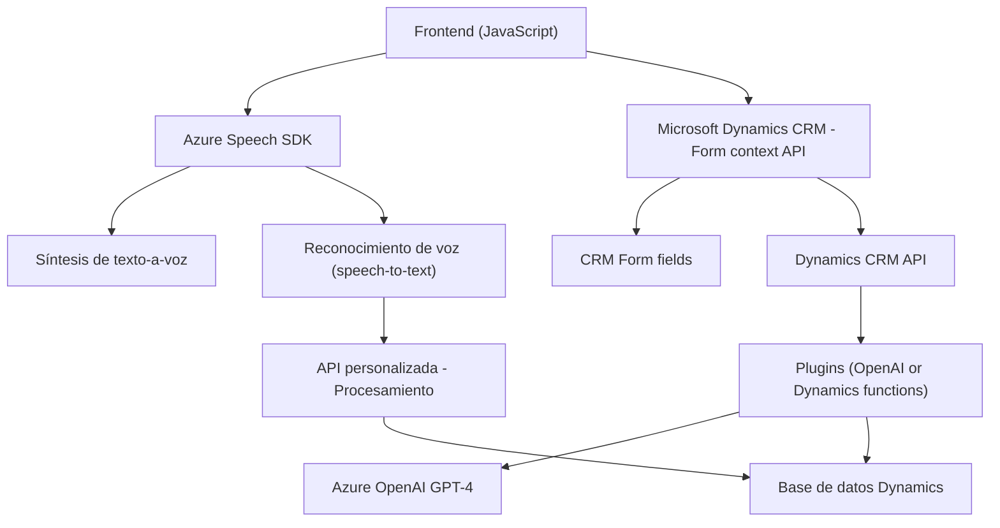

**Breve resumen técnico:**  
La solución en cuestión implementa funcionalidades web y de backend que integran tecnologías como Azure Speech SDK y Azure OpenAI para permitir el reconocimiento de voz, síntesis de texto a voz y transformación de texto en JSON estructurado en el contexto de formularios basados en Microsoft Dynamics CRM. La arquitectura es de tipo híbrido, combinando elementos monolíticos y microservicios con patrones de diseño como la delegación, modularización y la integración con servicios externos.

---

**Descripción de arquitectura:**  
La arquitectura combina una solución *n capas* para el frontend y backend, utilizando optimizaciones específicas como *lazy loading* y patrones de *delegación* en JavaScript. El backend implementa un modelo de microservicio para la integración con APIs externas (Azure OpenAI, Azure Speech SDK). Este enfoque modular favorece la interacción entre los componentes mediante APIs y SDKs dinámicos, lo que lo hace flexible y extensible.

El sistema está orientado a eventos, ya que depende de activadores en Dynamics CRM y de la interacción usuario-formulario en tiempo real. La capa de backend actúa como un intermediario entre Dynamics 365 y los servicios de Azure.

---

**Tecnologías usadas:**  
1. **Frontend:**
   - **JavaScript (JS):** Control de formularios e integración SDK.
   - **Azure Speech SDK:** Síntesis de voz y reconocimiento de audio.
   - DOM Manipulation APIs: Creación e interacción con elementos HTML dinámicos.

2. **Backend:**
   - **Microsoft Dynamics CRM SDK:** Interacción y programación de plugins personalizados.
   - **Azure OpenAI (GPT-4):** Procesamiento de lenguaje natural y conversión de texto a JSON estructurado.
   - **System.Net.Http y System.Text.Json:** Llamadas HTTP al API de Azure y manipulación/serialización de objetos JSON.
   - **Newtonsoft.Json.Linq:** Manejo avanzado de datos en formato JSON.

3. **Patrones de diseño:**
   - **Delegación:** Funciones altamente especializadas que distribuyen tareas específicas a módulos o funciones dedicadas.
   - **Lazy Loading:** SDK cargado dinámicamente cuando es necesario.
   - **Event-driven programming:** Interacción basada en triggers de eventos de usuario o API.
   - **Microservice proxy pattern:** Backend que ejecuta llamadas hacia Azure OpenAI como capas independientes.

---

**Diagrama Mermaid:**  

---

**Conclusión final:**  
La solución propuesta es un sistema interactivo web y backend que utiliza una combinación de front-end dinámico y servicios en la nube como Azure OpenAI y Azure Speech SDK. Es un sistema con arquitectura híbrida que combina módulos de una arquitectura *n capas* en el frontend con microservicios para la integración de las APIs externas en el backend. El uso claro de tecnologías como Dynamics CRM, Azure Speech SDK y Azure OpenAI le otorgan a la solución capacidades inteligentes como síntesis de voz, reconocimiento de audio y procesamiento avanzado de lenguaje natural.