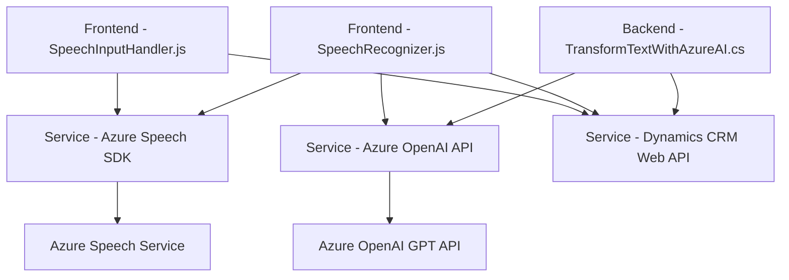

## Breve resumen técnico

El repositorio detalla la implementación de una solución que integra funcionalidades de entrada y salida de voz, reconocimiento de voz, procesamiento de datos asociados con formularios dinámicos en un frontend basado en Dynamics CRM y un plugin para procesamiento de texto vía Azure OpenAI. Las principales características giran en torno a la interacción de servicios de Microsoft Azure y APIs en un modelo integrado que parece atender flujos conversacionales y manejo de datos en tiempo real.

## Descripción de arquitectura

La arquitectura se presenta con un enfoque **cliente-servidor**, compuesto por:
1. **Frontend:** Utiliza JavaScript para manejar eventos y lógica sobre formularios de Dynamics CRM, integrando funcionalidades de Azure Speech SDK para síntesis y reconocimiento de voz.
2. **Backend:** Incluye un plugin (.NET C#) desarrollado para Dynamics CRM que extiende el poder de la plataforma CRM con Azure OpenAI para transformar e interpretar textos procesados desde el cliente.

La arquitectura es de **n capas**, puesto que los componentes están organizados con:
- Lógica de presentación (interacción de usuario en el frontend usando formularios).
- Lógica de aplicación (procesamiento y reconocimiento de datos, integración con APIs externas).
- Lógica backend con servicios conectados (plugins de Dynamics CRM para análisis e interacción con Azure).

## Tecnologías usadas

### Frontend:
- **JavaScript**:
  - Dinamismo en el manejo de eventos del formulario en tiempo real.
  - Carga dinámica del SDK de Azure Speech (https://aka.ms/csspeech/jsbrowserpackageraw).
- **Azure Speech SDK**:
  - Síntesis de voz, reconocimiento de texto por voz, interacción con claves de suscripción.
- **Dynamics CRM Web API (Xrm.WebApi)**:
  - Manejo de datos y manipulación de formularios en Dynamics CRM desde el cliente.

### Backend:
- **C# usando Microsoft Dynamics CRM SDK**:
  - Extensiones del CRM mediante plugins (implementación del patrón de integraciones de Dynamics).
- **Azure OpenAI Service**:
  - Procesamiento de texto con modelos como GPT para generación del contenido JSON y soporte a reglas predefinidas.
- Dependencias de .NET, tales como `System.Net.Http` y `System.Text.Json`.

### Patrones detectados:
- *Responsabilidad única:* Cada archivo (frontend/backend) tiene un objetivo claro y bien estructurado con separación de funcionalidades específicas.
- *Carga dinámica de dependencias:* Uso de JavaScript para verificar y cargar SDKs necesarios en tiempo de ejecución.
- *Integración externa:* Comunicación con servicios de Microsoft Azure y APIs propias de Dynamics CRM.

## Diagrama Mermaid válido para GitHub

Este diagrama representa una solución integrada mediante componentes frontend, backend y servicios externos.

## Conclusión final

La solución está diseñada para manejar la interacción entre usuarios y formularios mediante un sistema sofisticado de entrada/salida de voz y reconocimiento de voz. Con apoyo del SDK de Azure Speech y servicios como Dynamics CRM Web API, se extienden las capacidades de síntesis y procesamiento de datos en el cliente. En el backend, la arquitectura utiliza plugins personalizados para enriquecer los datos con una poderosa integración con Azure OpenAI. Esto crea un flujo basado en servicios y capas que conecta la lógica del cliente y servidor mediante APIs externas, con un diseño modular y escalable ideal para sistemas empresariales.