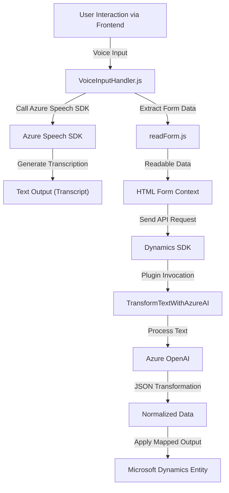

### Breve resumen técnico
El repositorio contiene tres archivos principales que implementan interacciones con formularios en una solución de Microsoft Dynamics 365 mediante el Azure Speech SDK y servicios de inteligencia artificial como Azure OpenAI. El objetivo principal es procesar textos (por voz o texto ingresado) para realizar operaciones en formularios, aplicando accesibilidad, reconocimiento de voz y transformación de datos con APIs personalizadas y servicios de IA.

---

### Descripción de arquitectura
La arquitectura se basa en un modelo híbrido que mezcla una **capa de integración con servicios externos** (Azure AI y Speech SDK) que se utilizan para lectura, procesamiento y transformación de texto, junto con una **capa de lógica de negocio personalizada** implementada como plugins dentro de Dynamics 365. Los archivos están claramente divididos según su función:
1. **Frontend-speech interaction**: Permite reconocimiento de voz e interacción directa con formularios.
2. **Plugin for transformation**: Procesa datos y conecta Dynamics 365 con Azure OpenAI.

La solución puede clasificarse como un modelo **N-capas** con integración basada en servicios externos para áreas específicas (Speech SDK y OpenAI). Presenta doble flujo de datos:
- Usuario interactúa directamente con la interfaz para realizar acciones basadas en voz.
- Microsoft Dynamics recibe eventos que invocan el plugin para transformar texto mediante normas de negocio.

---

### Tecnologías y frameworks utilizadas
1. **Frontend (JavaScript):**
   - **Azure Speech SDK**: Para reconocimiento y síntesis de voz.
   - DOM Manipulation: Generación dinámica de `script` y acceso al DOM.
2. **Backend (C# Plugin):**
   - **Microsoft Dynamics SDK (`Microsoft.Xrm.Sdk`)**: Facilita la interacción con el modelo de entidad de Dynamics 365.
   - **Azure AI (Open AI Service)**: Usado para interactuar con modelos de IA GPT para transformar texto.
   - **Newtonsoft.Json**: Manejo dinámico de JSON.
   - **System.Net.Http**: For HTTP requests to Azure OpenAI.

---

### Diagrama Mermaid válido para GitHub

---

### Conclusión final
Este repositorio implements a **multi-layer** architecture combining client-side interactions (JavaScript) and server-side plugins (C#). It primarily uses external services to enhance functionality:
- Frontend leverages **Azure Speech SDK** for voice detection and synthesis, improving accessibility.
- Backend integrates **Azure OpenAI** for text transformation, catering to enterprise needs with AI-enriched inputs.
- Microsoft Dynamics 365 serves as the orchestrator handling events and applying transformed data.

The solution exhibits clear modularity, separation of concerns, and a reliance on external services. While this ensures flexibility and modern capabilities, it introduces dependencies on Azure's cloud services for critical functionalities.