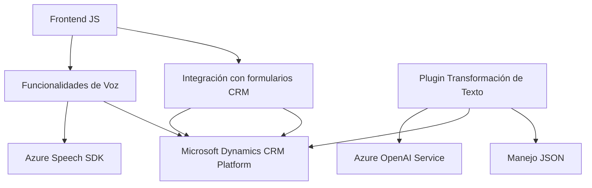

### Análisis Técnico

#### Breve Resumen Técnico
El repositorio contiene tres componentes clave que se pueden inferir:
1. Funciones de frontend destinadas a procesar el texto y la voz con integraciones en formularios CRM.
2. Funcionalidades de integración de voz mediante Azure Speech SDK.
3. Un plugin basado en C# que utiliza Azure OpenAI para enriquecer textos y producir estructuras procesadas en Microsoft Dynamics CRM.

Cada archivo aplica principios específicos de diseño moderno y explota tecnologías avanzadas como Azure SDK (Speech y OpenAI), junto con estructuras propias de Microsoft Dynamics CRM.

---

### Descripción de Arquitectura
La solución combina elementos de distintas arquitecturas:
1. **En el frontend:** La arquitectura está diseñada como una integración orientada a servicios dentro de una plataforma modular de frontend. Se integra con formularios dinámicos de CRM usando decisiones orientadas por eventos (event-driven).
2. **Plugin:** Realiza una separación clara de responsabilidades y sigue el patrón clásico de plugins en Dynamics CRM. Su arquitectura encapsula funcionalidades específicas de integración con Azure OpenAI mediante un diseño desacoplado, actuando como un microservicio que consume una API externa.

Por tanto, la solución global tiene características de **arquitectura orientada a servicios (SOA)** con un enfoque centralizado alrededor del ecosistema Dynamics CRM.

---

### Tecnologías Usadas
1. **Frontend:**
   - **Lenguaje:** JavaScript (algunas partes pueden ser TypeScript si no explícitamente declaradas).
   - **Azure Speech SDK:** Para síntesis y reconocimiento de voz.
   - **Microsoft Dynamics CRM APIs:** Manejo mediante `executionContext` y estructuras propias del CRM.
2. **Backend Plugin:**
   - **Lenguaje:** C#.
   - **Microsoft Dynamics SDK:** Para lógica CRM y manejo del contexto de datos.
   - **Azure OpenAI Service:** Para enriquecimiento y procesamiento semántico de texto.
   - **NewtonSoft.Json / System.Text.Json:** Para manejo y estructuración de objetos JSON.
3. **Patrones:**
   - Modularización de funciones.
   - Eventos y Promises (en frontend).
   - Plugin y Delegación de Responsabilidades (backend).

---

### Dependencias y Componentes Externos
1. **Azure Speech SDK:** Necesario para la síntesis de voz y reconocimiento.
2. **Microsoft Dynamics CRM:** Base del entorno de trabajo para formularios y datos.
3. **Azure OpenAI Service:** Usado en el plugin de C# para procesamiento semántico de texto.
4. **API Personalizada para reconocimiento semántico:** En frontend, integra una API externa que podría ser interna en Dynamics o desplegada independientemente.
5. **JSON Libraries (NewtonSoft, System.Text.Json)**: Para manejo avanzado de datos estructurados.

---

### Diagrama Mermaid

---

### Conclusión Final
La solución combina funcionalidades avanzadas de voz y procesamiento de lenguaje natural con una integración profunda en el ecosistema de Microsoft Dynamics CRM. Su arquitectura es híbrida y orientada a servicios, destacando patrones de diseño modernos como modularidad, eventos y delegación clara de responsabilidades. La dependencia principal en Azure Speech y OpenAI refuerza su enfoque hacia tecnologías de inteligencia artificial y servicios en la nube.