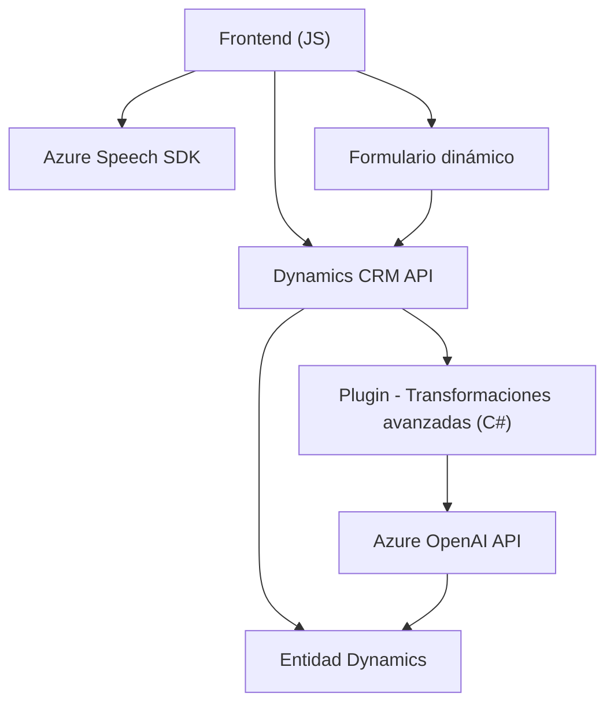

### Resumen técnico:
El código presentado en los archivos del repositorio describe un sistema híbrido que integra un **frontend** funcional y **plugins de backend** en el contexto de Dynamics CRM. Utiliza funcionalidades de Azure (Speech SDK y OpenAI) para sintetizar voz y procesar texto con inteligencia artificial.

### Descripción de arquitectura:
#### Tipo de solución:
Este es un sistema **modular** que combina diferentes capas de interacción con Microsoft Dynamics CRM:
1. **Frontend:** Archivos basados en JavaScript que implementan lógica de interacción de usuario, utilizando Dynamics CRM y servicios de Azure Speech para sintetizar datos de voz.
2. **Backend:** Plugins en C# diseñados como extensiones de Dynamics CRM que procesan texto con Azure OpenAI.

#### Tipo de arquitectura:
- **Multi-capas:** El sistema sigue una arquitectura basada en capas donde:
  - **Capa 1:** Interfaz (Reactiva y dinámica) basada en Dynamics CRM con lógica de frontend (JavaScript).
  - **Capa 2:** Plugins del backend (C#) utilizando Dynamics CRM SDK para procesamiento avanzado (texto con Azure OpenAI).
  - **Capa 3:** Servicios externos (Azure Speech, Azure OpenAI) configurados para interactuar con datos del sistema.

#### Integración:
- Fuertes dependencias con **Azure** para servicios cognitivos y APIs.
- Uso de la **Dynamics CRM API** para manipular formularios y datos.

### Tecnologías usadas:
1. **Frontend:**
   - **JavaScript (ES6):** Punto de entrada para interacción de usuario y lógica de negocio básica.
   - **Azure Speech SDK:** Procesamiento de entrada de voz y sintetización de texto.
   - **Dynamic CRM API:** Manipulación de campos y atributos de formularios.
   - **DOM Manipulation:** Carga dinámica del SDK de Azure Speech.

2. **Backend:**
   - **C# Plugins:** Extiende la funcionalidad del CRM con lógica personalizada.
   - **Azure OpenAI:** Transformación inteligente de texto.

3. **Servicios externos:**
   - **REST API:** Llamadas a servicios externos y manejo de respuestas JSON.
   - **Dynamics CRM SDK:** Comunicación directa con entidades y operaciones del CRM.

### Dependencias externas o componentes:
- **Azure Speech SDK:** Para entrada/salida de voz.
- **Azure OpenAI:** Para generación de texto transformado.
- **Dynamics CRM API:** Para manipulación de datos del sistema.
- **Microsoft .NET Framework:** Base para plugins escritos en C#.
- **NuGet Packages:** Posible uso de librerías auxiliares como Newtonsoft.Json.

---

### Diagrama Mermaid:

---

### Conclusión final:
Este repositorio implementa un sistema completo para interacción y manipulación de datos en **Microsoft Dynamics CRM**. Utiliza **Azure** como solución escalable para tareas cognitiva (sintetización de voz) y procesamiento avanzado (transformaciones inteligentes). La arquitectura empleada, aunque específica y dependiente de Dynamics CRM, combina un enfoque multi-capa para garantizar modularidad y separación de responsabilidades, permitiendo integración fluida entre **frontend**, **plugins backend**, y servicios externos.