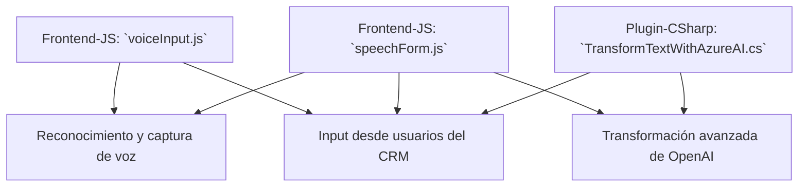

#### **Breve resumen técnico**
El repositorio describe una solución que implementa funcionalidades avanzadas mediante el uso de APIs externas (Azure Speech SDK y Azure OpenAI) para automatizar procesos en formularios y sistemas CRM como Dynamics 365. Incluye archivos de frontend basados en JavaScript y un plugin desarrollado en C#.

---

#### **Descripción de arquitectura**
1. **Tipo de solución**:  
   - La solución consiste en una **API dinámica** que interactúa con formularios en **Dynamics CRM**, enriquecida por integración con servicios de inteligencia artificial (Azure AI, OpenAI).  
   - Incluye una capa frontend (JavaScript) para interacción en tiempo real con formularios, procesamiento de reconocimiento de voz e integración directa.  
   - Además, contiene una capa de backend en forma de un **plugin** creado con C# que actúa como intermediario entre Dynamics CRM y los servicios de inteligencia artificial.

2. **Arquitectura**:  
   - Basada en una **arquitectura de n capas**:  
     - **Frontend:** Archivos JavaScript que operan en el navegador del usuario.  
     - **Backend:** Plugin ejecutado en el servidor de Dynamics 365.  
     - **External Services:** Integración con servicios de Azure OpenAI y Speech SDK para agregar potentes capacidades de IA y síntesis/reconocimiento de voz.  
   - Aplicación de **patrones de diseño**: modularización funcional, inyección de dependencias (Azure SDK cargado dinámicamente), y procesamiento de eventos basados en el reconocimiento de voz.

---

#### **Tecnologías utilizadas**
1. **Frontend:**
   - **HTML/JavaScript:** Manipulación de formularios y comunicación con SDK dinámico.
   - **Azure Speech SDK:** Reconocimiento de voz y síntesis de texto a voz.
   - **Dynamics CRM SDK for JavaScript:** APIs para manipulación dinámica de formularios y datos.

2. **Backend:**
   - **Microsoft Dynamics SDK (C# API Plugins):** Extensión funcional del CRM para procesos automatizados.
   - **Azure OpenAI:** Transformación avanzada de texto a JSON con modelos basados en inteligencia artificial.
   - **NewtonSoft.Json / System.Text.Json:** Serialización y deserialización de datos JSON en el plugin.

---

#### **Diagrama Mermaid**

---

#### **Conclusión final**
Este repositorio constituye una solución modular centrada en mejorar la experiencia de usuario en formularios dentro de Dynamics CRM mediante APIs externas y capacidades de inteligencia artificial. Su arquitectura de n capas, dependencias externas (Azure SDK y OpenAI), y diseño basado en modularización garantizan escalabilidad y mantenibilidad. Es ideal para aplicaciones empresariales que requieren integración de voz e IA con sistemas CRM existentes.