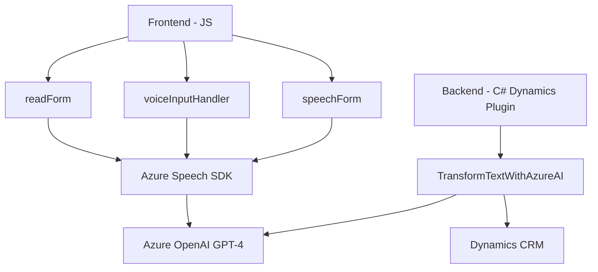

### Breve resumen técnico:
El repositorio contiene tres componentes principales:
1. **Frontend (JavaScript)**: Scripts para integrar Azure Speech SDK, capturar datos de formularios, sintetizar texto en voz, y realizar transcripciones de audio para rellenar formularios, con posible integración de APIs externas.
2. **Backend en Dynamics CRM (C#)**: Plugin para Dynamics CRM que utiliza Azure OpenAI GPT-4 para transformar texto en JSON estructurado.
3. **Arquitectura de servicios conectados**: Comunicación entre el frontend y servicios externos (Azure Speech SDK y Azure OpenAI). 

---

### Descripción de arquitectura:
- **Tipo de solución**: Aplicación empresarial híbrida.
  - **Frontend**: Procesos de síntesis de voz y transcripción mediante el navegador.
  - **Backend**: Función de plugin en Dynamics CRM que utiliza servicios de IA avanzada para datos estructurados.
- **Arquitectura**: 
  - El frontend emplea una arquitectura de **n capas**, separando la lógica de UI, lógica de negocio y comunicación con APIs externas.
  - El backend utiliza una **arquitectura de integración orientada a servicios** mediante Dynamics CRM y Azure OpenAI, delegando la lógica pesada de transformación a servicios externos sin administrar directamente el modelo de datos.

---

### Tecnologías, frameworks y patrones usados:
- **Frontend:**
  - **JavaScript/ES6**: Desarrollo del cliente web.
  - **Azure Speech SDK**: Reconocimiento de voz y síntesis de texto a audio.
  - **Patrones observador y delegación**: Para carga dinámica de scripts y manejo de eventos asíncronos.
  - **Modularidad**: Funciones independientes para carga de SDK, procesamiento de texto y comunicación con APIs.

- **Backend:**
  - **C#/.NET Framework**: Desarrollo de plugins en Dynamics CRM.
  - **Azure OpenAI GPT-4**: Transformación avanzada de texto a estructuras JSON.
  - **Microsoft.Xrm.Sdk**: Interacción con Dynamics CRM.
  - **HTTP Client**: Envio de solicitudes hacia servicios externos.
  - **JSON Libraries (System.Text.Json, Newtonsoft.Json)**: Construcción y parseo de contenido JSON.
  - **Patrones de integración**: Plugin como punto de entrada y servicio de Azure OpenAI como dependencia.

---

### Dependencias o componentes externos:
1. **Azure Speech SDK**: Bibliotecas externas cargadas dinámicamente desde `https://aka.ms/csspeech/jsbrowserpackageraw`.
2. **Azure OpenAI GPT-4**: Modelo de IA avanzado para procesamiento de texto en el backend.
3. **Dynamics CRM WebApi**: Para involucrar mapeo y manipulación de datos en formularios.
4. **Librerías Backend**: 
   - `System.Net.Http` (solicitudes HTTP hacia APIs).
   - `Newtonsoft.Json.Linq` (parseo flexible de JSON).
   - `Microsoft.Xrm.Sdk` (interacción directa con el modelo de datos CRM).

---

### Diagrama Mermaid

---

### Conclusión final:
Este repositorio está diseñado para resolver problemas empresariales que involucran interacciones avanzadas humano-sistema, como la recopilación de datos mediante voz y su integración con formularios en una plataforma CRM. Utiliza una combinación de tecnologías modernas: el frontend para captura y síntesis de voz, y el backend orientado a la inteligencia artificial para transformar datos. La arquitectura es service-oriented, con una clara separación de concernientes y una integración efectiva con servicios externos. Sin embargo, su enfoque modular puede expandirse hacia una estructura más formal como MVC o hexagonal si se busca mayor control, reutilización y escalabilidad.