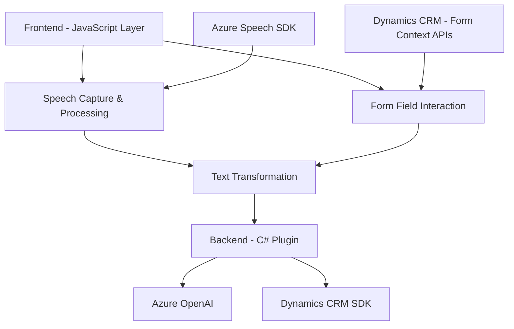

### Breve resumen técnico
El repositorio presenta funcionalidades de integración entre formularios personalizados y los servicios de Azure (Speech SDK y OpenAI). Las partes del código parecen estar orientadas principalmente al procesamiento del reconocimiento de voz y la síntesis de texto, además de la interacción con formularios en Dynamics CRM. También se integra un plugin desarrollado en C#, que emplea Azure OpenAI para transformar textos en objetos JSON estructurados bajo reglas específicas.

### Descripción de arquitectura
Este sistema utiliza una **arquitectura multicapa orientada a servicios**. Los componentes pueden ser clasificados como:
1. **Frontend funcionalidad**: Archivos como `readForm.js` y `speechForm.js` representan una capa de interacción con el usuario. Trabajan con APIs del formulario, procesan datos contextuales e interactúan con SDK externos (Azure Speech).
2. **Backend funcionalidad**: El plugin `TransformTextWithAzureAI.cs` en C# actúa como un servicio en Dynamics CRM, manejando la transformación de datos en JSON a través de llamadas al servicio Azure OpenAI.
3. **Servicios externos (API)**: Uso intensivo de servicios de Azure Speech SDK y OpenAI para tareas de síntesis, reconocimiento y transformación de texto.
4. **Integración CRM**: Dependencia en Dynamics 365 SDK para gestionar datos y ejecutar operaciones dentro del sistema de CRM.

Esta arquitectura demuestra una clara separación de responsabilidades entre frontend (procesamiento y síntesis) y backend (lógica empresarial y transformaciones).

### Tecnologías usadas
1. **Frontend**:
   - JavaScript (modular y procedimental).
   - **Azure Speech SDK**: Captura de voz, síntesis e interacción con formularios.
   - APIs de formulación en Dynamics CRM (como `formContext`).
   
2. **Backend (Plugin)**:
   - **C# con Dynamics SDK**: Extensión de lógica empresarial en forma de plugin.
   - **Newtonsoft.Json y System.Text.Json**: Manipulación de JSON.
   - **Azure OpenAI**: Transformaciones automáticas del texto en JSON estructurado.
   - HTTP client para comunicarse con servicios externos.

3. **Patrones principales**:
   - Modularidad: Separación de lógica en funciones y métodos independientes.
   - Service Locator Pattern: Uso del servicio de dependencia de Dynamics para gestionar recursos en tiempo de ejecución.
   - Integración cloud: Uso de servicios cloud-first en Azure.

### Diagrama Mermaid válido

### Conclusión final
Este repositorio presenta una **multicapa de integración** que utiliza servicios de Azure para ampliar las capacidades de interacción mediante voz en Dynamics CRM. La arquitectura es modular y está orientada a servicios, optimizando la reutilización de código y el acoplamiento con servicios externos para fortalecer la funcionalidad en diferentes sectores. Sin embargo, se podrían investigar opciones para mejorar la eficiencia y manejo de excepciones, así como explorar la posibilidad de migrar hacia una arquitectura más avanzada como la hexagonal, que permitiría una mayor separación de servicios en función de casos de uso y mayor adaptabilidad en implementaciones futuras.