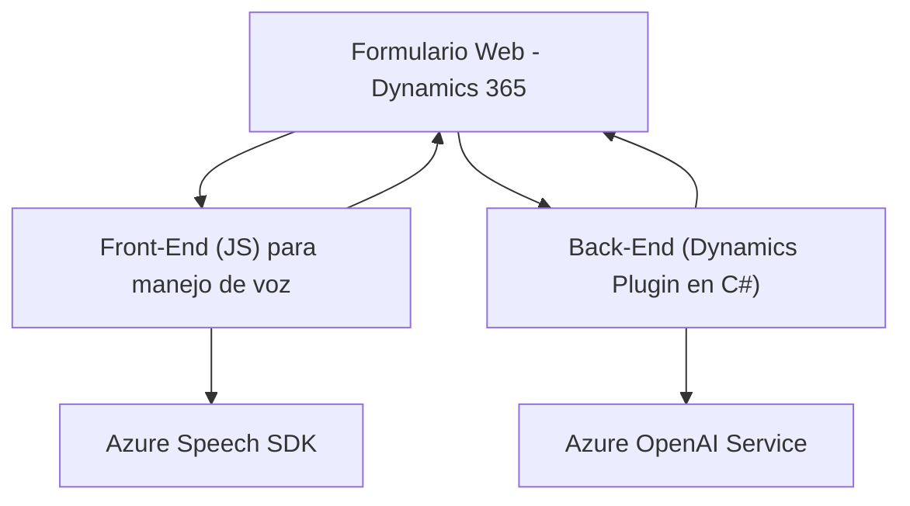

## Breve Resumen Técnico

El análisis del repositorio revela que la solución está compuesta de diferentes componentes que interactúan para ofrecer funcionalidades de reconocimiento y síntesis de voz en el manejo de formularios en Dynamics 365 CRM. Estas funcionalidades están soportadas por servicios externos como **Azure Speech SDK** y **Azure OpenAI Service**.

---

## Descripción de la Arquitectura

Este sistema parece seguir un enfoque **modular** dentro de un esquema de **arquitectura en capas** con cierta integración con **servicios externos** (Azure). La arquitectura incluye tres elementos principales:

1. **Frontend**: Archivos JavaScript (readForm.js y speechForm.js) que extienden las capacidades de un formulario web de Dynamics 365 al integrar tecnologías de reconocimiento de voz y síntesis de texto a voz de Azure.
2. **Backend Plugins**: Código back-end en C# para implementar un plugin que interactúa con Dynamics CRM mediante eventos y que invoca servicios de Azure, como OpenAI, para transformar datos en formato JSON siguiendo reglas definidas.
3. **Externo (Azure)**: Integración directa con **Microsoft Azure Speech Services SDK** y **Azure GPT/OpenAI API**, para añadir reconocimiento y síntesis de voz, y procesamiento avanzado de lenguaje natural.

La solución tiene una arquitectura **Service-Oriented Architecture (SOA)** similar a **Hexagonal Architecture**, aunque adaptada para trabajar dentro de la infraestructura y eventos de Dynamics CRM. El diseño es modular, con componentes independientes para frontend y backend que orquestan servicios y funcionalidades externos según el contexto. También se usa un patrón de **Plugin** en el lado del back-end basado en Dynamics CRM.

---

## Tecnologías Usadas

### Frontend:
- **Vanilla JavaScript**: Para la implementación de funcionalidades de reconocimiento y síntesis de voz.
- **Azure Speech SDK**: Para reconocimiento y síntesis de texto a voz.
- **Dynamics CRM Form context**: Interacción con la API y el modelo de datos de Dynamics.

### Backend:
- **Microsoft .NET Framework**: Desarrollo del plugin en C#.
- **Microsoft Dynamics CRM SDK**: Para extender las capacidades de CRM.
- **Azure OpenAI Services**: Gestión de la transformación de texto mediante GPT.
- **HTTP Client Libraries** (`System.Net.Http`): Llamadas para interactuar con Azure APIs.
- **Newtonsoft.Json & System.Text.Json**: Manejo de datos JSON.

### Patrones:
- **Event-Driven Programming**: Activación desde eventos específicos en el frontend y backend (usar la voz o trigger de Dynamics).
- **Plugin Pattern**: Permite integrar el comportamiento extendido con eventos del CRM.
- **Callback Pattern**: Utilizado para cargar el SDK Azure Speech de forma dinámica en los archivos JavaScript.
- **Service Integration Pattern**: Uso extensivo de servicios externos como Azure Speech SDK y OpenAI.

---

## Diagrama Mermaid válido para **GitHub Markdown**

---

## Conclusión Final

La solución analizada es una integración avanzada orientada a mejorar la experiencia de usuario mediante **tecnologías de reconocimiento y síntesis de voz**. A través de los archivos `readForm.js` y `speechForm.js`, el sistema implementa un frontend extensible para gestionar la interacción entre el usuario y los datos del formulario mediante voz. Por otro lado, el archivo `TransformTextWithAzureAI.cs` maneja procesos más complejos en el backend, haciendo uso de **Azure OpenAI API** para transformar datos textuales en formatos útiles.

La arquitectura es una combinación de **n capas** y elementos orientados a servicios externos (SOA), adaptada al ecosistema de Dynamics 365. La modularidad de funciones y la separación de responsabilidades hacen que el sistema sea fácilmente escalable y mantenible. Sin embargo, el manejo básico de algunos errores y la rigidez en ciertos flujos indican áreas potenciales de mejora.