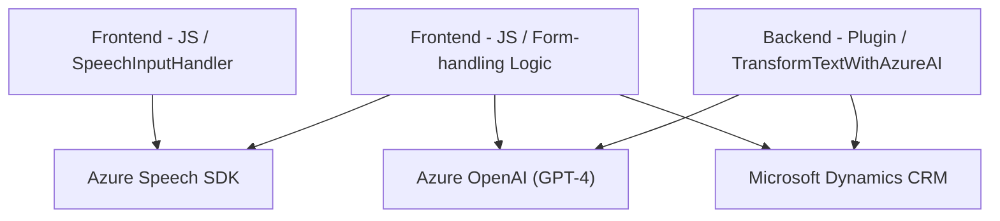

### Breve resumen técnico
El repositorio tiene una estructura modular para habilitar funcionalidad avanzada de entrada y síntesis de voz desde formularios visibles (frontend), procesar transcripciones con o sin soporte de inteligencia artificial (form-handling logic), y transformar texto mediante Azure AI (backend/plugin vinculándose a Dynamics CRM). Las dependencias externas incluyen Azure Speech SDK y OpenAI en Azure.

---

### Descripción de arquitectura
Este sistema parece estar diseñado como una **arquitectura en capas** donde cada módulo cumple una función independiente:
1. **Frontend**: Maneja interacción humano-computadora con la entrada de voz, captura datos del formulario y los transforma en información procesable.
2. **Lógica de Negocio (Middleware)**: Manipula transcripciones de reconocimiento de voz para actualizar dinámicamente formularios, con posibilidad de integrar inteligencia artificial mediante APIs externas.
3. **Backend (Plugins)**: Usa Dynamics CRM con un plugin basado en eventos (registrado en el pipeline de CRM) para transformar datos de entrada y estructurarlos en JSON mediante Azure OpenAI.

Patrones observados incluyen:
- **Modularidad**: Cada archivo y su función tienen una tarea específica.
- **Carga dinámica de SDK**: El frontend utiliza un patrón de external SDK loader para requerir solo los servicios necesarios en tiempo de ejecución.
- **Plug-in Architecture**: En el backend, un patrón estándar para Dynamics CRM mediante `IPlugin`.
- **Responsabilidad única**: Cada módulo aborda solo su parte lógica (separación estricta entre frontend, lógica y backend).
- **API Integration**: Alta dependencia en servicios como Azure Speech SDK, OpenAI y componentes de Dynamics CRM.

---

### Tecnologías usadas
- **Frontend**:
  - JavaScript (no especificado si usa ningún framework).
  - Azure Speech SDK (para entrada/salida de voz desde el navegador).
  - DOM API (directa manipulación para cargar scripts).
- **Middleware (Form Handling)**:
  - JavaScript, asíncrono con promesas.
  - APIs externas personalizadas vía HTTP.
  - Dinámico uso de inteligencia artificial y manipulación de datos con Xrm.WebApi (Dynamics CRM).
- **Backend**:
  - C# con .NET Framework (Microsoft Dynamics CRM plugin).
  - `Microsoft.Xrm.Sdk` y `Microsoft.Xrm.Sdk.Query` para integrarse en el contexto de CRM.
  - `System.Net.Http` para manejar solicitudes REST.
  - Azure OpenAI API (GPT-4) para procesamiento avanzado.
  - Manejo de JSON (`Newtonsoft.Json.LINQ`).
  
---

### Diagrama Mermaid para GitHub Markdown

---

### Conclusión final
El repositorio describe una solución híbrida donde la interacción humano-computadora se realiza en el cliente (frontend) mediante Azure Speech SDK, combinada con procesamiento inteligente (middleware/form handling) que integra lógicas avanzadas como manejo de formularios e inteligencia artificial. Finalmente, en el backend, un plugin correctamente estructurado usa Azure OpenAI para realizar tareas específicas de transformación de datos. Esta solución (multi-capa) sería adecuada para aplicaciones personalizables basadas en Microsoft Dynamics CRM o sistemas ERP donde se requiere automatización avanzada con interacción natural (voz-texto).