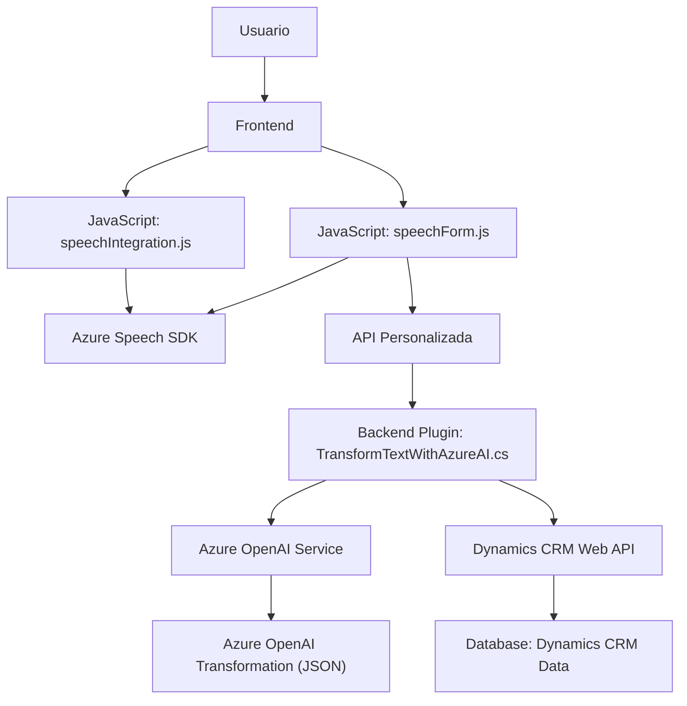

### Resumen Técnico
El repositorio contiene módulos relacionados con el manejo de formularios web mediante interacciones de voz y procesamiento de texto. Además, integra un plugin de Dynamics CRM donde se utiliza Azure OpenAI para transformar texto. La solución general está orientada a combinar inteligencia artificial (AI) y procesamiento de formularios estructurados.

---

### Descripción de Arquitectura
La solución presenta una arquitectura híbrida, compuesta por un **frontend** para interacción de usuarios por voz y texto, combinado con **plugins** para procesamiento avanzado en Dynamics CRM. En el frontend se observa el uso de funciones modulares y acopladas por el Azure Speech SDK. El lado del backend (plugin para Dynamics CRM) es una aplicación basada en el patrón **plugin-based architecture**, que conforma una arquitectura SOA, donde los servicios externos (Azure OpenAI) cumplen un rol crítico.

La arquitectura general es monolítica en Dynamics CRM (por el plugin), mientras el frontend podría ser considerado como **n capas**, dado que contiene una separación clara de interfaz, lógica, y datos (formularios y APIs).

---

### Tecnologías Usadas
1. **Frontend (JavaScript):**
   - Azure Speech SDK: Conversión de voz a texto y texto a voz.
   - API personalizada para procesamiento de texto con transcripciones y solicitud HTTP.
   - DOM y JS ES6+, incluyendo uso de funciones modernas como Promises.

2. **Backend (Dynamics CRM Plugin):**
   - Dependencias del SDK oficial de Dynamics CRM (`IPluginExecutionContext`, `IOrganizationServiceFactory`).
   - `HttpClient` y `System.Text.Json` para comunicación y procesamiento de datos JSON.
   - Azure OpenAI Services para procesamiento de texto.
   - Arquitectura SOA al integrar API externa.

3. **Nube:**
   - Azure AI (OpenAI y Speech SDK): Servicios cognitivos.

---

### Diagramas Mermaid (Compatible con GitHub Markdown)

---

### Conclusión Final
Esta solución implementa una combinación de **frontend en JavaScript** con capacidades para interactuar mediante voz y texto (mediante Azure Speech SDK), y un **backend basado en un plugin nativo de Dynamics CRM** que conecta con Azure OpenAI. La arquitectura se puede considerar híbrida, puesto que utiliza una mezcla de una solución de **n capas** para el frontend y **plugin-based architecture** en Dynamics CRM.

Los principales puntos fuertes de esta solución son:
1. **Uso avanzado de servicios de Azure**: particularmente OpenAI y Speech SDK.
2. **Modularidad**: Tanto el frontend como el backend están estructurados en funciones y clases especializadas.
3. **Integración con Dynamics CRM**: Genera un flujo completo entre interfaces de usuario y procesamiento backend.

Sin embargo, la alta dependencia de SDKs externos (Azure) y sistemas propietarios como Dynamics CRM podría limitar su escalabilidad o aplicabilidad fuera del contexto de estas plataformas empresariales.