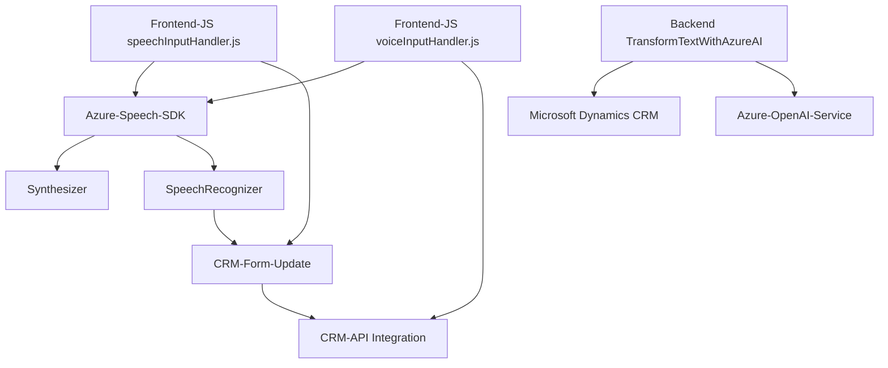

### Breve resumen técnico
Los archivos proporcionados pertenecen a una solución híbrida que integra un sistema CRM (Microsoft Dynamics) con capacidades avanzadas de interacción mediante voz y texto. El foco está en dos áreas:
- Procesamiento y transcripción de entrada (speech-to-text y text-to-speech) c on el uso del **Azure Speech SDK**.
- Transformación y procesamiento de texto con reglas estrictas mediante el servicio **Azure OpenAI**.

### Descripción de arquitectura
La solución implementa una arquitectura multicapas mezclada con un enfoque orientado a servicios (SOA). Se destacan las siguientes características:
- **Capa de Plugins CRM**: Extensiones de lógica empresarial en Dynamics que interactúan con servicios externos.
- **Frontend web modular**: Módulos JS dinámicos para interacción del usuario mediante voz y texto.
- **Integración con servicios externos**:
  - Uso del **Azure Speech SDK** para sintetizar voz y reconocer texto hablado desde una interfaz web.
  - Uso de **Azure OpenAI Service** para transformar texto en estructuras JSON a través de plugins del CRM.
  
### Tecnologías usadas
- **Frontend/JS modules**:
  - Lenguaje: JavaScript (ECMAScript)
  - SDK: Microsoft Azure Speech SDK
  - Web API: Microsoft Dynamics CRM (`Xrm.WebApi.online.execute`).

- **Backend (C#)**:
  - Microsoft Dynamics CRM Plugin Framework `IPlugin`.
  - OpenAI API (Python or external Azure APIs via HTTP POST serialization).
  - JSON manipulation via `Newtonsoft.Json` and `System.Text.Json`.
  - Azure OpenAI Integrations (API for advanced natural language transformations).
  - HTTP communication via `System.Net.Http`.

### Dependencias o componentes externos
- **Azure Speech SDK**:
  - Usado en los módulos JS para definir capacidades como síntesis de voz (text-to-speech) y reconocimiento (speech-to-text).
- **Azure OpenAI Service**:
  - Utilizado para la transformación de texto en JSON dentro de un plugin de Dynamics CRM.
- **Microsoft Dynamics CRM SDK**:
  - Usado para interactuar con datos y capacidades del sistema CRM.
- **Newtonsoft.Json.JSON** y **System.Text.Json**: Manipulación de estructuras JSON.
- **CRMs Xrm.WebApi.online API**: Para realizar operaciones automatizadas dentro del CRM.

### Diagrama Mermaid válido para GitHub Markdown

### Conclusión final
La solución en el repositorio analiza las capacidades de un sistema interactivo con el usuario mediante voz y texto, complementado por procesamiento en la nube. Utiliza un enfoque modular y moderno basado en servicios web, SDKs, y plugins estandarizados. La arquitectura combina eficientemente componentes de Microsoft Dynamics, soluciones Azure y JavaScript modular para construir una interfaz rica y funcional dentro de un sistema CRM. Es adecuada tanto para sistemas monolíticos extendibles como para arquitecturas híbridas entre frontend/back-office.