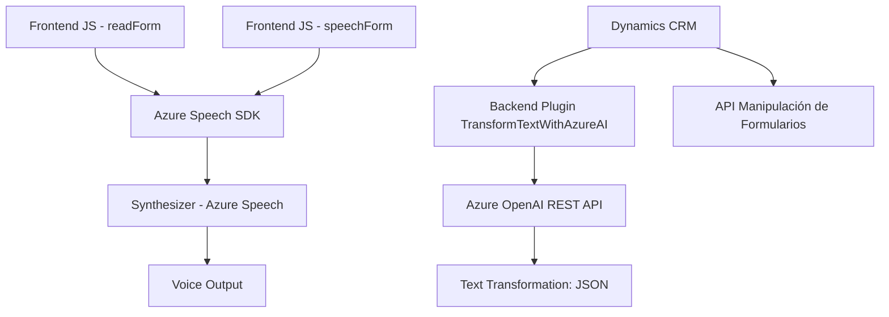

### Resumen técnico
El repositorio analiza tres componentes clave del sistema:
1. Archivos de frontend (`readForm.js` y `speechForm.js`): Implementan interacciones entre formularios visuales, reconocimiento de voz y síntesis de texto a voz usando Azure Speech SDK.
2. Plugin backend (`TransformTextWithAzureAI.cs`): Amplía Dynamics CRM mediante procesamiento de texto en Azure OpenAI y refleja un patrón de integración profundo con servicios externos.

---

### **Descripción de arquitectura**
1. **Tipo de solución**:
   - **General**: Sistema híbrido web con integración de IA.
   - **Componentes individuales**:
     - **Frontend**: Formulario dinámico (JS) con eventos de voz y reconocimiento textual usando Azure Speech.
     - **Backend**: Plugin CRM (C#) que interactúa con un API de Azure para transformación robusta de texto.

2. **Arquitectura**:
   - Es una arquitectura orientada a servicios (SOA) con tres capas:
     - **Frontend/Cliente**: HTML + JS modular para procesamiento local.
     - **Middleware/Integración**: Azure Speech SDK (JS) y Plugin CRM que actúa como adaptador entre Dynamics CRM y servicios de Azure.
     - **Servicios externos**: Azure OpenAI para procesamiento de datos transversales.

3. **Patrones utilizados**:
   - **Callback y modularización funcional** (Frontend JS): Lógica dividida en funciones para minimizar acoplamiento.
   - **Encapsulación digital** (Plugin): Concentración robusta de responsabilidad para transformación basada en IA.
   - **Adaptador externo**: Azure Speech SDK y OpenAI se emplean como adaptadores para operaciones específicas.

4. **Dependencias externas**:
   - **Azure Speech SDK**: Reconocimiento y síntesis de voz.
   - **Dynamics CRM SDK**: API para manipulación de datos.
   - **Azure OpenAI API**: IA para procesamiento y transformación de texto.
   - **HTTP y JSON libraries (System.Net.Http, Json)**: Manejo de solicitudes REST y estructuras JSON.

---

### **Tecnologías usadas**
1. **Frontend**:
   - **Lenguajes**: JavaScript.
   - **SDK**: Azure Speech SDK.
   - **Plataforma**: Dynamics CRM (formContext y executionContext).

2. **Backend**:
   - **Lenguajes**: C#.
   - **Framework**: Dynamics CRM Plugin Framework.
   - **APIs**:
     - Azure OpenAI REST API.
     - Dynamics CRM Web API.

---

### Diagrama Mermaid

---

### Conclusión final
El sistema se basa en una arquitectura orientada a servicios, utilizando componentes desacoplados:
- Frontend: Modularización con integración de Azure Speech SDK para manejo del formulario basado en voz.
- Backend: Plugin robusto en C# para gestionar lógica empresarial avanzada y procesamiento de texto en Azure OpenAI.
- Dependencias externas: Amplia integración con servicios de Microsoft, incluyendo Azure Speech y OpenAI.

Su diseño permite flexibilidad para ampliar capacidades, como añadir nuevos endpoints de IA o registros dinámicos en Dynamics CRM. Es un enfoque moderno y escalable para manejar datos con entrada y salida por voz e inteligencia artificial avanzada.