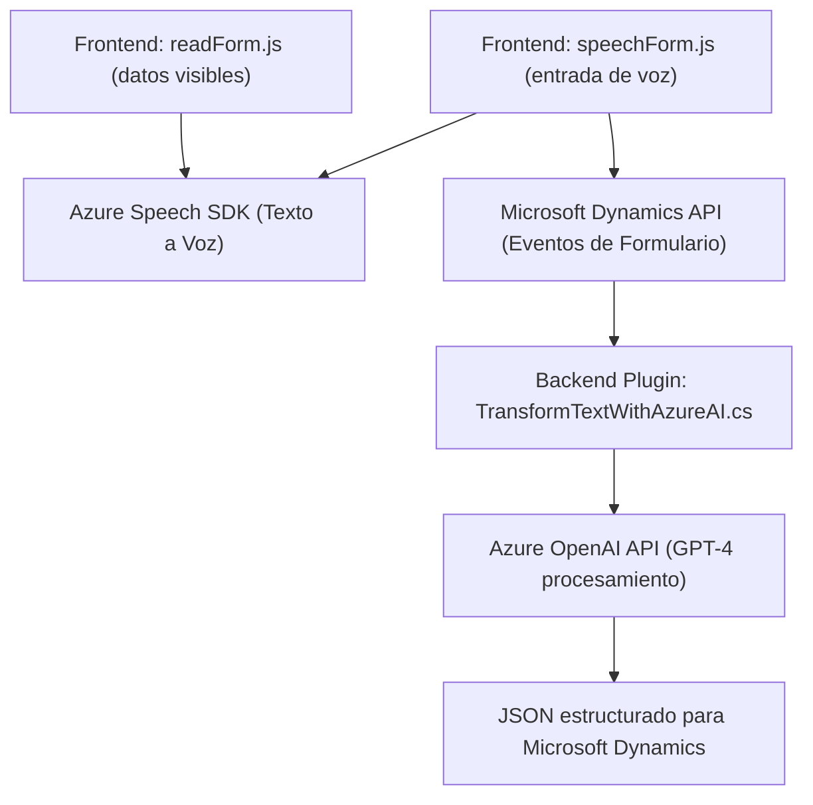

### Breve Resumen Técnico
El repositorio es una solución multifacética que integra múltiples capas, desde un frontend interactivo que utiliza reconocimiento de voz hasta la capa de backend basada en plugins para Microsoft Dynamics CRM. Utiliza servicios en la nube como Azure Speech SDK y Azure OpenAI para ampliar las capacidades del sistema, transformando texto y voz en una experiencia optimizada para el usuario.

---

### Descripción de la Arquitectura
La solución utiliza una arquitectura **n-capas** con integración de servicios externos. Las capas incluyen:
1. **Frontend interactivo**:
   - Manipulación de la interfaz mediante reconocimiento de voz (entrada) y síntesis de voz (salida), aprovechando Azure Speech SDK.
   - Modularización y eventos controlados en el navegador.
   - Datos de formularios CRM se manejan como una capa de repositorio dinámica para sincronizar datos procesados.

2. **Backend extensible**:
   - Plugins diseñados para Microsoft Dynamics CRM, como en el archivo `TransformTextWithAzureAI.cs`, que procesan datos y hacen llamadas a servicios externos como Azure OpenAI.
   - El backend complementa funcionalidades del frontend y transforma datos en formatos útiles para CRM mediante microservicios (Azure APIs).

---

### Tecnologías Usadas
1. **Frontend**:
   - **JavaScript**: Orientado a eventos con modularización de funciones.
   - **Azure Speech SDK**: Para reconocimiento y síntesis de voz.
   - **DOM Manipulation**: Carga dinámica de librerías externas.

2. **Backend**:
   - **C#** con Microsoft Dynamics SDK (`IPlugin`): Extensibilidad en el contexto de CRM.
   - **Azure OpenAI**: Procesamiento textual avanzado utilizando el modelo GPT-4.
   - **HTTPClient** y **JSON Serialization** (en C#).

3. **APIs externas**:
   - Azure Speech Service.
   - Azure OpenAI Service.

---

### Diagrama Mermaid

---

### Conclusión Final
El repositorio es una solución híbrida de n-capas que combina características de microservicios en el backend, con un frontend orientado a eventos y tecnologías avanzadas de Azure. Su objetivo principal es enriquecer la funcionalidad de Microsoft Dynamics CRM mediante reconocimiento de voz, síntesis de texto a voz, y procesamiento automático de texto respaldado por la inteligencia artificial de Azure OpenAI. Está bien estructurado y utiliza patrones de modularización y arquitectura orientada a servicios, lo que asegura escalabilidad, eficiencia y extensibilidad.