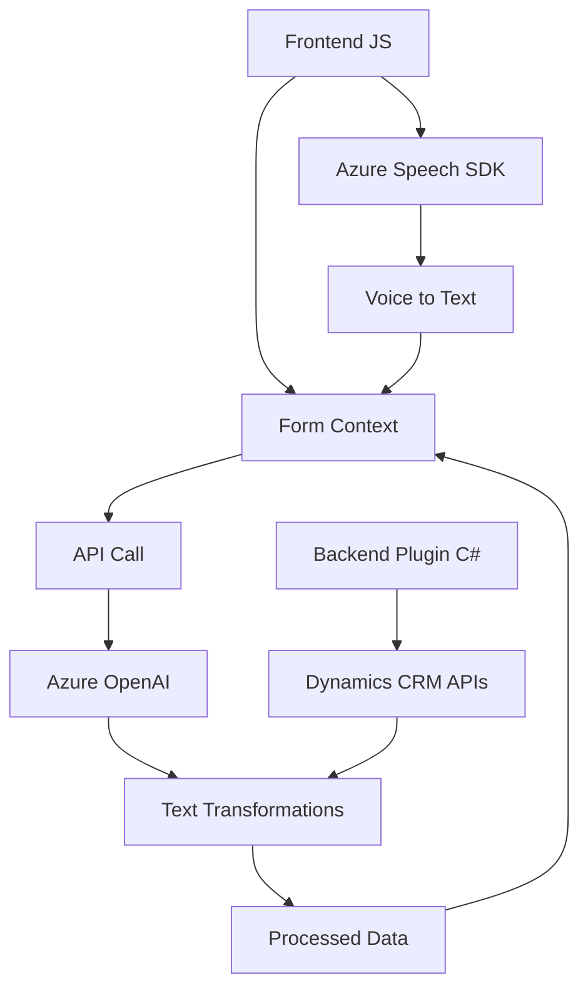

### Breve Resumen Técnico:

El repositorio analiza la interacción entre un sistema frontend basado en JavaScript (para manejo de formularios y voz) y componentes backend (plugins de Dynamics CRM en C#), integrados con servicios externos como Azure Speech SDK y Azure OpenAI. Esta solución se centra en capturar, procesar, sintetizar y transformar texto desde formularios y entradas de voz, aprovechando los servicios de nube de Azure para inteligencia artificial y síntesis de voz.

---

### Descripción de Arquitectura:

La arquitectura del sistema parece ser una **n-capas**, donde el frontend colabora directamente con APIs y SDKs, mientras el backend estructurado en forma de plugins aprovecha servicios externos. No se observa una arquitectura basada en microservicios ni completamente desacoplada debido a la fuerte cohesión del sistema en torno a las dependencias de Microsoft Dynamics CRM, Azure Speech SDK y Azure OpenAI.

Las capas se dividen en:
1. **Frontend**:
   - Captura datos de formularios y entrada de voz mediante JavaScript interactivo.
   - Usa patrones de modularidad y eventos-contextuales para organizar las operaciones.
2. **Backend**:
   - Plugins en C# implementados bajo el modelo extensible de Dynamics CRM.
   - Lógica y transformaciones asociadas a cada evento del sistema.
3. **Servicios Externos**:
   - **Azure Speech SDK**: Usado para sintetizar voz desde texto y convertir la voz en texto.
   - **Azure OpenAI**: Procesa transformaciones de texto relacionadas con el modelo GPT.
   - **Dynamics CRM API (Xrm.WebApi)**: Facilita las operaciones en la base de datos del sistema.

---

### Tecnologías Usadas:

1. **Frontend**:
   - JavaScript (ES6+).
   - DOM manipulation para carga dinámica de scripts como Azure Speech SDK.
   - Azure Speech SDK.
2. **Backend**:
   - C#.
   - Microsoft Dynamics CRM SDK (`IPlugin` y `Xrm.WebApi`).
   - System.Net.Http (solicitudes REST).
   - Integración con Azure OpenAI para procesamiento de texto.
3. **Dependencias Externas**:
   - Azure Speech SDK: Reconocimiento y síntesis de voz.
   - Azure OpenAI (simplificado como GPT): Procesamiento avanzado de texto.

---

### Diagrama Mermaid:

A continuación, el diagrama representa las actividades y dependencias del sistema, mostrando el flujo desde el frontend hacia el backend y servicios externos.

---

### Conclusión Final:

El sistema integra eficientemente varios servicios de Azure (Speech SDK y OpenAI) con un CRM como Dynamics en una arquitectura de n-capas. Aunque el frontend tiene capacidades de interacción directa mediante APIs, la conexión centralizada al backend refleja una dependencia fuerte en Dynamics CRM. El diseño modular facilita el mantenimiento y evolución del código, mientras que la solución aprovecha patrones modernos (event-driven y modularidad) para un procesamiento eficiente. Sin embargo, al estar altamente dependiente de SDKs y servicios externos de Azure, su portabilidad fuera del ecosistema de Microsoft sería limitada.