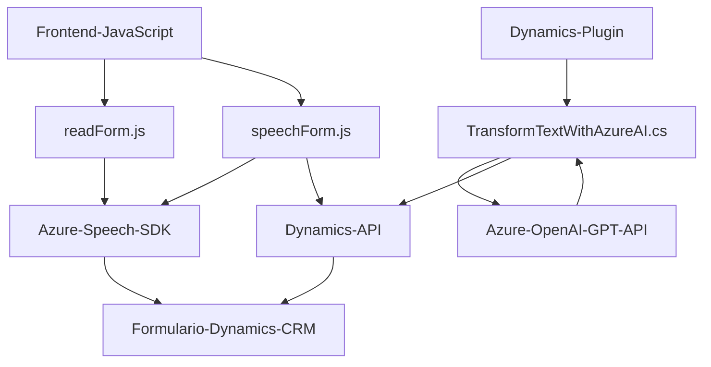

### Breve resumen técnico

El repositorio está compuesto por tres archivos principales que implementan una solución donde se integra Azure Speech SDK, Microsoft Dynamics CRM SDK y Azure OpenAI GPT API para lograr accesibilidad y automatización en el procesamiento de texto y voz en formularios. 

La solución combina un **frontend** basado en funciones JavaScript para interactuar con formularios, un plugin en **C#** diseñado para transformaciones avanzadas mediante Azure OpenAI, y una **API personalizada** que facilita la integración con inteligencia artificial.

---

### **Descripción de arquitectura**

La arquitectura del proyecto sigue un modelo de **microservicios** en su integración con sistemas externos (como Azure Speech SDK y Azure OpenAI) y el uso de un **plugin desacoplado** diseñado para CRM Dynamics. Sin embargo, a nivel de estructura interna, presenta elementos típicos de **n capas**:

1. **Capa de interfaz de usuario**: Archivos JavaScript (`readForm.js` y `speechForm.js`) para interactuar con formularios y fomentar accesibilidad con voz. Implementan una arquitectura funcional y modular.
2. **Capa de lógica del negocio**: Plugin (`TransformTextWithAzureAI.cs`) para procesar datos y aplicar reglas específicas utilizando servicios OpenAI, implementando lógica desacoplada de los sistemas CRM.
3. **Capa de API**: Proveyendo la comunicación con servicios externos (Azure Speech SDK y OpenAI GPT API).

Es una arquitectura que favorece la modularidad y facilita la integración con servicios terceros, siguiendo principios de **cohesión funcional** y **separación de responsabilidades**.

---

### **Tecnologías usadas**

1. **Frontend:**
   - **JavaScript**: Base para implementar funciones modulares y manejar eventos del contexto de Dynamics 365.
   - **Azure Speech SDK**: Para síntesis de voz y reconocimiento de entrada por audio.

2. **Backend:**
   - **Microsoft Dynamics CRM SDK**: Manejo de plugins y manipulación de atributos en formularios CRM.
   - **Azure OpenAI GPT API**: Para transformación de texto en formato JSON basado en IA.

3. **Frameworks/Librerías Backend:**
   - **Newtonsoft.Json**: Procesamiento avanzado de objetos en JSON.
   - **HttpClient**: Realización de solicitudes HTTP hacia servicios externos (OpenAI API).

4. **Patrones arquitectónicos:**
   - **Callback/Facade**: Envoltorios sobre SDK externos para simplificar su uso.
   - **Mapping dinámico**: Relación de campos visibles con datos internos mediante mapeo.
   - **Plugin CRM**: Intercepta datos de formularios en tiempo real.

---

### Diagrama **Mermaid** válido para GitHub

---

### Conclusión final

La solución presentada en el repositorio es una implementación robusta que une una interfaz de usuario **frontend**, integración de SDKs externos (Azure Speech), y un plugin basado en **CRM Dynamics**, complementada con una API de IA de OpenAI. Sigue principios de arquitectura **modular** y **n capas**, permitiendo escalabilidad y facilidad de mantenimiento.

Se destaca por enfocarse en la accesibilidad y automatización de la entrada de datos en entornos empresariales, asegurando la sincronización y transformación rápida de datos mediante herramientas modernas. Sin embargo, dado que el sistema interactúa directamente con servicios externos (Azure Speech y OpenAI), su estabilidad depende de la disponibilidad y configuración de estos servicios.