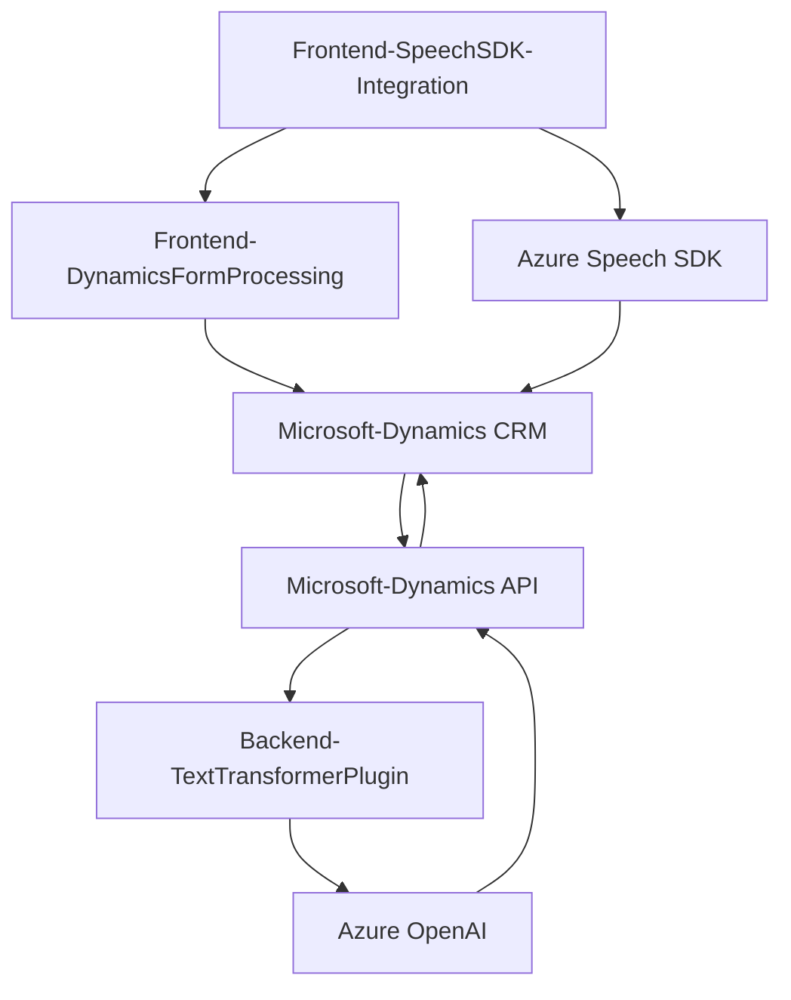

### **Breve resumen técnico**
El repositorio descrito parece formar parte de una solución empresarial para integrar Microsoft Dynamics CRM con servicios de Azure. Los archivos analizados incluyen componentes de frontend en JavaScript y un plugin backend en C# para extender las funcionalidades de Dynamics CRM al aprovechar el reconocimiento de voz con Azure Speech SDK y el procesamiento de lenguaje natural (GPT-4) con Azure OpenAI.

---

### **Descripción de la arquitectura**
La solución tiene características que indican una arquitectura **de capas (n-tier)**. Esto se evidencia debido a la separación entre distintas responsabilidades:

1. **Frontend:** JavaScript interactúa con formularios de Dynamics CRM, habilitando la funcionalidad de entrada y salida de voz y otras capacidades.
2. **Backend:** El plugin C# implementa procesamiento en el servidor y sirve como punto de interacción entre Dynamics CRM y Azure OpenAI API para transformar texto en JSON estructurado.
3. **Exposición de servicios:** Uso de APIs externas (Azure Speech y OpenAI).

En general, el enfoque modular y abstraído presente en los componentes sugiere un diseño que encapsula cada una de las responsabilidades en módulos específicos.

---

### **Tecnologías usadas**
1. **Frameworks:**
   - **Microsoft Dynamics CRM SDK**: Utilizado para extender funcionalidades en el entorno de Dynamics (backend).
   - **Azure OpenAI API**: Procesa texto con capacidades de Inteligencia Artificial basadas en GPT.
   - **Azure Speech SDK**: Realiza el reconocimiento y síntesis de texto en el navegador (JavaScript frontend).

2. **Lenguajes:**
   - **JavaScript**: Utilizado en los scripts frontend para dinamizar el nombre de los campos y manejar eventos del navegador.
   - **C#**: Programación del plugin para Dynamics CRM.

3. **Libraries:**
   - **Newtonsoft.Json**: Serialización/deserialización de objetos JSON (backend).
   - **System.Net.Http**: Para realizar llamadas HTTP al servicio OpenAI API.

4. **Tools:**
   - **GitHub**: Para versionamiento y colaboraciones.
   - **Azure**: Proveedor principal de SDKs y APIs para AI (Speech y OpenAI).

---

### **Diagrama Mermaid**

Diagrama que representa las principales interacciones entre componentes basado en el análisis:

---

### **Conclusión final**
La solución es una integración avanzada entre frontend y backend de Dynamics CRM con servicios de Azure. Su diseño utiliza una arquitectura **n capas**, separando funciones de presentación, lógica del negocio y acceso remoto a servicios. Los componentes emplean tecnologías punteras como el **Azure Speech SDK** para habilitar comunicaciones por voz y el **Azure OpenAI** para implementar capacidades de procesamiento de lenguaje natural (generación de respuestas mediante GPT-4). 

### **Posibles mejoras**
1. **Gestión de secretos:** Usar un sistema seguro, como Azure Key Vault, para las credenciales usadas en los servicios externos.
2. **Documentación más estructurada:** Detallar cómo se manejan errores en cada capa de la arquitectura.
3. **Implementación de pruebas:** Incluir pruebas unitarias y de integración para validar el comportamiento del plugin y los componentes de frontend.
4. **Centralización de configuraciones:** Incluir un archivo para centralizar configuraciones (regiones de Azure, deployment de GPT, etc.).