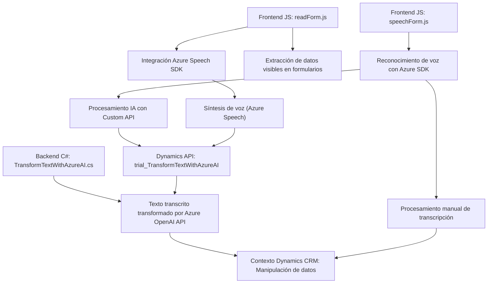

### Breve Resumen Técnico
El repositorio contiene tres componentes principales:
1. **`readForm.js` y `speechForm.js`**: Implementan el procesamiento de formularios y reconocimiento por voz, con integración dinámica del SDK de **Azure Speech Services**. Utilizan patrones como **Facade** y manejan dependencias externas mediante cargas dinámicas.
2. **`TransformTextWithAzureAI.cs`**: Plugin de **Dynamics 365** que usa la API de Azure OpenAI para transformar textos en objetos JSON estructurados, implementando un patrón de **Servicio Externo** en una arquitectura de **Microservicios**.

### Descripción de Arquitectura
La arquitectura global es híbrida:
1. Para el frontend (`readForm.js` y `speechForm.js`), emplea una arquitectura de **Cliente/Servidor** complementado por modularidad de funciones y soporte de dependencias dinámicas. Aprovecha el **patrón Facade** para sus implementaciones.
2. El backend (`TransformTextWithAzureAI.cs`) está orientado a eventos con una **arquitectura basada en Plugins** propia de Dynamics 365. Además, integra **Microservicios** mediante la API REST de Azure OpenAI.

### Tecnologías Usadas
1. **Frontend:**
   - JavaScript (DOM Manipulation, programación asíncrona).
   - **Azure Speech SDK** (síntesis y reconocimiento de voz).
   - Web APIs (carga dinámica de scripts, llamadas a servicios externos).
   - Dynamics 365 context (gestión de formularios).

2. **Backend:**
   - C# (interacción SDK Dynamics CRM).
   - **Azure OpenAI API** (transformación inteligente de texto).
   - REST APIs para comunicarse externamente.
   - Framework de Plugins de Dynamics CRM (Microsoft.Xrm.Sdk).

### Dependencias o Componentes Externos
1. **Azure Speech SDK**:
   - Para síntesis de voz y reconocimiento.
   - Cargado dinámicamente desde su CDN (`https://aka.ms/csspeech/jsbrowserpackageraw`).
   
2. **Azure OpenAI API**:
   - Transformación de texto en el backend con modelos como GPT (ej. GPT-4).
   
3. **Dynamics 365**:
   - Contextos de formularios y API REST para gestión de datos.
   
4. **APIs del navegador y Xrm SDK**:
   - Funciones del navegador para el cliente. El backend utiliza el SDK de Dynamics para manipular entidades.

---

### Diagrama Mermaid

---

### Conclusión Final
Este repositorio muestra un proyecto configurado para aprovechar funcionalidades modernas como **Azure Speech SDK** y **Azure OpenAI** para implementar una solución que integra componentes frontend y backend relacionados con reconocimiento y síntesis de voz. La arquitectura híbrida combina un enfoque modular en el cliente y un diseño orientado a eventos y microservicios en el servidor.

Es ideal para casos de uso donde se necesitan formularios dinámicos, automatización basada en voz y transformación inteligente de datos. Sin embargo, el manejo de credenciales y dependencias con servicios externos podría optimizarse, aplicando mejores prácticas como inyección de dependencias y seguridad.