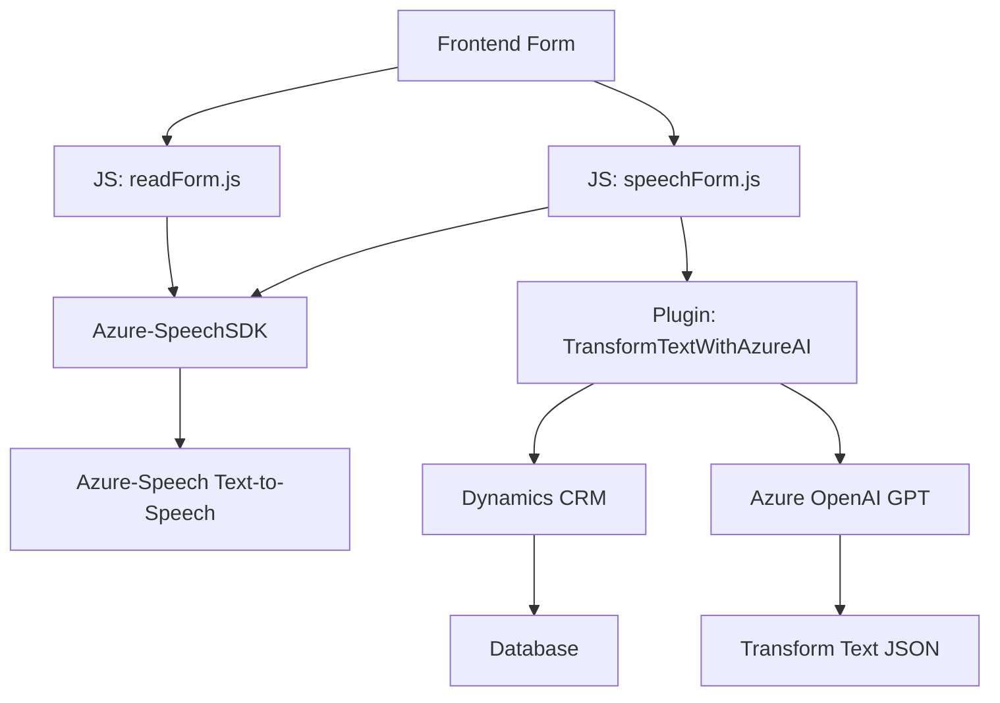

# Análisis de la solución

## Resumen técnico
El repositorio describe tres archivos que abordan una solución basada en Microsoft Dynamics 365 con integración de servicios de Azure Speech SDK y Azure OpenAI. La funcionalidad está orientada hacia la obtención y manejo de datos a nivel de formularios en Dynamics 365, combinando reconocimiento de voz y procesamiento avanzado de texto con IA.

---

## Descripción de arquitectura
#### Tipo de solución
La solución es un **conjunto de servicios integrados** que se encarga de manejar eventos y procesar datos de formularios dentro de Dynamics 365. Utiliza **Azure Speech SDK** para el reconocimiento y síntesis de voz y **Azure OpenAI** para transformación avanzada de texto. Es probable que sirva como parte de una aplicación de negocio (CRM) con funcionalidades cognitivo-conversacionales.

#### Tipo de arquitectura
La arquitectura parece estar estructurada como un **modelo de arquitectura de n-capas**, donde:
1. **Capa de presentación**: Implementada en los archivos front-end (JavaScript) para la interacción directa con el usuario o formulario.
2. **Capa de lógica de negocio**: Implementada por los plugins .NET de Dynamics CRM, en este caso `Plugins.TransformTextWithAzureAI.cs`, donde se procesan las entradas y se relacionan con los servicios de Azure OpenAI.
3. **Capa de datos**: Uso de `Microsoft.Xrm.Sdk` y API de Dynamics 365 para interactuar con la base de datos subyacente.

Esta solución también muestra algunos elementos de **arquitectura hexagonal**, gracias a la clara separación entre las entidades del sistema y las adaptaciones externas (Azure SDK, OpenAI API).

---

## Tecnologías y patrones utilizados
### Tecnologías
1. **Frontend:**
   - JavaScript (módulos para gestión de voz y datos visibles).
   - Azure Speech SDK: reconocimiento de entrada de voz y síntesis.
   - Dynamics 365 UI Framework (`executionContext`).

2. **Backend:**
   - C#: Plugins para Dynamics CRM.
   - Azure OpenAI: API para procesamiento avanzado de texto (GPT).

3. **Integraciones externas**:
   - RESTful APIs: Comunicación con Azure OpenAI para transformación de datos.
   - Azure Speech SDK: SDK para entrada y salida de voz.

### Patrones de diseño y desarrollo
1. **Wrapper / Adapter:** El uso explícito de funciones como `ensureSpeechSDKLoaded` encapsula la lógica para interactuar con dependencias externas.
2. **Domain-Driven Design:** Uno de los archivos crea modelos para representar la estructura de los datos del formulario, como los objetos `{label, value}`.
3. **Command Query Separation:** Los métodos están claramente divididos entre los que recuperan datos del formulario y los que procesan o transforman la información.

---

## Dependencias y componentes externos
1. **Azure Speech SDK:** Utilizado para procesamiento de entrada y salida de voz.
2. **Azure OpenAI Service:** Para tareas de procesamiento avanzado de texto, con integración vía API REST.
3. **Dynamics 365 Framework:** Ecosistema CRM que soporta el flujo de datos entre el usuario y el backend.
4. **Microsoft.Xrm.Sdk:** Para la manipulación de datos y eventos en Dynamics CRM.
5. **Newtonsoft.Json:** Bibliotecas para manejo y serialización de JSON.
6. **System.Net.Http:** Para solicitudes HTTP hacia el servicio OpenAI.
7. **Key management y credenciales:** Las API Key del servicio de Azure se administran directamente en el código (deben ser externalizadas por seguridad).

---

## Diagrama MERMAID

---

## Conclusión final
Esta solución combina tecnologías orientadas al cliente (frontend con JavaScript) y al servidor (backend con C#, Dynamics CRM) para implementar una interfaz inteligente capaz de manejar voz y procesamiento de texto avanzado. Los patrones usados ofrecen modularidad y escalabilidad, aunque hay riesgos de seguridad inherentes en la administración de claves de API. Además, dado su dependencia de servicios externos (Azure), se debe garantizar el manejo adecuado de tiempos de respuesta y tolerancia a fallos.