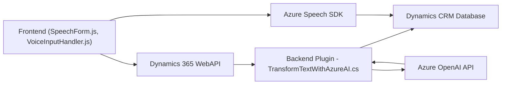

### Breve Resumen Técnico

El repositorio contiene un conjunto de archivos que integran funcionalidad para formularios inteligentes en Dynamics 365. Se apoya en **Azure Speech SDK** y **Azure OpenAI API** para facilitar accesibilidad, procesar datos por voz y realizar transformaciones automáticas mediante inteligencia artificial. La arquitectura comprende una interacción entre frontend dinámico, plugins de backend y APIs externas.

---

### Descripción de Arquitectura

La solución implementa una **arquitectura basada en servicios**, con comunicación directa entre componentes frontend, backend y servicios externos de Azure. El sistema utiliza eventos y callbacks en el frontend para procesar entrada, mientras que en el backend un plugin actúa como intermediario entre Dynamics CRM y Azure OpenAI.

1. **Frontend**:
   - Reconocimiento de voz y síntesis de texto a voz.
   - Manipulación y procesamiento dinámico de formularios de Dynamics 365.
2. **Backend (Plugin en C#)**:
   - Transformación de texto con Azure OpenAI API.
   - Consume datos estructurados del frontend y devuelve resultados al CRM.

---

### Tecnologías Usadas

1. **Frontend**:
   - **JavaScript/TypeScript**: Desarrollo de interacción y procesamiento dinámico.
   - **Azure Speech SDK**: Sintetiza texto y permite reconocimiento de voz.
   - **Dynamics 365 WebAPI**: Manipulación de datos en formularios CRM.

2. **Backend**:
   - **C# (.NET Framework)**: Desarrollo del plugin para Dynamics CRM.
   - **Newtonsoft.Json**: Manejo de datos en JSON.
   - **Azure OpenAI API**: Transformación de texto en base a normas definidas.
   - **Microsoft Dynamics SDK**: Para interacción entre plugins y CRM.

---

### Diagrama Mermaid

---

### Conclusión Final

La solución es una aplicación modular basada en servicios para mejorar formularios en Dynamics CRM. Utiliza un reconocimiento avanzado de voz y capacidades de inteligencia artificial para transformar y organizar datos en un flujo fluido. La arquitectura combina un frontend dinámico en JavaScript, APIs externas (Azure Speech y OpenAI), y un plugin backend en C#, destacándose por su diseño extensible y su capacidad de integración con servicios inteligentes.

Es ideal para entornos empresariales que buscan automatización, accesibilidad y modernización de sus formularios. Si bien la dependencia de servicios externos de Azure es importante, esta se compensa con las capacidades avanzadas que aporta.