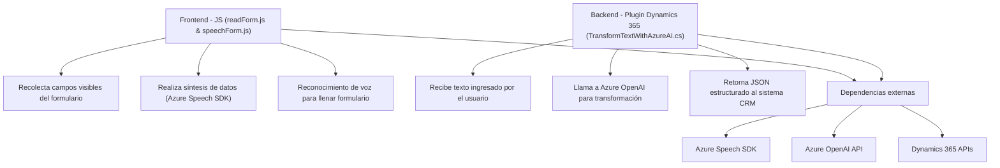

### Breve resumen técnico

Este repositorio incluye tres componentes principales relacionados con la funcionalidad de voz y procesamiento de texto dentro de aplicaciones Microsoft Dynamics 365. Los archivos implementan lógica tanto de frontend (manejo de voz y formularios) como backend (comunicación con Azure OpenAI para procesar texto). Están orientados a mejorar la accesibilidad y automatización en un entorno de CRM mediante interacción con servicios externos de Azure.

---

### Descripción de arquitectura

La solución se puede clasificar como un híbrido **frontend-backend**, constituida por módulos frontend que interactúan directamente con la interfaz del usuario (manejo de voz y formularios), y componentes backend que procesan información avanzada mediante un plugin de Dynamics conectado con Azure OpenAI. Este diseño sigue una arquitectura **n capas** donde las capas principales son:
1. Presentación: Funciones en JavaScript (manejo de voz y procesamiento de formularios).
2. Lógica de negocio: Plugin Dynamics en C# que llama a Azure OpenAI para el procesamiento avanzado.
3. Integración: Uso del SDK de Voz de Azure y APIs externas.

---

### Tecnologías usadas

1. **Frontend (JavaScript)**:
   - **Azure Speech SDK**: Para reconocimiento de voz y síntesis en tiempo real.
   - **Dynamics 365 API**: Uso de objetos del contexto como `formContext`, `executionContext`, etc.

2. **Backend (C#)**:
   - **Microsoft Dynamics SDK**: Para plugins personalizados y manipulación de datos CRM.
   - **Azure OpenAI**: Para transformación avanzada de texto.

3. **Dependencias externas**:
   - `System.Net.Http` y `Newtonsoft.Json` (en C#) para consumir servicios REST.
   - **SDK dinámicos**: Ambos módulos frontend cargan el Speech SDK de forma dinámica (sin instalación previa).

---

### Diagrama Mermaid válido para GitHub

---

### Conclusión final

La solución presentada es una implementación híbrida que aprovecha servicios de Azure (Speech SDK y OpenAI) junto con lógica de CRM (Dynamics 365). Este diseño sigue una arquitectura **n capas**, donde:
- **Frontend** maneja la interacción directa con el usuario.
- **Backend** realiza procesamiento complejo externo.
- **Servicios externos** integran capacidades avanzadas como inteligencia artificial y síntesis de voz.

Aunque eficiente y modular, se recomienda mejorar la gestión de credenciales y claves API para reforzar la seguridad del sistema. También podría beneficiarse de mayor desacoplamiento si se implementaran más principios de arquitectura hexagonal o microservicios modularizados.