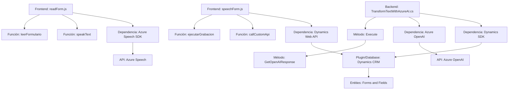

### Breve resumen técnico
El repositorio engloba múltiples archivos que trabajan juntos para gestionar formularios en Dynamics 365, integrando reconocimiento de voz y transformación de texto mediante el Azure Speech SDK y Azure AI. Su funcionalidad principal incluye convertir los datos del formulario en voz, interpretar comandos hablados para mapear campos del formulario, y transformar texto utilizando servicios externos de Azure OpenAI.

### Descripción de arquitectura
La arquitectura del repositorio combina elementos **modulares y orientados a servicios**, siendo híbrida en su enfoque.  
- **Frontend**: Scripts en JavaScript diseñados para interactuar con formularios en Dynamics 365.  
   - Modularidad en funciones independientes que se cargan dinámicamente (Azure Speech SDK).  
- **Backend**: Un plugin C# (`TransformTextWithAzureAI.cs`) que actúa como puente entre Dynamics CRM y Azure OpenAI, implementado como un **plugin en Dynamics CRM**.  

La solución tiene características de una arquitectura **n-capas**, donde:  
- **Presentación**: Scripts JS en el frontend.  
- **Lógica de negocio**: Implementación mediante los métodos del plugin (C#) y los scripts JavaScript.  
- **Acceso a datos**: Comunicación con Microsoft Dynamics CRM vía `Xrm.WebApi` y con Azure OpenAI vía API.

### Tecnologías usadas
1. **Frontend tecnologías**:  
   - JavaScript: Lenguaje principal de los scripts.  
   - Azure Speech SDK: Sintetizador de texto a voz y reconocimiento de comandos hablados.  
   - Dynamics 365 Web API: SDK interno para manipular formularios y datos.

2. **Backend tecnologías**:  
   - C#: Lenguaje del plugin.  
   - Azure OpenAI: API para transformar texto.  
   - Microsoft Dynamics SDK: API para plugins.  

### Dependencias o componentes externos
1. **Azure Speech SDK**: Usada en scripts JS para voz y transcripción.  
2. **Azure OpenAI**: Plugin backend para transformación de texto.  
3. **Dynamics 365 Web API**: Para interacción con formularios y entidades.  
4. **Newtonsoft.Json**: Manejo de objetos JSON en C#.  
5. **System.Net.Http**: Solicitudes HTTP para consumir API externas.  

### Diagrama Mermaid válido para GitHub

### Conclusión final
Este repositorio representa una solución integrada para automatizar la gestión de Dynamics 365 utilizando tecnologías modernas como el Azure Speech SDK y Azure OpenAI en una arquitectura de **n-capas**, donde el frontend ejecuta funcionalidades de voz y lógica de negocio básica mientras el backend complementa con un plugin potenciado por inteligencia artificial. Es ideal para automatización de procesos en sistemas empresariales, mostrando un enfoque centrado en servicios cloud y comunicación API.