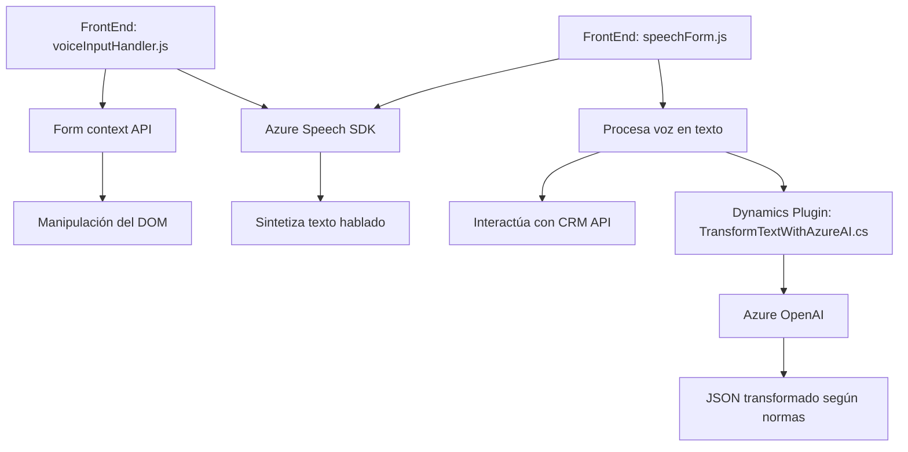

### Breve resumen técnico
El repositorio contiene componentes para integrar capacidades avanzadas de voz y procesamiento de texto en la plataforma Dynamics CRM utilizando **Azure Speech SDK** y **Azure OpenAI API**. Está dividido en tres módulos principales: `frontend` (JavaScript controlando formularios y funciones interactivas basadas en voz), `speechForm.js` (entrada y reconocimiento de voz), y un `plugin` en C# que aplica transformaciones avanzadas a textos bajo normas predefinidas.

### Descripción de arquitectura
La solución combina elementos de una arquitectura de n-capas:
1. **Frontend**: Implementando interacciones usuario-SDK para la captura, procesamiento y síntesis de voz.
2. **Backend**: Integración con Dynamics CRM mediante un plugin que amplía las capacidades del sistema.
3. **External Services**: Dos dependencias externas: el **Azure Speech SDK** para síntesis y reconocimiento de voz, y la **Azure OpenAI API** para transformación de texto en la capa de lógica del servidor.

Además, el diseño utiliza patrones como el **Observer** dentro del plugin (que reacciona a eventos CRM) y dependencia de servicios externos (Azure).

### Tecnologías usadas
1. **Frontend** (JavaScript y DOM API): 
   - SDKs externos: **Azure Speech SDK**.
   - APIs de Dynamics CRM.
2. **Backend** (C#, Dynamics CRM Plugins):
   - `Microsoft.Xrm.Sdk` y `System.Net.Http` para comunicación con el API de CRM y Azure.
   - **REST API client**: Azure OpenAI.
   - Manejo de JSON con `Newtonsoft.Json.Linq`.
3. **Externals**:
   - Azure Speech SDK y Azure OpenAI para aprovechar inteligencia artificial, reconocimiento de voz, y transformación de texto.

### Diagrama Mermaid válido para GitHub

### Conclusión final
La solución es una combinación de frontend dinámico y un backend integrado. El **frontend con JavaScript** actúa como controlador de interacción entre formularios y voz utilizando Azure Speech SDK, mientras que el **plugin en C#** maneja la integración con Dynamics CRM y Azure OpenAI para ofrecer transformaciones avanzadas de texto. Todo el sistema sigue una lógica modular y aprovecha los servicios de terceros en una arquitectura extensible n-capas.