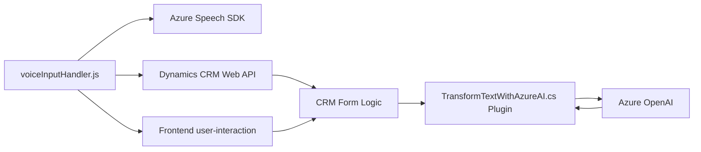

### Breve resumen técnico:
El repositorio parece tener como objetivo implementar una solución que integre capacidades de entrada de voz (speech-to-text) y generación/transformación de texto (text-to-speech y procesamiento avanzado con IA mediante Azure OpenAI). Esto se alinea con soluciones que incluyen funcionalidades basadas en interacción con formularios en Dynamics CRM.

---

### Descripción de la arquitectura:
La solución presenta tres componentes principales:
1. **Frontend (JavaScript)**: Se encarga de la interacción del usuario a través del navegador. Obtiene datos del formulario, realiza operaciones como síntesis y reconocimiento de voz a texto, y llama a funcionalidades del backend si es necesario.
2. **Backend (Dynamics CRM Plugin)**: Procesa el texto recibido, transforma su estructura mediante inteligencia artificial (Azure OpenAI), y realiza operaciones específicas en el sistema de CRM, como actualizaciones de registros.
3. **Servicios Terceros**: El sistema se apoya en servicios externos, como **Azure Speech SDK** y **Azure OpenAI**, para realizar tareas de reconocimiento de voz y procesamiento avanzado de texto.

La arquitectura se aproxima a un diseño de **SOLUCIÓN MICRO-NCAPA**:

- **Moderada separación de capas dentro del frontend:** Hay una capa de interacción cliente (formulario y eventos del UI) y otra capa de negocio que centraliza el procesamiento de datos y comunicación con servicios externos (Azure Speech SDK).
- **Plugin en el backend**: El backend sigue el patrón de extensibilidad especializado de Dynamics CRM (`IPlugin`) para operaciones sobre formularios y entidades.
- **Servicios externos**: La arquitectura utiliza servicios externos como Azure Speech SDK y Azure OpenAI, delegando tareas específicas como speech-to-text y procesamiento de texto.

Es importante señalar que la arquitectura exhibe características del paradigma **event-driven** al activar funcionalidades en respuesta a acciones del usuario (como el reconocimiento de voz y la actualización al formulario CRM), y del **patrón de servicios remotos**, por su dependencia en APIs externas.

---

### Tecnologías usadas:
1. **Frontend (JavaScript):**
   - **Azure Speech SDK**: Utilizado para realizar reconocimientos de voz y sintetizar texto a voz.
   - **Dynamics CRM Web API**: Consume el objeto `executionContext` para interactuar con formularios y APIs personalizadas.

2. **Backend (C#):**
   - **Microsoft Dynamics CRM SDK**:
     - Manejo de plugins y eventos en el CRM.
   - **Azure OpenAI Service**:
     - Procesamiento y transformación del texto utilizando modelos de inteligencia artificial avanzados como GPT-4.
   - **C# y bibliotecas relacionadas**:
     - `System.Net.Http` para comunicación con servicios web.
     - `Newtonsoft.Json` para manejo de datos JSON.

---

### Diagrama Mermaid válido para GitHub:

---

### Conclusión final:
La solución combina características de reconocimiento de voz y procesamiento de texto para enriquecer la experiencia en sistemas Dynamics CRM. Se basa en una arquitectura que mezcla varias tecnologías: **JavaScript** y **Azure Speech SDK** para la parte del frontend, con soporte adicional mediante comunicación directa con APIs de **Dynamics CRM**. En el backend, se utiliza un plugin basado en **C#** y el protocolo `IPlugin` de Dynamics para la integración con los datos y lógica del sistema CRM. Destaca también la implementación de inteligencia artificial avanzada a través del servicio **Azure OpenAI** para adaptar y transformar texto.

El diseño sigue una arquitectura que podría ser considerada **micro-ncapas**, empleando patrones como la separación de lógica por capas, integración con servicios externos mediante APIs, y un enfoque event-driven en la activación de funcionalidades por medio de interacciones del usuario.