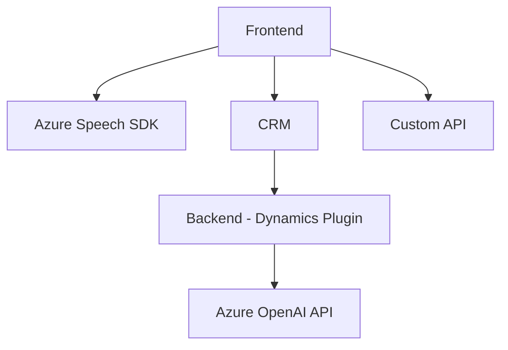

## Breve resumen técnico
La solución distribuye funcionalidades relacionadas con el manejo de formularios y voz (léase reconocimiento, síntesis y aplicación) entre archivos JavaScript en el frontend y un plugin desarrollado para Dynamics CRM en C#. La solución aprovecha Azure Speech SDK para la conversión de texto a voz y reconocimiento de voz, además de Azure OpenAI para el procesamiento avanzado del texto transcrito. También realiza una integración directa con CRM mediante plugins y `Xrm.WebApi.online`.

---

## Descripción de arquitectura
La arquitectura combina un enfoque **modular** en los scripts frontend y utilitarios (e.g., divisiones funcionales basadas en la responsabilidad de cada función) con una arquitectura **cliente-servidor** debido a la interacción entre la aplicación y el CRM, configurada como una plataforma backend. El plugin implementa un patrón de **plugin de Dynamics CRM**, optimizado para los flujos de datos con servicios externos (Azure AI) y CRM interno.

La solución trabaja como conjunto de componentes que interactúan con APIs de terceros y el CRM, mostrando características propias de una arquitectura **microservicios acoplada**: cada módulo tiene un nivel de independencia, mientras que se comunica con servicios externos y CRM. A su vez, está orientada a ser adaptable y escalable para incorporar herramientas adicionales sin modificar la estructura principal de la aplicación.

---

## Tecnologías usadas
1. **Frontend (JavaScript)**
   - Azure Speech SDK: Síntesis y reconocimiento de voz.
   - Custom APIs: Para procesamiento en Azure AI y CRM.
   - Modular JavaScript: Funciones reutilizables, organizadas por tareas específicas y separación de responsabilidades.

2. **Backend (C# Plugin para Dynamics CRM)**
   - Microsoft Dynamics CRM SDK (`Microsoft.Xrm.Sdk`): Integración directa con el núcleo del CRM.
   - Azure OpenAI API: Procesamiento de texto en JSON estructurado basado en reglas.
   - JSON libraries: `Newtonsoft.Json` y `System.Text.Json` para manejo de datos en JSON.
   - Communication: `System.Net.Http` para realizar solicitudes HTTP.

---

## Diagrama Mermaid válido para GitHub

---

## Conclusión final
La solución presentada tiene como objetivo enriquecer aplicaciones de formularios basadas en CRM con funcionalidades avanzadas de interacción humana a través de reconocimiento de voz, síntesis de voz, y procesamiento de texto asistido por inteligencia artificial. También utiliza prácticas modernas como modularidad en frontend, integración con APIs externas, y extensibilidad en el lado del CRM mediante plugins.

La arquitectura está diseñada para ser altamente escalable en un entorno cliente-servidor y adaptable para interacción con múltiples tecnologías externas (e.g., SDK de Azure Speech, OpenAI). Su enfoque modular y distribuido es beneficioso para mantener y extender las capacidades del sistema sin generar alta complejidad técnica.