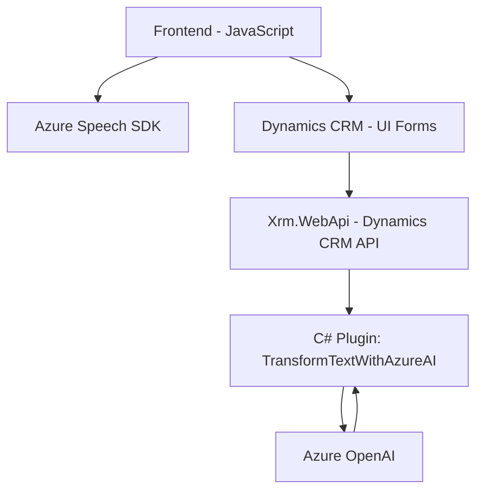

### Breve resumen técnico

El repositorio combina múltiples archivos: dos basados en **JavaScript** para manipulación y reconocimiento de voz en formularios integrados en Dynamics CRM, y un **plugin en C#** para integrar el servicio de Azure OpenAI en Dynamics CRM. La solución es una integración avanzada que mezcla **procesamiento de voz** y **transformación de texto mediante Inteligencia Artificial (IA)** utilizando servicios de Microsoft Azure y tecnologías propias del ecosistema Dynamics CRM.

---

### Descripción de arquitectura

La solución se puede categorizar como una **arquitectura de capas**, aunque con elementos que bordean la integración de servicios externos. De manera detallada:

1. **Front-end en JavaScript** integrado en Dynamics CRM:
   - Dos scripts (`readForm.js` y `speechForm.js`) interactúan con el modelo del formulario de Dynamics (via `executionContext`) para manejar entrada/salida de datos y reconocimiento de voz.
   - **Azure Speech SDK** se utiliza para la síntesis y transcripción de voz, interactuando entre los formularios y los servicios de Azure.
   - Utiliza patrones de **eventos asincrónicos** y **manipulación dinámica de UI**.

2. **Plugin en C# para procesamiento de texto**:
   - Este plugin (`TransformTextWithAzureAI.cs`) es un micro-servicio dentro de Dynamics CRM que directamente invoca Azure OpenAI para transformar un texto en un formato estructurado basado en IA.
   - Con la arquitectura típica de Dynamics CRM plugins, opera en respuesta a eventos del sistema y actúa como intermediario entre el CRM y Azure OpenAI.

En conjunto, la arquitectura puede clasificarse como **n-capas** orientada a servicios** (Dynamics CRM como capa lógica y datos; Azure Speech SDK para interfase con voz; Azure OpenAI como servicio de procesamiento avanzado).

---

### Tecnologías usadas

1. **Frontend**:
   - **JavaScript**: Lenguaje base de los dos archivos.
   - **Azure Speech SDK**: Integración para síntesis y transcripción de voz. Utiliza reconocimiento de voz en tiempo real.
   - **Xrm.WebApi**: API de Dynamics CRM para operaciones con los datos del sistema.
   - **Browser API**: Para interactuar con el DOM y otros componentes del navegador, más manipulación de la UI.

2. **Backend (Plugin C#)**:
   - **C# / .NET Framework**: Para el desarrollo del plugin.
   - **Microsoft Dynamics SDK**: Proporciona las piezas fundamentales para implementar plugins que interactúan con modelos de datos y operaciones de CRM.
   - **Azure OpenAI SDK/API**: Servicio de inteligencia artificial usado para procesar texto (modelo GPT).
   - **System.Net.Http** y **JSON Libraries**: Realiza peticiones HTTP hacia Azure OpenAI y procesa las respuestas mediante JSON.

3. **Nube**:
   - Microsoft Azure: 
     - **Azure Speech SDK** para manejo de entrada/salida de voz.
     - **Azure OpenAI** para procesamiento de texto e IA.

---

### Diagrama Mermaid válido para GitHub

---

### Conclusión final

Este repositorio es la implementación de una solución basada en **event-driven architecture** y **n-capas**, aprovechando dos servicios complementarios de Microsoft Azure: **Speech SDK** para procesamiento de voz y **OpenAI** para procesamiento de IA. Los scripts de **JavaScript** funcionan en el cliente como asistentes inteligentes en la UI del CRM, mientras que el plugin de **C#** actúa como un microservicio integrado para la transformación de texto según reglas específicas.

Es una solución diseñada para enriquecer la experiencia de usuario en Microsoft Dynamics CRM, simplificándola mediante el uso de tecnologías avanzadas como el reconocimiento y la generación de voz y el procesamiento de lenguaje natural.