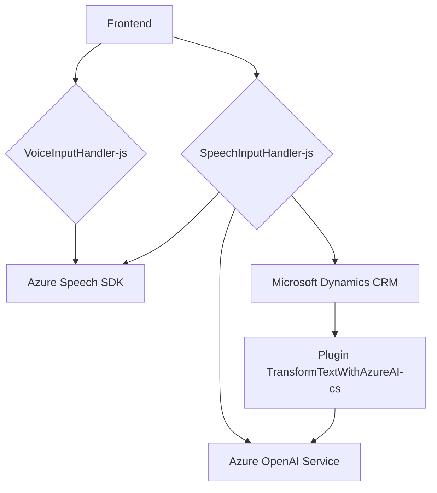

### Breve resumen técnico:
El repositorio contiene una solución que integra diferentes componentes para el manejo de formularios, lectura por voz, reconocimiento de texto, y procesamiento a través de inteligencia artificial. Hay tres archivos principales:

1. **VoiceInputHandler.js**  
   `Reads form data and converts it to speech using Azure Speech SDK.`

2. **SpeechInputHandler.js**  
   `Performs voice recognition and updates form fields based on audio input, using Azure Speech SDK and an external API backed by AI.`

3. **TransformTextWithAzureAI.cs**  
   `Plugin for Dynamics CRM that leverages Azure OpenAI Service to transform text input into structured JSON according to user-defined norms.`

### Descripción de arquitectura:
La solución sigue un modelo **cliente-servidor desacoplado**, con procesamiento distribuido entre un **frontend basado en JavaScript** que interactúa con APIs externas (Azure Speech SDK y Dynamics APIs), y un **backend basado en Microsoft Dynamics CRM** que utiliza plugins como el presentado en el archivo `.cs`. Esta solución es más cercana a una **arquitectura de n capas** debido al flujo claro entre presentación, lógica de negocios, y servicios externos (IA, voz/speech SDK).

Los principales componentes son:
- **Frontend:** Responsable de interactuar con el usuario. Lectura de formularios y reconocimiento de voz con contextualización en Dynamics CRM, utilizando SDK externas y APIs para agregar funcionalidad avanzada (voz y AI).
- **Backend:** Extensión del modelo de Dynamics mediante un plugin que realiza procesamiento avanzado utilizando **Azure OpenAI**.

El diseño tiene patrones de responsabilidad única (una clase o función para cada unidad funcional), modularidad, y un enfoque en eventos disparados por interacción del usuario. Existe una clara separación entre el frontend y el backend.

---

### Tecnologías usadas:
1. **JavaScript**  
   - Manejo de la interfaz en el navegador, incluyendo la lectura de formularios y el reconocimiento de voz usando SDK.
   - Azure Speech SDK dinámicamente cargado para sintetización y reconocimiento.

2. **Azure Speech SDK**  
   - API externa para convertir texto a voz y reconocer voz para convertirla en texto.

3. **Microsoft Dynamics CRM**  
   - Extensiones del CRM definidas como plugins para transformar datos y manipular formularios.

4. **Azure OpenAI Service**  
   - Usado en el plugin del backend para transformar texto no estructurado en JSON mediante procesamiento por IA (modelo GPT-4).

5. **System.Net.Http** y **Newtonsoft.Json**  
   - Para integrar y consumir APIs externas en el código del plugin.

### Diagrama mermaid:

### Conclusión final:
La solución implementada tiene una estructura de **n capas con integración de APIs externas**, diseñada principalmente para el procesamiento interactivo (voz, texto, y datos). Su diseño modular permite que cada componente funcione de manera autónoma pero interconectada, siendo capaz de trabajar sobre Microsoft Dynamics y utilizando servicios de inteligencia artificial. Sin embargo, el código manifiesta una alta dependencia tanto de Azure Speech SDK como de Azure OpenAI para completar su funcionalidad. Esto podría generar desafíos en costos y disponibilidad a largo plazo si se replantea la arquitectura.