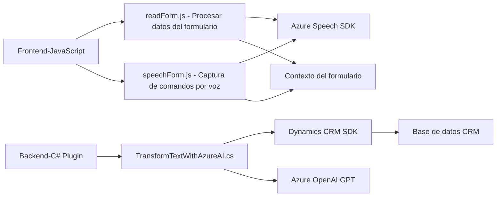

### Breve resumen técnico
El repositorio está compuesto por componentes que permiten la integración de voz en formularios mediante el uso de Azure Speech SDK y OpenAI para procesamiento de texto. Los archivos están divididos entre funcionalidades de frontend y plugins para backend en un entorno CRM como Microsoft Dynamics.

---

### Descripción de la arquitectura
Este sistema tiene una arquitectura basada en capas, incluyendo componentes frontend que interactúan con SDKs y servicios externos (Azure Speech SDK), y plugins backend dentro de Dynamics CRM que extienden paquetes core de CRM mediante herramientas de inteligencia artificial como OpenAI. El diseño combina funcionalidad de procesamiento cognitivo, interacción con formularios y lógica de manejo de datos, manteniendo una separación clara entre frontend y backend.

**Tipos de arquitectura presentes:**
1. **Arquitectura de n capas**: Separación entre frontend (readForm.js, speechForm.js) y backend (transformTextWithAzureAI.cs plugin).
2. **Integración basada en APIs**: Invocación de servicios externos (Azure Speech SDK, Azure OpenAI).

---

### Tecnologías usadas
1. **Frontend (JavaScript):**
   - Azure Speech SDK: Para síntesis de voz y reconocimiento.
   - JavaScript nativo: Para lógica de manipulación de datos, DOM y callbacks.
2. **Backend (C# Plugin):**
   - Microsoft Dynamics CRM SDK: Para datos internos y eventos en CRM.
   - System.Net.Http: Para invocación de APIs externas.
   - Azure OpenAI: Transformación de texto utilizando inteligencia artificial.
   - Newtonsoft.Json: Procesamiento de datos JSON.

### Patrones utilizados:
- **Modularización**: Separación de lógica de voz (synthesizing, recognition) y procesamiento de datos (lectura de formularios, mapeos de atributos).
- **Integración externa controlada**: Verificación de disponibilidad de SDKs y reacciones dinámicas.
- **Plugin Pattern**: En backend, para extender funcionalidad de CRM sin modificar la base del sistema.
- **Event-driven architecture**: Uso de callbacks y manejo dinámico de flujo en frontend.

---

### Diagrama Mermaid válido para GitHub
Representa la interacción entre componentes internos y servicios externos.

---

### Conclusión final
El repositorio representa una solución híbrida que combina interacción frontend con procesamiento cognitivo usando APIs de Azure Speech y OpenAI. La arquitectura modular de n capas permite personalizar la interacción del usuario con formularios en un entorno CRM, mientras que los plugins amplían las capacidades del sistema mediante integración de inteligencia artificial. Esta combinación es ideal para automatizar tareas repetitivas y mejorar la interfaz de usuario en sistemas empresariales modernos.