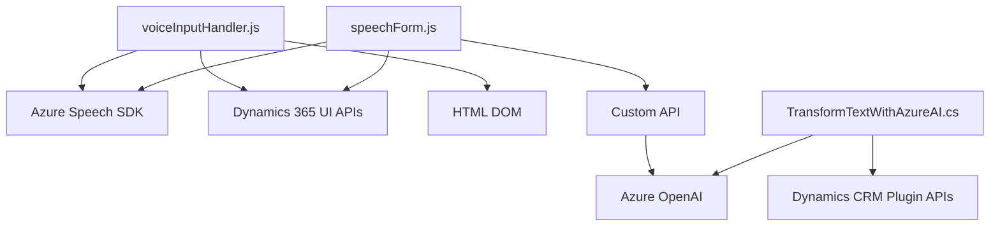

### Breve resumen técnico:
El repositorio contiene tres componentes principales centrados en funcionalidades para procesamiento de texto y voz, utilizando servicios externos como **Azure Speech SDK** y **Azure OpenAI**. Estos elementos están integrados con el Dynamics 365 CRM, habilitando una interacción avanzada a nivel de formularios.

---

### Descripción de la arquitectura:
La solución sigue una arquitectura **modular y orientada a servicios**, donde los tres archivos interactúan con APIs externas (Azure Speech SDK y OpenAI) y APIs internas de Dynamics 365 para manipular formularios. 

Aunque el diseño específico varía, globalmente parece un enfoque **orientado a componentes**, cada archivo está diseñado para ser reutilizable dentro del entorno CRM. El plugin (backend) es monolítico, mientras que las dos componentes de frontend se organizan en capas funcionales que actúan como consumidores de SDK externos.

---

### Tecnologías usadas:
1. **Frontend:**
   - **JavaScript:** Desarrollo de funcionalidades para síntesis y reconocimiento de voz, basado en llamadas asincrónicas.
   - **Azure Speech SDK:** Integración para texto a voz y reconocimiento de voz.
   - **Dynamics CRM UI API:** Manipulación de datos en formularios y entidades internas.

2. **Backend (plugin):**
   - **C#:** Desarrollo del plugin para Dynamics CRM que utiliza Microsoft SDKs.
   - **Azure OpenAI:** Generación de transformaciones de texto mediante GPT.
   - **Newtonsoft.Json y System.Text.Json:** Procesamiento de datos JSON.

---

### Diagrama Mermaid:

---

### Conclusión final:
El repositorio implementa una solución híbrida con funcionalidades distribuidas entre frontend y backend. Su propósito principal es mejorar la integración de voz, texto y procesamiento de datos en una interfaz de usuario basada en Dynamics CRM, aprovechando las capacidades de servicios modernos como Azure Speech SDK y OpenAI. La arquitectura destaca por su modularidad y enfoque en la reutilización, pero aún mantiene dependencias importantes con los servicios de Dynamics CRM y Azure.