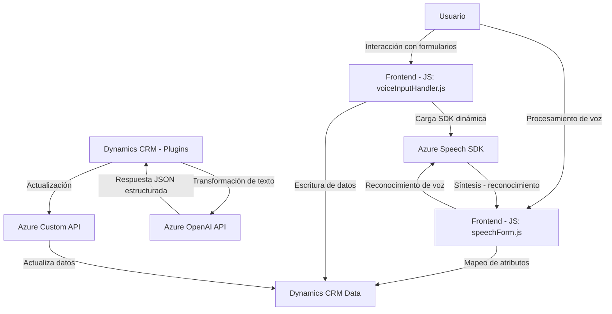

### **Análisis técnico detallado**

#### **1. Qué tipo de solución es:**
El repositorio define una solución híbrida que involucra múltiples componentes: 
- **Frontend**: JavaScript para la interacción con formularios (ej. lectura y reconocimiento de voz). 
- **Backend**: Un plugin `.cs` para Dynamics CRM integrado con servicios externos (Azure OpenAI).
- **Integraciones**: Uso de Azure Speech SDK y API personalizada con Dynamics 365 Web API para procesamiento de voz y manipulación de datos.

Por lo tanto, el repositorio puede considerarse una solución completa, principalmente orientada a extender funcionalidades en Dynamics CRM usando herramientas modernas como Azure Cognitive Services y OpenAI APIs.

---

#### **2. Tecnologías y patrones usados:**
- **Tecnologías y servicios utilizados**:
  - **Frontend**:
    1. **JavaScript**: Lenguaje principal para operaciones en el navegador relacionadas con los formularios.
    2. **Azure Speech SDK**: Reconocimiento y síntesis de voz.
    3. **Dynamics 365 Web API**: Interacción con el CRM para realizar tareas como actualización de campos.
  - **Backend**:
    1. **C# (Microsoft .NET)**: Plugin para extender funcionalidades en Dynamics CRM.
    2. **Azure OpenAI Services**: Transformación de texto y creación de estructuras JSON usando IA.
    3. **System.Net.Http**: Envío de solicitudes HTTP a servicios externos.
    4. **JsonDocument**: Manipulación de datos JSON en C#.
    5. **Newtonsoft.Json.Linq**: Procesamiento extensivo de JSON.

- **Patrones utilizados**:
  1. **Callback-driven design**: En el frontend, se llama a funciones solamente cuando las dependencias necesarias están disponibles.
  2. **Plugin Pattern**: Extensión de funcionalidades del CRM mediante la interfaz `IPlugin` en el archivo `.cs`.
  3. **Facilitador (Wrapper Pattern)**: Modularización del código para interacción con APIs y servicios externos, como el SDK de Azure Speech y OpenAI APIs.
  4. **Integración dinámica de dependencias**: Métodos como `ensureSpeechSDKLoaded` se encargan de cargar dinámicamente las librerías necesarias y evitar bloqueos.
  5. **Flujo procedural**: Transformación de datos y llamadas a APIs externas se realizan en pasos organizados secuencialmente.

---

#### **3. Qué tipo de arquitectura tiene:**
- **Arquitectura híbrida**:
  - El frontend sigue una estructura básica de funciones organizadas según operaciones de interacción con el usuario y servicios.
  - La integración utiliza un enfoque basado en eventos (event-driven) con llamadas asincrónicas.
  - El backend combina lógica de negocio y conectividad con APIs externas, utilizando el patrón de plugin para integrar un CRM monolítico (Dynamics CRM).
  - Aunque no utiliza patrones como Arquitectura Hexagonal, su combinación podría clasificarse como una **arquitectura n-capas** (Frontend + Plugin + servicios externos).

---

#### **4. Dependencias o componentes externos presentes:**
1. **Azure Speech SDK** (JavaScript): Para reconocimiento y síntesis de voz.
2. **Azure OpenAI Services** (C#): Transformación avanzada de texto con IA.
3. **Dynamics 365 Web API**:
   - `Xrm.WebApi` para manipular datos del formulario en Dynamics CRM.
   - Custom API para operaciones específicas.
4. **Newtonsoft.Json** / **JsonDocument** (C#): Procesamiento de respuestas JSON.
5. **System.Net.Http** (C#): Conexión HTTP con servicios externos para realizar operaciones REST.
6. **Azure API Keys**: Necesarias para autenticarse en APIs de Speech y OpenAI.
7. **Browser compatibility considerations**: Código de JavaScript debe ejecutarse en navegadores modernos que soporten ES6 y APIs globales (como `window.SpeechSDK`).

---

### Diagrama **Mermaid**:

---

### **Conclusión final:**
Este repositorio forma parte de una solución moderna que integra un frontend basado en JavaScript, SDKs de Azure (Speech + OpenAI) y extensiones de Microsoft Dynamics CRM que interactúan con APIs internas y externas. Su arquitectura usa una combinación de enfoques n-capas (frontend + backend + servicios externos) y patrones funcionales como dinámica de plugins y manejo en pasos procedurales.  
Sin embargo, podría beneficiarse de una mayor separación de responsabilidades y un diseño basado en clases o patrones como MVC o hexagonal en el frontend y el backend, respectivamente, para facilitar la escalabilidad y mantenimiento.