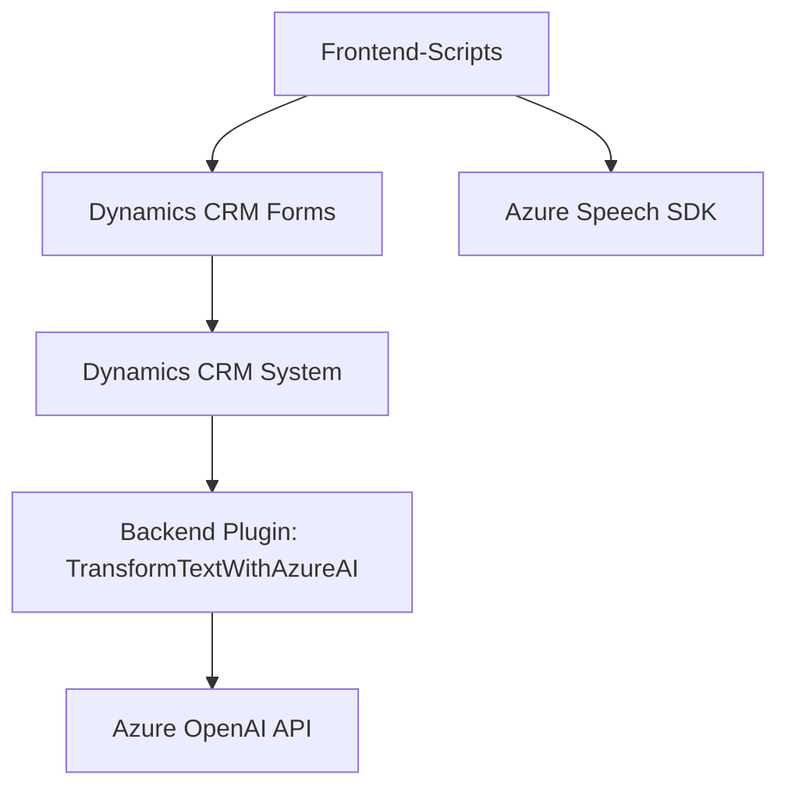

### Breve resumen técnico
El repositorio parece ser parte de una solución híbrida que integra tres capas funcionales:
- **Frontend:** Script de cliente en **JavaScript** para Microsoft Dynamics CRM, combinando transcripción de voz y síntesis utilizando **Azure Speech SDK**.
- **Backend Plugin:** Código en **C#** para transformaciones de texto mediante la API de **Azure OpenAI**, implementado como un **plugin** en Dynamics CRM.
- **Integración:** Ambas partes se conectan a servicios de Azure (Speech y OpenAI) para enriquecer la funcionalidad del sistema CRM con entrada y salida por voz y procesamiento semántico avanzado.

---

### Descripción de arquitectura
La arquitectura en general tiene características **modulares** y puede categorizarse como una **solución de n capas:**
1. **Capa de presentación (Frontend):**
   - Scripts en JavaScript que interactúan directamente con **Microsoft Dynamics CRM Forms**.
   - Funciones diseñadas para integrar reconocimiento de voz y síntesis de texto con APIs de Azure.
2. **Capa lógica (Plugin):**
   - Implementación basada en la **IPlugin** para extender eventos específicos de Dynamics CRM usando procesamiento centralizado con reglas en Azure OpenAI.
3. **Capa de servicios externos (Cloud Integration):**
   - Consumo de servicios de **Azure Speech SDK** y **Azure OpenAI** mediante llamadas API para enriquecer las capacidades con Inteligencia Artificial y computación en la nube.

---

### Tecnologías usadas
1. **Frontend:**
   - **JavaScript:** Scripts modulares que interactúan con formularios de Dynamics CRM.
   - **Azure Speech SDK:** Asincronía y manipulación de entrada/salida por voz.
   - **Promesas y asincronía (JavaScript):** Gestión eficiente de operaciones dependientes de APIs remotas.
   - **Framework Dynamics CRM:** Uso de objetos como `formContext` y `Xrm.WebApi`.

2. **Backend Plugin:**
   - **C#:** Código para el plugin, que opera dentro del ecosistema de Dynamics CRM.
   - **Microsoft Dynamics CRM SDK:** Elementos como `IPlugin`, `ExecutionContext` y `IServiceProvider`.
   - **Azure OpenAI API:** Para procesamiento avanzado del texto.
   - **HTTP Client en .NET:** Consumir APIs externas de Azure.

3. **Patrones utilizados:**
   - **Capa de integración:** Separación de preocupaciones mediante la comunicación con servicios externos (Azure).
   - **Modularidad:** Cada función en el frontend y backend está diseñada para realizar una tarea específica.
   - **Asincronía y Promesas:** Gestión de operaciones remotas con tiempos de ejecución desconocidos (Servicios de Azure).

---

### Dependencias o componentes externos
1. **Azure Speech SDK:** Tecnología clave para habilitar reconocimiento y síntesis de voz.
2. **Azure OpenAI API:** Procesamiento avanzado de texto con ML/AI.
3. **Microsoft Dynamics CRM SDK:** Dependencia tanto en plugins como en los scripts de cliente.
4. **HTTP Client en C#:** Para ejecutar peticiones hacia APIs externas.
5. **Framework Dynamics CRM (JS):** Funciones como `Xrm.WebApi.online.execute` y `formContext`.

---

### Diagrama Mermaid válido para GitHub

---

### Conclusión final
El repositorio representa una solución orientada a **Dynamics CRM**, basada en una arquitectura de **n capas** con integración de tecnologías de Azure. La solución combina procesamiento en tiempo real (SDK de voz) y asincronía avanzada (OpenAI) para enriquecer formularios dinámicos con interacción por voz y transformaciones semánticas. Es modular y extensible gracias al uso conjunto de plugins backend y scripts frontend conectados a servicios en la nube.